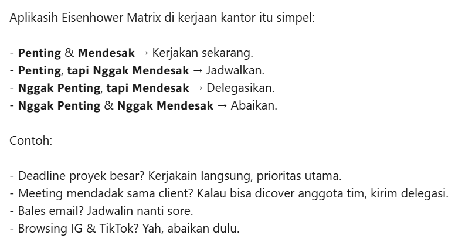

topidesta.my.id rumah baru dari blog <a href="https://topidesta.my.id/" target="_blank"> topidesta.wordpress.com</a> (iklan diwordpress gratis, sungguh menggila!!). Kali ini Blog ditenagai oleh beberapa teknologi JavaScript (React,GatsbyJS dan Netlify) dan bukan lagi PHP (wordpress), berhubung di wordpress terlalu **_BANYAK IKLAN (ads)_** yang mengganggu, baik pengunjung ataupun saya sebagai penulis merasa terganggu, akhirnya coba cari tau teknologi yang tren (2019) Yes, pertama, hunting domain dulu, kebetulan saya dapat ~~**_GERATIS alias FREE_** (saat domain .dev)~~.

## Siapa Dibalik Topidesta?

Yaps, topidesta hanya sebuah nama blog biar mudah di ingat, saya sendiri seorang **Fullstack Developer** di salah satu Rumah Sakit di Jakarta Timur, nama saya MUCHAMAD DESTA FADILAH. Berdasarkan halaman dari about.me/desta ... saya men-claim diri saya sebagai berikut.

```bash
Software Engineer? Yes i do, because I'm at government environment.

I'm fall in love ReactJS so NextJS too. But I'm Not Frontend master.

My Background From Codeigniter Stack, but I'm not Backend master.

I'm setup Server for Whatsapp API Service and Manage code from/ to github but I'm not DevOps master too.

Sometimes research about trend Technology about Web Development or Mobile Development stack.

I Believe I must be Professional in every Project i'm handling.

For now, I'm learning C# (.NET) and do some Project with ReactJS or NextJS Cycle.
```

## Siapa si Muchamad Desta Fadilah?

Baiklah, berdasarkan hasil Test Genetikal, personal genetik adalah saya termasuk kategori IE **Intuiting Extrovert** Tulen (Darah B) yang artinya, kreatif yang mengandalkan tenaga anaerobik (karena perutnya panjang) dengan tenaga meledak-ledak, memiliki jiwa perubahan, dan memiliki ciri merakit atau ide brilian yang datang dari langit untuk didaratkan ke bumi sesuai keadaan masyarakat atau selera pasar.

Meski begitu saya akan tetap melaksanakan matrix eisenhower seperti berikut,



---

Beberapa teknologi pengembangan website sederhana ini:

1. [EXABYTES](https://kutt.it/uF3WcK) ~ED: 15/04/2027
2. [GITHUB](https://kutt.it/github)
3. [NETLIFY](https://kutt.it/netlify)
4. [VERCEL](https://kutt.it/vercel)
5. [GATSBYJS](https://kutt.it/gatsbyjs)
6. [YARN PACKAGE MANAGER](https://kutt.it/yarn)
7. [VSCodium](https://kutt.it/vscodium)

Tulisan blog ini gak jauh beda dengan blog sebelumnya di wordpress dan konten dari blog ini lebih kekiniian, ya, meski latarbelakang saya dari develover  tapi saya suka belajar hal baru seperti , , , ,
, , yang saya coba implementasikan dikantor yang sekarang, untuk Framework UI, saya biasa pakai , , , Untuk CI/CD biasa menggunakan  dan , CMS saya lebih sering menggunakan , untuk pola belajarnya pun sama, setiap stack teknologi yang saya pelajari, tidak membaca secara utuh manual book, tapi yang diperlukan saja, selebihnya googling dan baca koding orang, ya, saya bukan developer sejati, cuman abal abal dan hanya sebatas senang, kalo otak luarbiasa ini kepake (logic), masyaAllah lahaulawalakuwatillabillah.

Ada beberapa aplikasi yang udah release menggunakan ReactJS (Fronted) dan Codeigniter (Backend), klik ke [Halaman Project](/projek) untuk lebih detail.

### Persentasi Ngoding!

<figure><embed src="https://wakatime.com/share/@topidesta/6d3200ff-9b6f-4d3c-9488-2c546204092d.svg"></embed></figure>

<figure><embed src="https://wakatime.com/share/@topidesta/7eda6f42-4b96-43e7-9420-273eda8e0f52.svg"></embed></figure>

<figure><embed src="https://wakatime.com/share/@topidesta/d08ef9c6-64a1-4591-a64a-d190157fd994.svg"></embed></figure>

> Akhir kata, happy coding!
