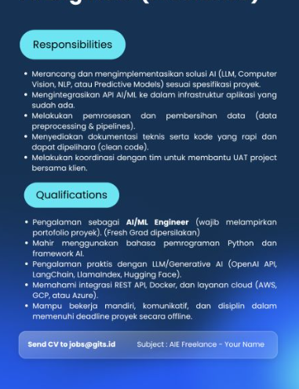

Ada banyak teknologi yang berkembang, halaman ini sebagai pengingat saya dalam belajar, secara umum basic dunia perkodingan diawali dari **PHP - Codeigniter**, hingga sekarang saya bekerja.

## Belajar?

Dalam belajar, saya bisa menjadi apa saja, artinya selama hal itu tidak menggangu kegiatan/ pekerjaan, bahkan dapat membantu maka saya akan pelajari, saya tertarik pada **front-End** ataupun **back-End**. Saat ini fokus belajar saya disisi Front-End, pada bahasa JavaScript Terutama React.

Link [Video](/video) adalah halaman untuk menampilkan video tutorial yang saya ikuti, mohon maaf kebanyakan didapatkan dengan cara Torrent, dan beberapa akses dengan user/password terbatas (hanya 2-3 ), sekali lagi, kalo punya duit yang gak kepake, mending beli buat tutorialnya, kalo saya kepake buat bayar kuota internetnya.

Link [Buku](/buku) adalah halaman untuk buku tutorial yang gw coba baca. hehe. kadang pengen baca kadang pengen liat video, tutorialnya.

Link [Sertifikat](/sertifikat) adalah halaman bukti belajar gw sudah kelar dan sourcecode belajar disimpan di Halaman [ATM Github](https://github.com/amati-tiru-modifikasi).

### Python 3

Target saya di Python bukan sekadar back-End biasa, tapi menjadi **AI/ML Engineer**: fokus pada integrasi model AI/LLM ke dalam aplikasi, pengelolaan data pipeline, dan pemrosesan API/Cloud.

Target ini berdasarkan lowongan kerja berikut:

#### Phase 1: Pondasi Pemrograman & Data

- [ ] Bahasa Python

  - [ ] Dasar Python: variabel, tipe data, kontrol alur
  - [ ] Data Structures: list, tuple, dict, set, comprehension
  - [ ] Object-Oriented Programming (OOP)
  - [ ] Library pemrosesan data: **Pandas, NumPy, Pydantic**

- [ ] Data Preprocessing & Pipeline

  - [ ] Pembersihan data dan penanganan missing values
  - [ ] Normalisasi teks/ citra
  - [ ] Pembuatan alur kerja data (data pipelines)

- [ ] REST API & Backend Basic

  - [ ] Membuat dan mengonsumsi API dengan FastAPI atau Flask
  - [ ] Menjembatani model AI dengan aplikasi backend

#### Phase 2: Spesialisasi AI, LLM & Framework

- [ ] Integrasi LLM & Generative AI

  - [ ] OpenAI API dan Hugging Face Transformers
  - [ ] Prompt Engineering
  - [ ] Function Calling
  - [ ] Embeddings

- [ ] Orkestrasi LLM (RAG)

  - [ ] Framework LangChain atau LlamaIndex
  - [ ] Membangun sistem Retrieval-Augmented Generation (RAG)
  - [ ] Vector Databases: ChromaDB, Pinecone, atau Qdrant

- [ ] Visi Komputer & NLP Dasar

  - [ ] Dasar OpenCV untuk pemrosesan gambar (Computer Vision)
  - [ ] Klasifikasi dan analisis teks (NLP)

#### Phase 3: Infrastruktur & Cloud Deployment

- [ ] Containerization

  - [ ] Docker untuk membungkus aplikasi Python/AI
  - [ ] Menjalankan container secara konsisten di server mana pun

- [ ] Cloud Services (AWS, GCP, atau Azure)

  - [ ] VM (EC2/ Compute Engine)
  - [ ] Serverless Function
  - [ ] Cloud Storage

- [ ] Clean Code & Git

  - [ ] Standar penulisan kode rapi (PEP 8)
  - [ ] Dokumentasi teknis (Swagger/ OpenAPI)
  - [ ] Manajemen versi menggunakan Git

#### Phase 4: Portofolio & Lamaran Kerja

- [ ] Proyek 1 Hate Speech Detection Using Machine Learning Project
- [ ] Proyek 2 Complete Face Recognition Using SQL Database Project 2025
- [ ] Proyek 3 (LLM/RAG): aplikasi tanya-jawab dokumen internal (PDF Chatbot) dengan LangChain, OpenAI API, dan FastAPI
- [ ] Proyek 4 (Computer Vision/ Predictive): API deteksi objek atau prediksi data tabular yang di-containerize dengan Docker
- [ ] Dokumentasi kode: semua proyek disimpan di GitHub dengan README.md lengkap (arsitektur, cara instalasi, dokumentasi API)
