Bismillah, ini adalah halaman Latihan dari Tutorial yang Saya Ikuti. Semoga tidak menjadikan "Tutorial Hell".

## 🆄🅳🅴🅼🆈 atau 🅴🅶🅶🅷🅴🅰🅳

> 👉 [Klik untuk Kloningan dari Udemy/ Egghead](/project-kloningan-dari-udemy-egghead)

## 🆈🅾🆄🆃🆄🅱🅴 

> 👉 [Klik untuk Kloningan dari Youtube](/project-kloningan-dari-youtube)

## 🅳🅴🆅 atau 🅼🅴🅳🅸🆄🅼

> 👉 [Klik untuk Kloningan dari Dev atau Medium](/project-kloningan-dari-dev-atau-medium)

## 🅕🅡🅔🅔🅒🅞🅓🅔🅒🅐🅜🅟

> 👉 [Klik untuk Kloningan dari Freecodecamp](/project-kloningan-dari-freecodecamp)

## KelasKoding

> 👉 [Klik untuk Kloningan dari kelasKoding](/project-kloningan-dari-kelaskoding)

---

## ⌨️ Portofolio Aplikasi ⌨️

---

### Website RSUP Persahabatan

  
 👇 Klik Detail

| Stack | Status | Akses |
| :---: | :---: | :---: | 
| GravCMS, Github, CloudFlare | ⚙️ DEV ⚙️ | [link](https://grav.rspersahabatan.co.id/id) |
| <td colspan="3"><fieldset><legend>Website RSUP Persahabatan V3</legend>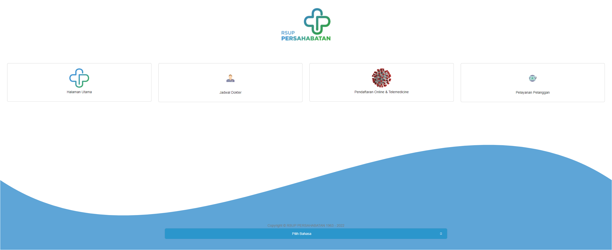</fieldset></td>|
| Codeigniter, CanvasCMS | 🚀 LIVE 🚀 | [link](https://rsuppersahabatan.co.id )|

### Web Blogging Topidesta

  
 👇 Klik Detail

| Stack | Status | Akses |
| :---: | :---: | :---: | 
| GatsbyJS, ShibaCSS, Netlify, Github, CloudFlare | 🚀 LIVE 🚀 | [link](https://topidesta.my.id )|

### Pencarian Dokter

  
 👇 Klik Detail

| Stack | Status | Akses |
| :---: | :---: | :---: | 
| ReactJS, Bootstrap, ReduxJS, Codeigniter | 🚀 LIVE 🚀 | [link](https://dokter.rsuppersahabatan.co.id/ ) |
| <td colspan="3"><fieldset><legend>Pencarian Dokter Per Spesialis</legend>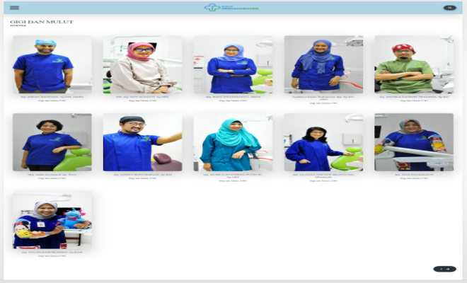</fieldset></td>|
| <td colspan="3"><fieldset><legend>Detail Dokter</legend>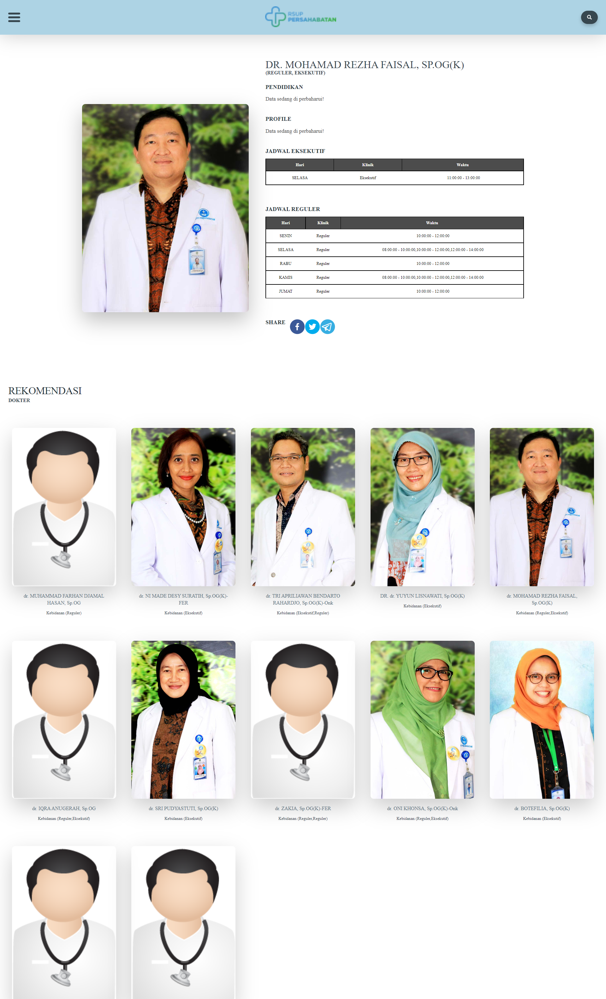</fieldset></td>|

### Aplikasi Surat

  
 👇 Klik Detail

| Stack | Status | Akses |
| :---: | :---: | :---: | 
| ReactJS, Codeigniter 4, API WA, Golang | ⚙️ DEV ⚙️ | [link](https://surat.rsuppersahabatan.co.id/) |

### API REST Service

  
 👇 Klik Detail

| Stack | Status | Akses |
| :---: | :---: | :---: | 
| Codeigniter 3 | 🚀 LIVE 🚀 | [link 1](https://rsuppersahabatan.co.id/apis) |
| Codeigniter 3 | ⚙️ DEV ⚙️ | [link 3](https://dev.ci3.api.persahabatan.co.id/) |
| Codeigniter 4 | 🚀 LIVE 🚀 | [link 2](https://api.persahabatan.co.id/)|
| Codeigniter 4 | ⚙️ DEV ⚙️ | [link 2](https://dev.api.persahabatan.co.id/)|

### Whatsapp BOT & API

  
 👇 Klik Detail

| Stack | Status | Akses |
| :---: | :---: | :---: | 
| NodeJS, Baileys, Codeigniter, BOT Whatsapp | 🚀 LIVE 🚀 | Private |
| <td colspan="3"><fieldset><legend>APIWA Unofficial</legend>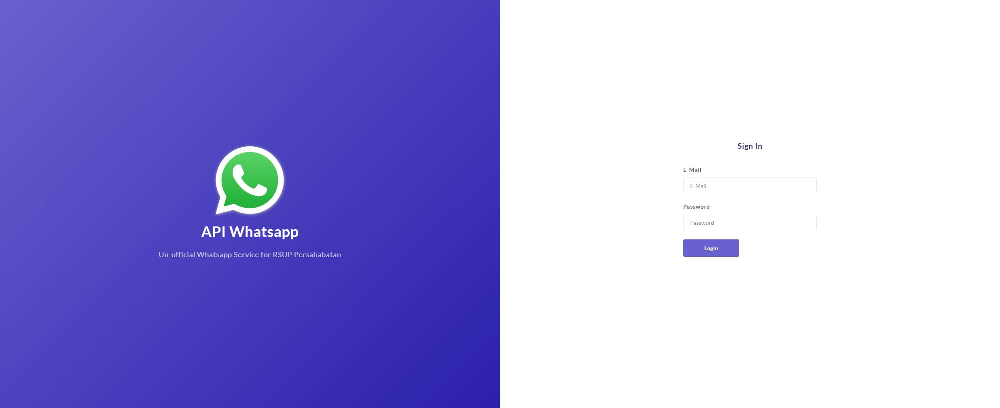</fieldset></td>|

### Manual Book Prima SIMRS

  
 👇 Klik Detail

| Stack | Status | Akses |
| :---: | :---: | :---: | 
| Docusaurus, NetlifyCMS, Firebase | 🚀 LIVE 🚀 | [Link](https://prima.simrspersahabatan.co.id/) |
| <td colspan="3"><fieldset><legend>Manualbook SIMRS Prima</legend>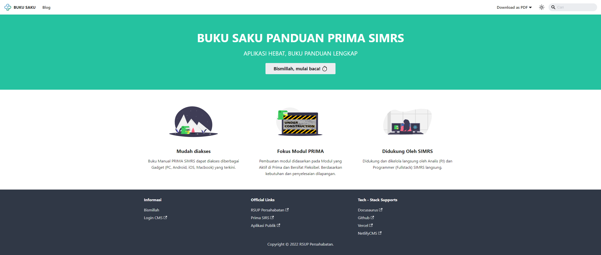</fieldset></td>|
| <td colspan="3"><fieldset><legend>Manualbook SIMRS Prima</legend>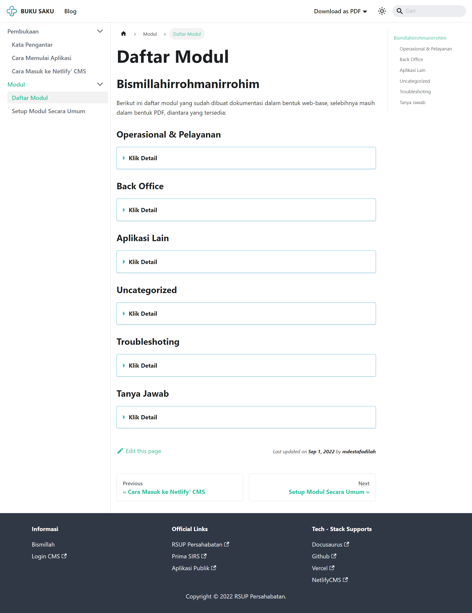</fieldset></td>|

### Lowongan Pekerjaan

  
 👇 Klik Detail

| Stack | Status | Akses |
| :---: | :---: | :---: | 
| ReactJS, ReduxJS, Bootstrap, Codeigniter | 🚀 LIVE 🚀 | [link](https://lowongan.rsuppersahabatan.co.id/) |
| <td colspan="3"><fieldset><legend>Lowongan Pekerjaan</legend>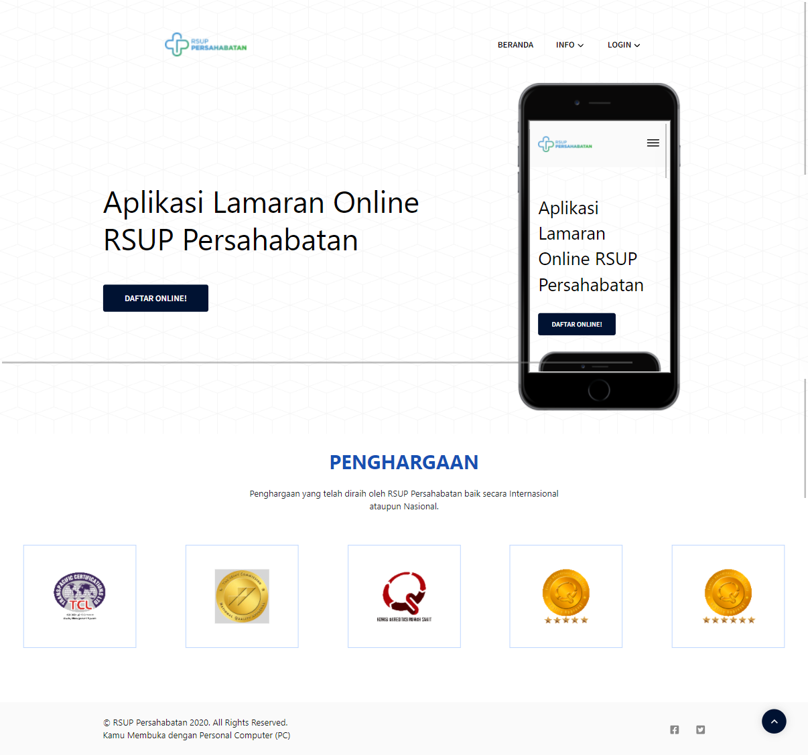</fieldset></td>|

### Landing Pendaftaran Online

  
 👇 Klik Detail

| Stack | Status | Akses |
| :---: | :---: | :---: | 
| GatsbyJS, NetlifyCMS, Vercel | 🚀 LIVE 🚀 | [link](https://pendaftaran.rsuppersahabatan.co.id/) |
| <td colspan="3"><fieldset><legend>Landing Pendaftaran Online</legend>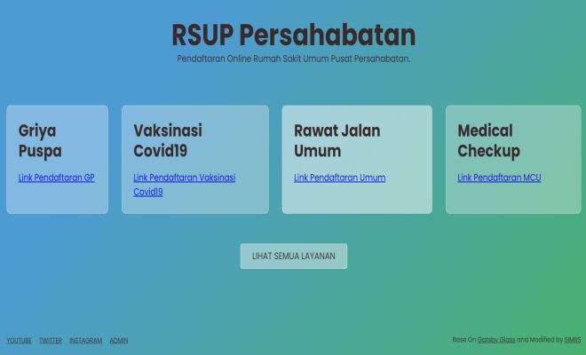</fieldset></td>|
| <td colspan="3"><fieldset><legend>Landing Pendaftaran Online 2</legend></fieldset></td>|

### Bank Darah (UTDRS)

  
 👇 Klik Detail

| Stack | Status | Akses |
| :---: | :---: | :---: | 
| ReactJS, ReduxJS, RHF, Codeigniter, Golang | 🚀 LIVE 🚀 | [link 1](https://bankdarah.rsuppersahabatan.co.id/) |
| ReactJS, ReduxJS, Formik, Codeigniter, Golang | 🚀 LIVE 🚀 | [link 2](https://ic.bankdarah.rsuppersahabatan.co.id/) |
| <td colspan="3"><fieldset><legend>Bank Darah (UTDRS) RSUP Persahabatan</legend>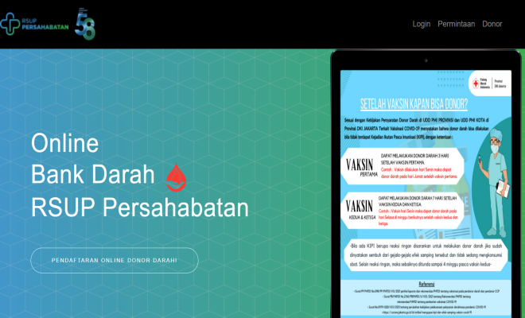</fieldset></td>|
| <td colspan="3"><fieldset><legend>Formulir Inform Consent (IC)</legend>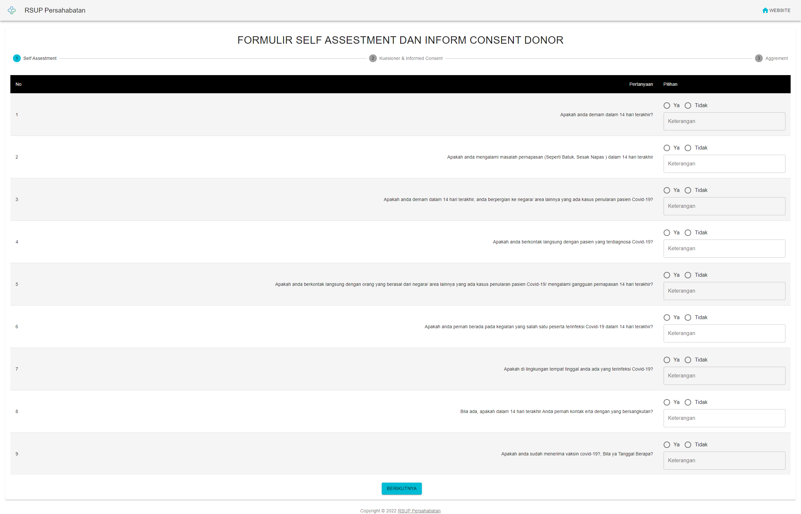</fieldset></td>|

### Kuesioner Fagestorm

  
 👇 Klik Detail

| Stack | Status | Akses |
| :---: | :---: | :---: | 
| ReactJS, Formik, Redux, Codeigniter 4 | 🚀 LIVE 🚀 | [link](https://fagestorm.netlify.app/) |
| <td colspan="3"><fieldset><legend>Kuesioner Fagestorm</legend>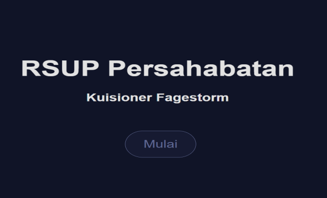</fieldset></td>|

### Config and Maintenance Server

  
 👇 Klik Detail

| Stack | Status | Akses |
| :---: | :---: | :---: | 
| Ubuntu, aaPanel, CloudFlare | 🚀 LIVE 🚀 | [link](https://persahabatan.co.id/)|
| Ubuntu, aaPanel, CloudFlare | 🚀 LIVE 🚀 | [link](https://dev.persahabatan.co.id/)|
| Ubuntu, aaPanel, CloudFlare | 🚀 LIVE 🚀 | [link](https://halobayi.co.id/)|

### Zoom Meeting

  
 👇 Klik Detail

| Stack | Status | Akses |
| :---: | :---: | :---: | 
| NextJS, GraphQL, Google API | ⚙️ DEV ⚙️ | [link](https://zoom.rsuppersahabatan.co.id/)|
| <td colspan="3"><fieldset><legend>Zoom Meeting</legend>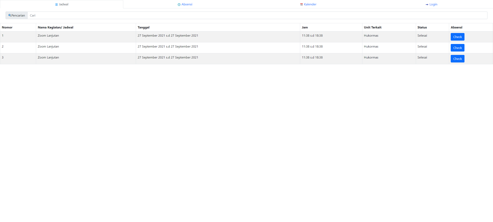</fieldset></td>|

### Spinner Pemenang

  
 👇 Klik Detail

| Stack | Status | Akses |
| :---: | :---: | :---: | 
| NextJS, GraphQL, Google API | ⚙️DEV⚙️ | [link](https://putar.rsuppersahabatan.co.id/) |

### Aplikasi Survei

  
 👇 Klik Detail

| Stack | Status | Akses |
| :---: | :---: | :---: | 
| ReactJS, ReduxJS, MaterialUI, Formik, YUP | ⚙️DEV⚙️ | [link](https://survey.rsuppersahabatan.co.id/) |

### Prima QR Login

  
 👇 Klik Detail

| Stack | Status | Akses |
| :---: | :---: | :---: | 
| NextJS, ReduxJS, ChakraUI, RHF | ⚙️DEV⚙️ | [link](https://login.rsuppersahabatan.co.id/) |

### Simrs Chrome Notification

  
 👇 Klik Detail

| Stack | Status | Akses |
| :---: | :---: | :---: | 
| Javascript, Codeigniter, Extend Chrome | ⚙️DEV⚙️ | - |

### Sistem Informasi Management Klinik

  
 👇 Klik Detail

| Stack | Status | Akses |
| :---: | :---: | :---: | 
| Codeigniter 4, jQuery, Datatables, Bootstrap 5 | ⚙️DEV⚙️ | [link](https://sim.halobayi.co.id/)|

### Online Proctoring System

  
 👇 Klik Detail

| Stack | Status | Akses |
| :---: | :---: | :---: | 
| JavaScript, Codeigniter | 🚀 ACTIVE DEVELOPMENT 🚀 | [link](https://lab.katalis.persahabatan.co.id/rest-server/proctoring)|
| JavaScript, NodeJS, ViteJS, Preact | 🚀 ACTIVE DEVELOPMENT 🚀 | [link](https://github.com/mdestafadilah/proctoring.js)|

