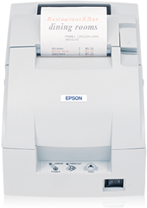

## Bismillah...

Kebetulah dikantor lagi dapet maenan baru, printer epson series tm-u220d kayak gini:



Terus, karena ngoding langsung pake RAW-TEXT dari printer ribet, contoh RAW-TEXT dari Vendor Zebra kayak gini neh:

```javascript
^FN11 : NO Rekam medis
^FN12 : Nama Pasien
^FN13 : No Rekam medis bentuk barcode
^FN61 : Nama obat
^FN62 : kwantitas makan, brp tablet/kapsul perhari
^FN63 : sblm atau ssedh makan
^PQ  : kwantitas label identik
^XA
^XFE:PHARMA01.ZPL
^FN11^FD111212121212^FS
^FN12^FDKomarudin Ibrahim Saleh^FS
^FN13^FD&gt;;111212121212^FS
^FN61^FDPanadol Expectoran 250mg^FS
^FN62^FD3 x 1 Tablet / hari^FS
^FN63^FDMinum Setelah Makan^FS
^PQ2,0,0
^XZ
```


Nah, karena yang dipake itu dari EPSON, akhirnya searching eh dapet deh di Github yang senang hati berbagi ini linknya:
<blockquote><a href="https://github.com/mike42/escpos-php/tree/master">https://github.com/mike42/escpos-php/tree/master</a></blockquote>
Ternyata TM-U220 didukung sama libarary ini, yaudah oprek deh, cara gunanya gampang banget, karena udah pake bootstrap auotloader, jadi yah tinggal load sebagai library ... selebihnya bisa dicek di repo gw:
<blockquote><a href="https://github.com/RSUP/ESC-POS">https://github.com/RSUP/ESC-POS</a></blockquote>
Gw Kagak fork, soalnya gw pake manual download dan upload file git nyah .... hehehe.

Have a nice day!

source:
<ol>
 	<li>https://github.com/mike42/escpos-php/tree/master</li>
 	<li>https://github.com/RSUP/ESC-POS</li>
</ol>