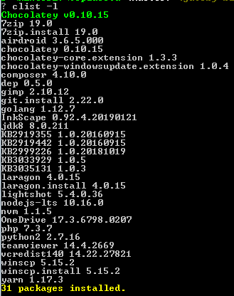

Bismillah

Kebetulan **laptop** dan **komputer kantor** pakai windows original, jadi sekarang pakai windows baik nguli jadi web dev (front/ backend) atau sebagai penulis blog [Topidesta' Dev](https://topidesta-dev.me)
, kembali ke topik lagi. Kalo di GNU/Linux kita kenal, DPKG, RPM, YUM, PACMAN, dll. Untuk diwindows, sekarang ini ada yang namanya Chocolatey Package Manager, amazing ini aplikasi, bisa akses kehalaman ini:

> [Chocolatey Link](https://chocolatey.org/packages)

Silahkan baca sendiri cara installnya, bisa lewat commandpromt (CMD) atau Windows Powershell (WPS), harus **admin** saat hendak install yah. 

Kurang lebih dengan perintah ``choco list --local-only`` kita akan lihat daftar yang sudah terinstall, kurang lebih seperti gambar dibawah ini daftar list yang terinstall

tanpa download file lagi, choco akan mengdownload lalu install, otomatis dengan perintah yang simple, ``choco install nama_aplikasi -y``, tunggu dan boom. done.

Have a nice day!

source:
1. https://superuser.com/questions/1270151/how-to-list-installed-chocolatey-packages