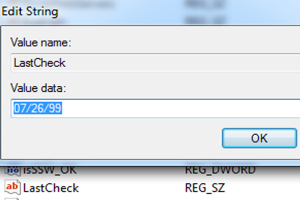
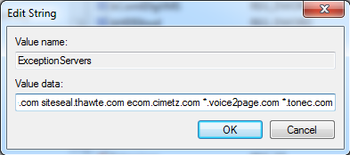

### Bismillah 

Ini mah sekedar catatan gw ajah yak, kebetulan meski dengan windows original, beberapa software masih pakai jamu (alias crack-crackan) ... terkait harga software yang benar benar ngocek kantong, kali ini catatan mengenai update *IDM* yang selalu muncul, ada 2 cara yang gw lakukan, 2 tekhnik seharusnya, ini tekhnik pertama.

#### 1 (Perpanjang Tahun)
berikut ini langkahnya:
1. Open regedit (WinKey + R) lalu ketik **regedit**, lalu Enter
2. Buka key: **HKEY_CURRENT_USER\Software\DownloadManager\LastCheck**
3. Ubah ke format tahun yang akan datang, misal: **01/01/99**
4. Keluar regedit
5. Restart Komputer
6. Done

Berikut screenshoot tanggalnya:

#### 2 (Abaikan Server IDM)
Jika langkah pertama kurang puas, alias masih ajah muncul notif update atau apalah apalah ini tekhnik selanjutnya, berikut ini langkahnya:
1. Open regedit (WinKey + R) lalu ketik **regedit**, lalu Enter
2. Klik **HKEY_CURRENT_USER\Software\DownloadManager**
3. Klik kanan, new keyword **DWORD** pilih arsitektur 32/64 bit
4. Ketik nama **AutoUpdate** 
5. Lalu pilih **ExceptionServers**
6. Klik kanan tambahkan tulisan **'*.tonec.com'** dibaris terakhir
6. Klik Ok
7. Restart Komputer
8. Done
Berikut ini tampilannya:

Selesai, Have a nice day!

sumber:
1. https://kutt.it/xoRCeB
2. https://kutt.it/xC99tg
