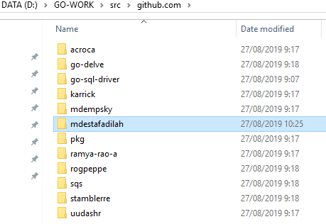
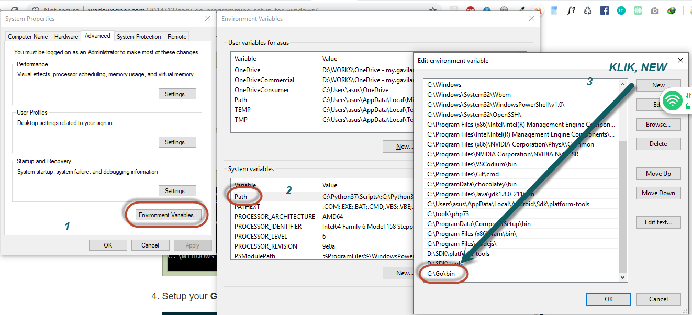
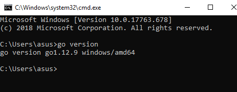
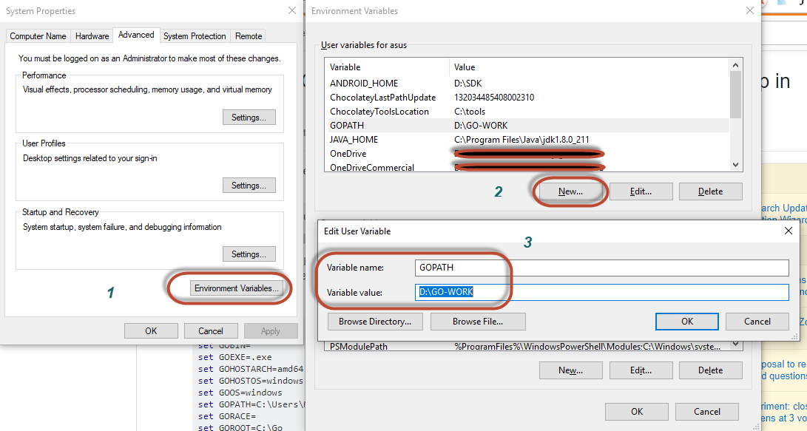
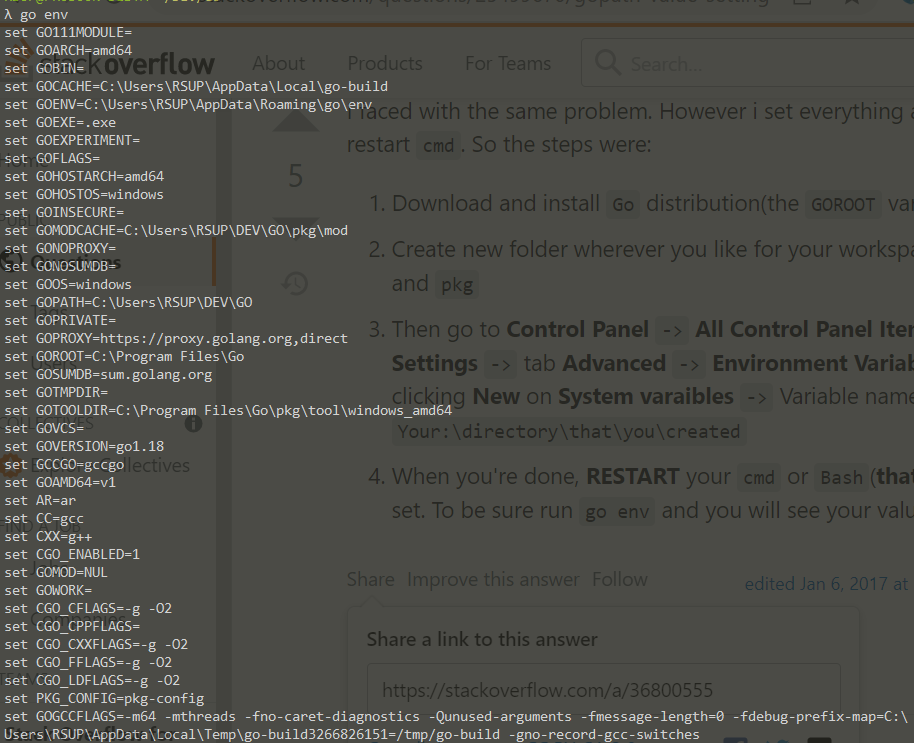
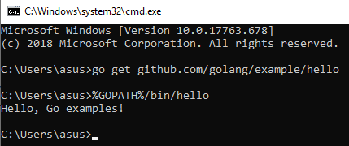

### Bismillah

Sekedar catatan gw ajah sih, lagi iseng belajar bahasa GO, tetiba terfikirkan kalo banyak folder dalam pengembangannya bagaimana? struktur projectnya, karena GO itu sifat bahasanya package/ membutuhkan paket lain, akhirnya googling dulu ... terdampar dihalaman ini:

> https://golang.org/doc/code.html#Workspaces

Secara eksplisit, **workspace** bahasa GO, merupakan ruang kerja, dimana didalamnya terdapat, 2 folder utama, yaitu:

- `src` source file go disini
- `bin` source exe go disini

## UPDATE

---

Ternyata ada 1 folder, setelah dieksekusi, nama foldernya:

- `pkg`

jadi semacam folder yang menghubungkan _object go yang sudah dicompile_ dari folder `src` yang saling terhubung ke folder `bin`, contohnya: paket `fmt` hampir ada disemua program Go, ketika kita compile akan muncul di pkg tapi sekali saja, dan tersimpan di folder `pkg`, dan akan _terlink otomatis_, penghematan!.

info didapat dari sini: [StackOverFlow](https://stackoverflow.com/a/47369867)

---

GO akan membuat file binaries saat build project yang akan disimpan di `bin` folder dan folder `src` lah yang akan menjadi tempat project dibuat dalam bentuk **subdirectory** , kurang lebih workspce seperti ini:



Lihat, ada folder `mdestafadilah` dimana didalam folder itu akan ada subdirectory project kita, ini berdasarkan rekomendasi golang didokumentasinya ya.

> Untuk instalasi GO silahkan gunakan [Chocolatey Management Software](aplikasi-manager-aplikasi-di-windows)

Ups, kayaknya ada yang keliwat, yaps .. `PATH` agar bisa diakses oleh CMD Windows dan `GOPATH` agar menjadi default dari workspace project GO, silahkan refrensikan ke alamat ini:

> http://go.topidesta.my.id/go-setup-win

secara singkat kurang lebih seperti gambar dibawah ini untuk setting `path`



Untuk mengecek apakah berhasil, silahkan buka command prompt, lalu ketik: `go version` maka akan muncul versi go, kurang lebih seperti gambar dibawah ini:



selanjutnya, kita akan setting `GOPATH` sebagai workspace project kita, terkait tulisan ini, silahkan bebas meletakkan folder utama GO dimana saja, kalo gw di drive D: dengan nama folder `GO-WORKS`, silahkan lihat gambar dibawah ini, perhatikan ada nomor sebagai langkahnya:



Untul melakukan pengecekan konfigurasi lakukan perintah seperti dibawah ini:
```bash
go env
```

Jika sudah nanti akan muncul konfigurasi golang di PC kita.


info dari sini -> https://stackoverflow.com/a/36800555

verifikasi apakah `GOPATH` sudah benar dengan download hellworld golang:

```cms
go get github.com/golang/example/hello
%GOPATH%/bin/hello
```

jika gopath sesuai akan muncul seperti ini:


dan ... selesai!
