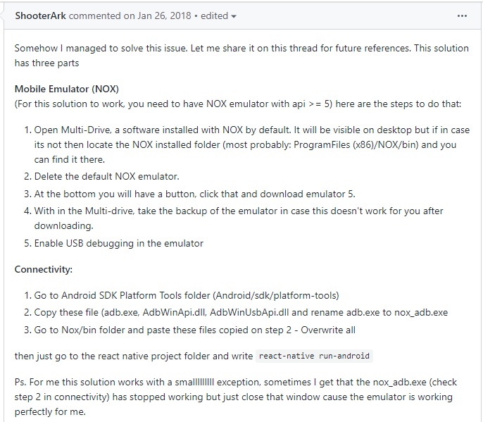
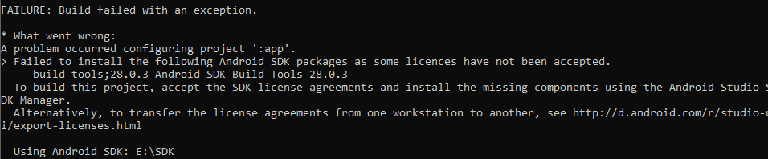
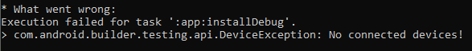
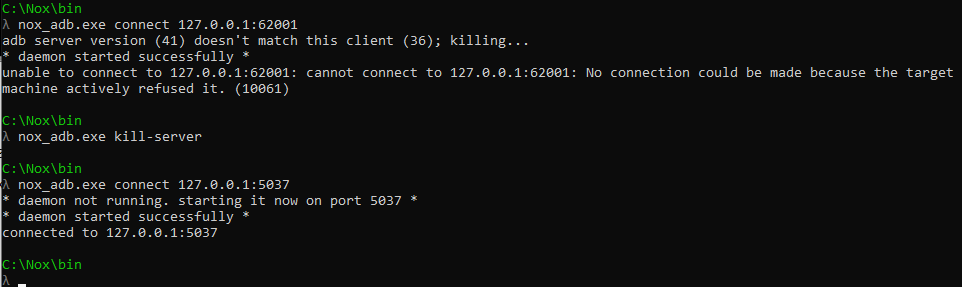
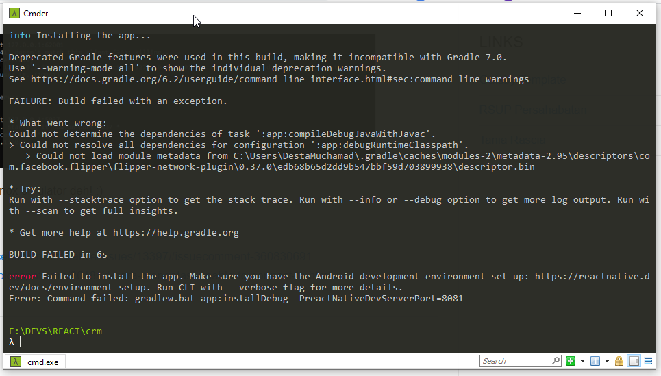
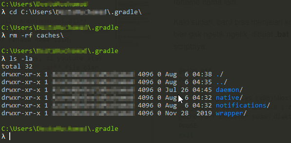
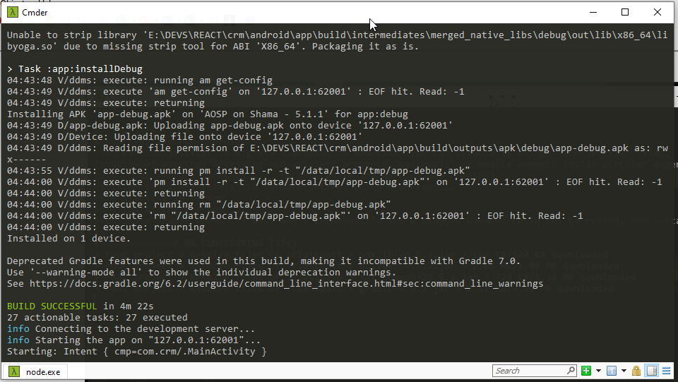

## bismillah

kali ini sekedar catatan pribadi ajah, cara biar running emulator yang ringan, NOX Emulator termasuk ringan, dibanding dengan GenyMotion ya, nah karena sering muncul kalimat **no devices detected ..** akhirnya cari tau di google, terdampar dihalaman github, kurang lebih perintahnya seperti gambar ini:


pastikan liat log setelah perintah _react-native run-android_ karena nanti akan muncul error yang akan tampil kurang lebih kayak gini:



solusinya buka SDK Manager (dalam hal ini, gw gak install Android Studio ya) dan install deh build tools 28.0.3, kelar.

running deh react native, ups, muncul error lagi kayak gini:



jangan panik, jalankan lagi ajah perintah koneksi ke nox, liat gambar pertama, perintahnya kurang lebih seperti ini:

```bash
nox_adb.exe connect 127.0.0.1:62001
```

eh muncul error

```script
unable to connect to 127.0.0.1:62001: cannot connect to 127.0.0.1:62001: No connection could be made because th
e target machine actively refused it.
```

langsung ajah jalankan perintah dibawah ini...

```bash
nox_adb.exe kill-server
nox_adb.exe connect 127.0.0.1:5037
```

berikut ini gambarnya:


done, sekarang bisa pake nox emulator deh! :)

---

**UPDATE**

Kebetulan pas lagi pengen develop native react, tetiba nox emulator di windows 10 gw selalu _bluescreen_ begitupula pake emulator dari android studio dan genymotion. Gw cari permasalahannya, karena install software tertentu, gw juga lupa. Akhirnya **reset** windows deh, eh kereset juga settingan native react dan beberapa tools lainnya.

Seperti biasa, gw ikutin langkah diatas seperti ini:

```bash
nox_adb.exe connect 127.0.0.1:62001
```

dan ternyata gak bisa langsung connect, gw lupa ada point tertentu untuk koneksikan nox dengan SDK android, gw baru engeh pas liat vidio ini: https://www.youtube.com/watch?v=_JJ-mxlTADc

Jadi, copy file **adb.exe, AdbWinApi.dll, AdbWinUsbApi.dll** copy-paste di folder **bin** nox terinstall, lalu rename **adb.exe ke nox_adb.exe** dan nox_adb dibackup/ rename nama lain.

Kalo sudah, **buka nox emulator** lalu **koneksikan** ke nox! Ups, di youtube atas dikasih trick biar gak ngetik ngetik, dibuat **.bat** file biar bisa dieksekusi windows 10, berikut scriptnya:

```bash
@echo off
PAUSE
C:
cd "C:\Program Files (x86)\Nox\bin"
nox_adb.exe connect 127.0.0.1:62001
@echo Port Emulator sudah diaktifkan
PAUSE
exit
```

buat yang mau filenya silahkan dicomit disini: https://cl.ly/d90053443bd9

Selesai, tunggu... ada error di **gradle** ...



OMG ... cobaaan apalagi ini, searching via gogel, akhirnya disuruh hapus folder cachenya dahulu, berikut contohnya:



kalo udah lalu jalankan perintah **react-native run-android** di folder project native react, kurang lebih nanti akan download ulang, pastikan terkoneksi ke internet, seperti digambar ini:


ditunggu saja, tergantung kecepatan internet dan hardisk anda, karena banyak file yang didownload, jika sudah selesai maka akan muncul keterangan koneksi ke nox, seperti digambar ini:



Done! beneran selesai. Project native react sudah tampil di emulator nox!

Mantap betul ...

sumber:

1. https://github.com/facebook/react-native/issues/13397#issuecomment-360830691
2. https://codingrakitan.blogspot.com/2018/11/cara-mengatasi-unable-to-connect-to.html
3. https://www.youtube.com/watch?v=_JJ-mxlTADc
4. https://stackoverflow.com/a/54514380
