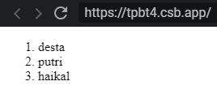

## bismillah

sekedar catatan pribadi ajah, karena sebelumnya kita sudah bahas cara memecah sebuah object array di react, dengan declarative code, menggunakan fungsi *map()* dan *filter()*, berikut ini contoh pemanfaatannya, dalam format .js ataupun .jsx format.

```javascript
const orang = [{ nama: "desta" }, { nama: "putri" }, { nama: "haikal" }];

/* FORMAT JS */
const element = React.createElement(
  "ol",
  null,
  orang.map(seorang =>
    React.createElement("li", { key: seorang.nama }, seorang.nama)
  )
);
```


```javascript
const orangs = [{ nama: "desta" }, { nama: "putri" }, { nama: "haikal" }];

/* FORMAT JSX */
const element = <ol>
  {
    orangs.map((orang) => (
      <li>{orang.nama}</li>
    ))
  }
</ol>
```

resultnya sama seperti ini:

1. 

live version bisa dicek dihalaman ini: https://tpbt4.csb.app/

oke done, have a nice day!