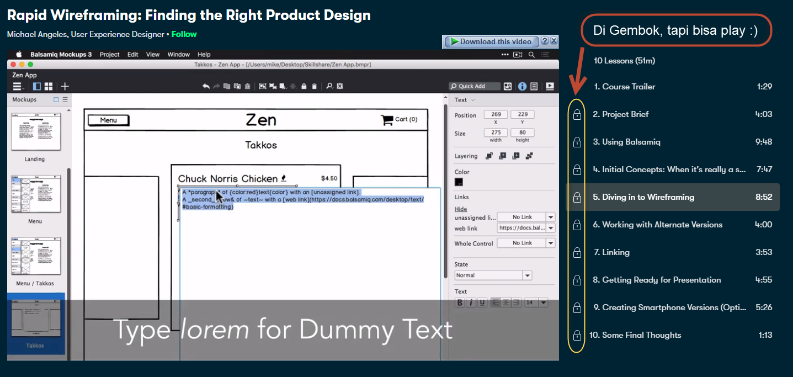
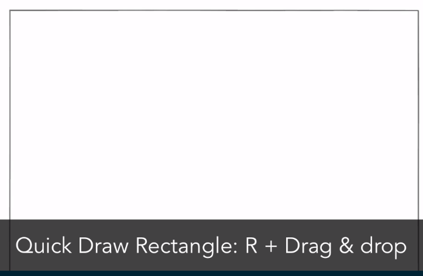
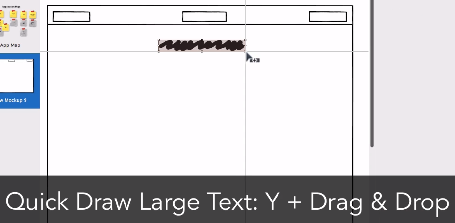
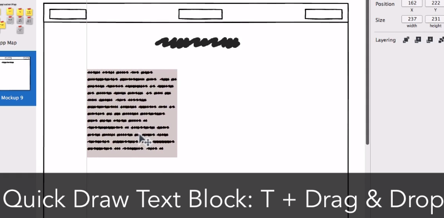
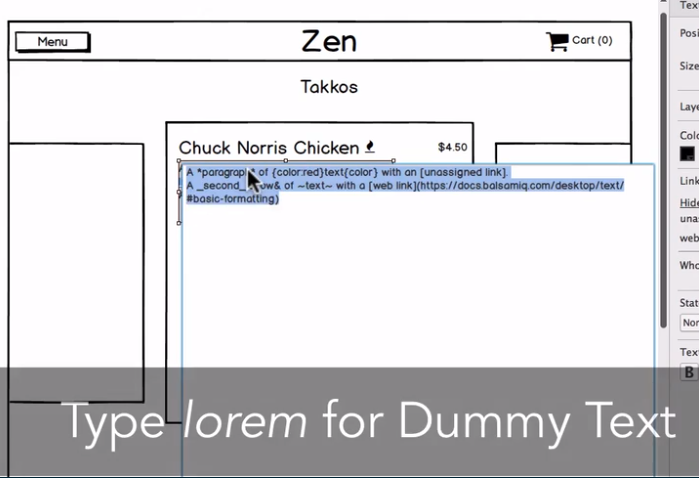
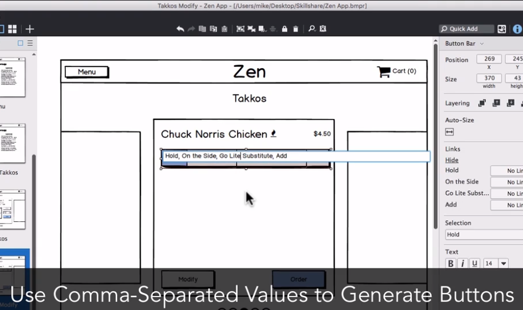
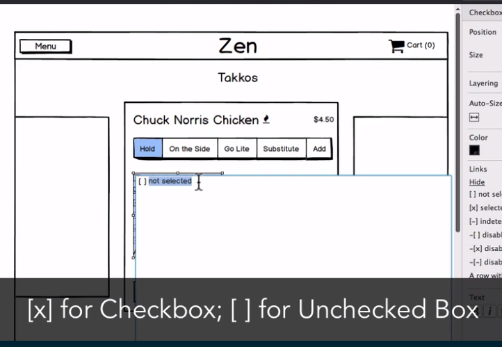
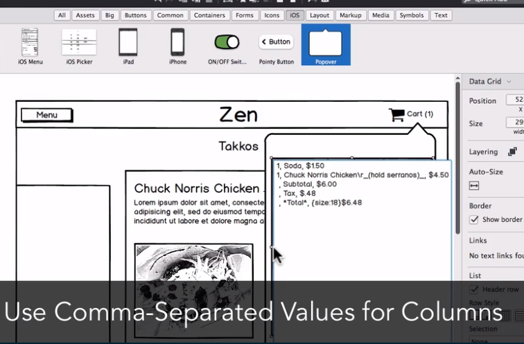

## bismillah 

berikut ini syntact cepat untuk membuat design dengan balsamiq mockup ... ups, gw dapet dari tutorial yang gratis tapi lewat web resmi, ini buktinya:

> https://www.skillshare.com/classes/Rapid-Wireframing-Finding-the-Right-Product-Design/1947996659/projects

berikut ini screenshoot cara pemanfaatan balsamiq dengan keyboard shortcut:

1. Membuat Frameborder/ Rectangle (R + Drag Mouse)
   

2. Membuat Menu/ Judul (Y + Drag Mouse)
    

3. Membuat Text Paragraf
   

4. Membuat Dummy Tet (Ketikkan *lorem*)
   

5. Transform Rectangle ke Icon Tertentu
   

6. Generate Button 
   
   
7. Checkbox atau Uncheckbox
   
   
8. Buat Kolom dengan Comma
   
   

alhamdulillah, kelar juga perkenalan dengan balsamiq mockup ... seru juga ternyata ... haha, maaf video tutorialnya gak bisa di download meski ada terdownload, suara tak muncul, karena formatnya .ts pake vlc cuman gambar ajah.

have a nice day!
