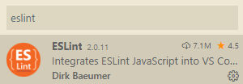
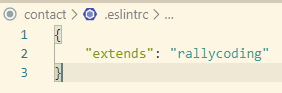

## bismillah 

Kita akan buat setiap coding react, baik native atau web, otomatis rapih kalo gak nanti muncul warning, nah berikut ini langkahnya:

1. Install secara global eslint dengan perintah `npm install -g eslint`
2. Install Extention ESlint di VSCodium
   
3. Install dependencies dengan perintah `yarn add eslint-config-rallycoding`
4. Buat sebuah rules di project yang aktif dengan nama file `.eslintrc` dan isi dengan sebuah object scriptnya
   
5. Done
   
## Testing

