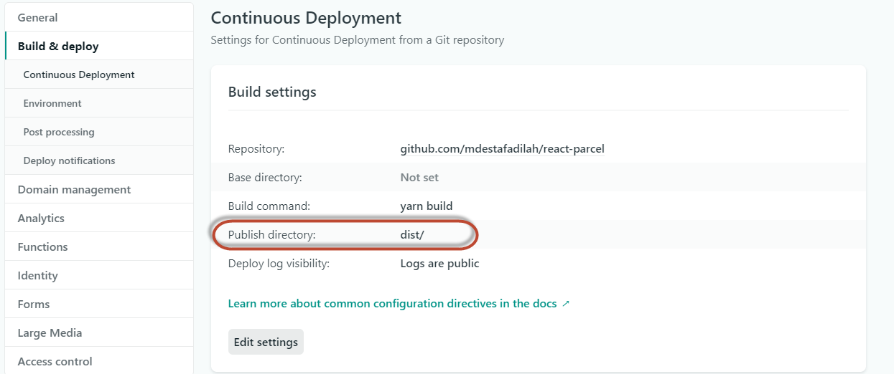

## bismillah

Sebelumnya pengen pake `create-react-app` untuk project pencarian dokter dengan reactJS, tapi kok ya kayak berat ya, pas perintah build atau development, seperti `yarn start` ataupun `yarn build`. Akhirnya cari via google alternatif webpack, dapet deh beberapa diantaranya yang rekomended itu `Parcel bundler`, banyak di Github yang udah ready-to-production structure folder untuk development react. hanya saja disini gw ikut meramaikan, hehe, silahkan ke halaman ini:

`https://github.com/mdestafadilah/react-parcel`

itu udah ready to-go, termasuk running di netlify :) :) :).

Ups, ada settingan khusus dinetlify berikut ini settingannya:

1. Masuk ke Site Settings
2. Pilih Build & Deploy
3. Edit Publish directory, defaultnya adalah `build` ganti menjadi `dist`
   
4. done.

Haha ... sekian alternatif yang bisa di implementasikan!

have a nice day!
