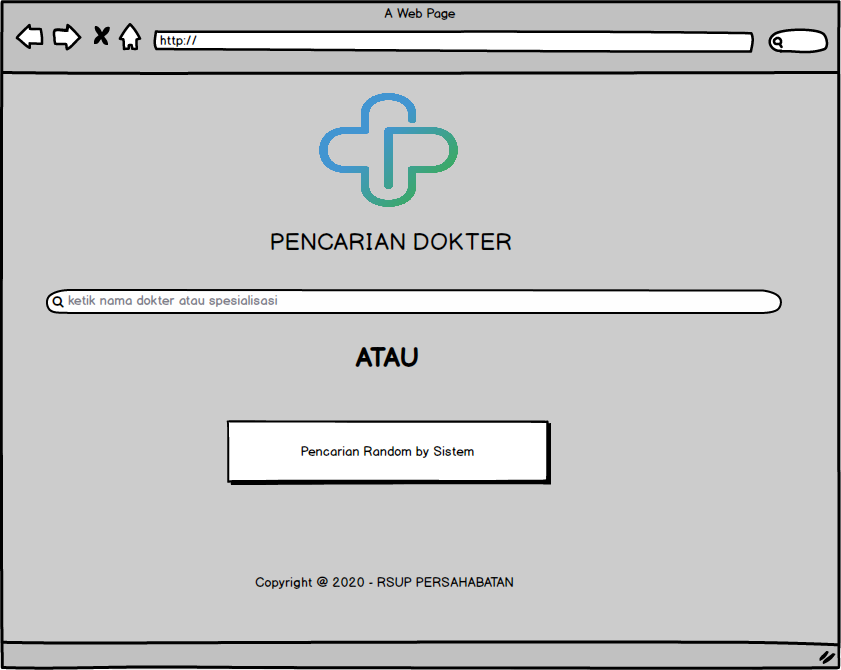
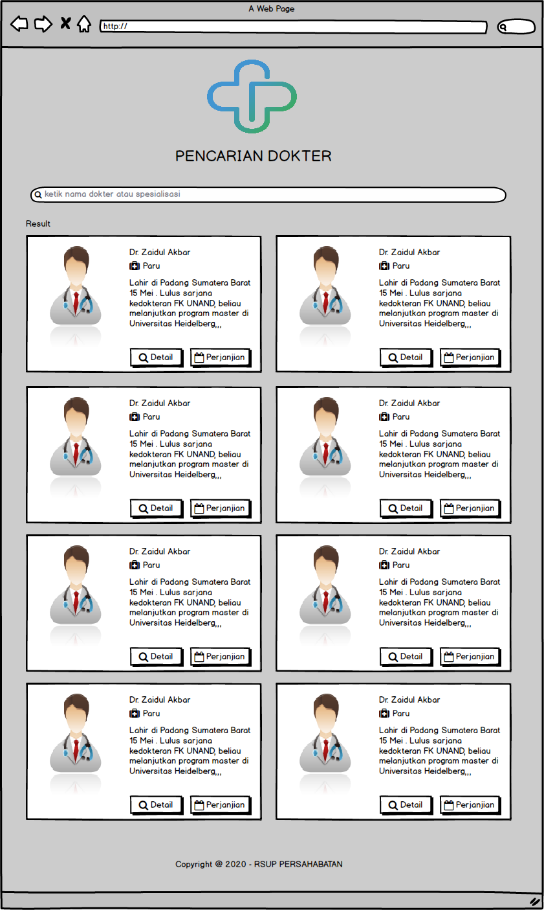
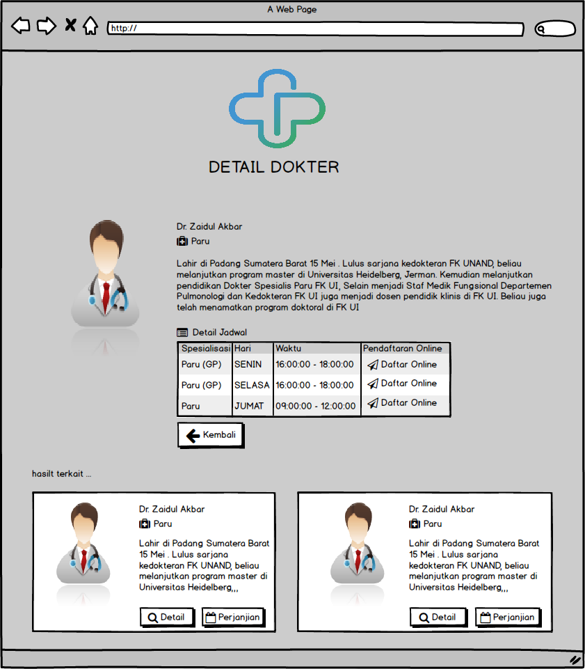
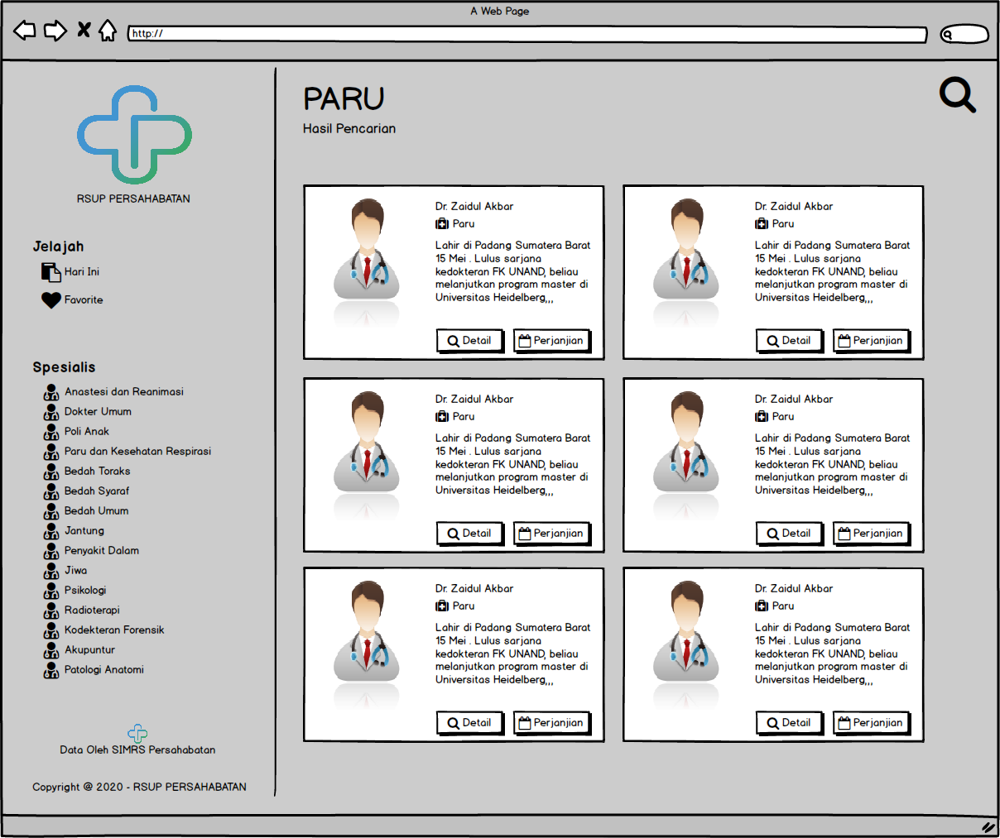

## bismillah

Langsung aja ini adalah mockup atau design dari aplikasi yang akan gw kembangkan, yang sudah running dihalaman [ini](https://rsuppersahabatan.co.id/dokter) cuman kurang puas getu, dari sisi `frontend` ataupun `backend` ya, karena dikembangkan dengan butuh cepet, alhasil gw kembangkan sesuai template yang sudah dibeli.

Dipostingan lainnya akan gw jelaskan juga dari sisi backend API/ REST data dari aplikasi PRIMA, karena yang sekarang belum bisa sharing api/ rest, kudu pake password dan username basic, next implementasi JWT sebagai authnyah dari sisi backend.

Kembali lagi ke postingan kali ini, ini dia 3 design utama, ups... gw nyontek ini hehe dari beberapa project react-movie yang pernah gw [bahas](source-react-movie-di-github-siap-dibedah), baiklah berikut ini 3 designnyah:

1. Antarmuka
   

2. Hasil Pencarian
   

3. Detail pencarian
   

Emang sih sederhana, setidaknya gw berusaha membuat sebuah aplikasi berkualitas, aplikasi yang kedepannya mudah dikembangkan, dimana sourcecode bahkan designpun bisa diubah tidak terlalu rumit, dimana kalo ada programmer selain gw, mudah untuk handle, tidak kebingungan.

Oyah, silahkan comot file mockupnya, gw pake balsamiq mockup. ini filenya:

`https://cl.ly/ff0babe2a231`

-------

## UPDATE

Kurang puas dengan tampilan diatas akhirnya gw coba mockup ulang, dengan sedikit nyontek hehe ... berikut ini tampilannya.

1. Antarmuka
   

2. Hasil Pencarian
   

3. Detail pencarian
   

Seperti biasa, kalo ada yang mau, file mockupnya, comot ajah, geratis, bebas lu mau pake apa kagak:

`https://cl.ly/ec9be70e6783`

Have a nice day!