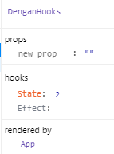
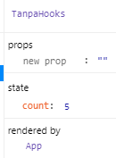

## bismillah

Lagi ikutin tutorial copy paste untuk aplikasi pencarian dokter, mentog di `hooks` lifecycle method, yang dahulu pernah gw bahas, ada di sini: [ajax-request-di-react-lifecycle-event](ajax-request-di-react-lifecycle-event) dan seketika dikenalkan dengan hooks, ada dihalaman ini: https://reactjs.org/docs/hooks-effect.html, langsung ajah kita coba okeh, source uji coba ada dihalaman ini:

`https://github.com/mdestafadilah/contohreacthooks`

pembahasan master ada di halaman ini: [https://medium.com/@ri7nz/3-cara-fetch-data-di-reactjs-aaa064ccf5e9](https://medium.com/@ri7nz/3-cara-fetch-data-di-reactjs-aaa064ccf5e9)

disini gw cuman mau bahasa sebagai noobitol, pemula, meski sudah tua. hehe.

dalam uji coba tersebut, kita dikenalkan dengan merubah suatu DOM dengan render ulang (re-render), kalo dihooks dikenal dengan `useEffect` kalo yang umum itu lifecycles method (`componentDidMount`,`componentDidUpdate`) jika tanpa hooks kita merubah dengan state/ data ke DOM tanpa render ulang.

kalo pake hooks jadi lemot dong? ups, ya kagak lah ... bukan render halaman website secara utuh, hanya logical data aja, dan tidak ada pengulangan fetch data disetiap komponen, di project react-movie sudah ada, jadi cukup 1 komponen untuk 1 kebutuhan, dan seterusnya. inget, state itu sifatnya local, bukan global loh. #koreksikalogwsalah

ini dia perbedaan lifecycle nya:

---

terlihat kan, kalo hooks itu re-render dari DOM, sedangkan tanpa hooks, merubah state yang sama.

bingung ya? gw jg bingung jelasinnya... hehe.

~ todo: https://www.robinwieruch.de/react-fetching-data ~

Have a nice day!
