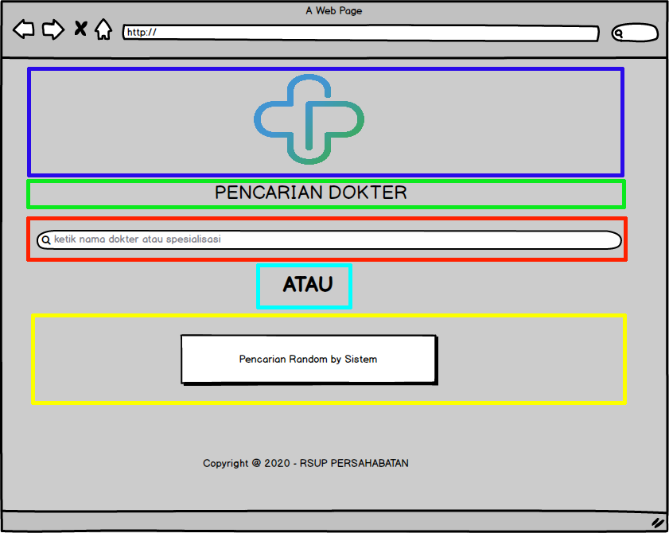
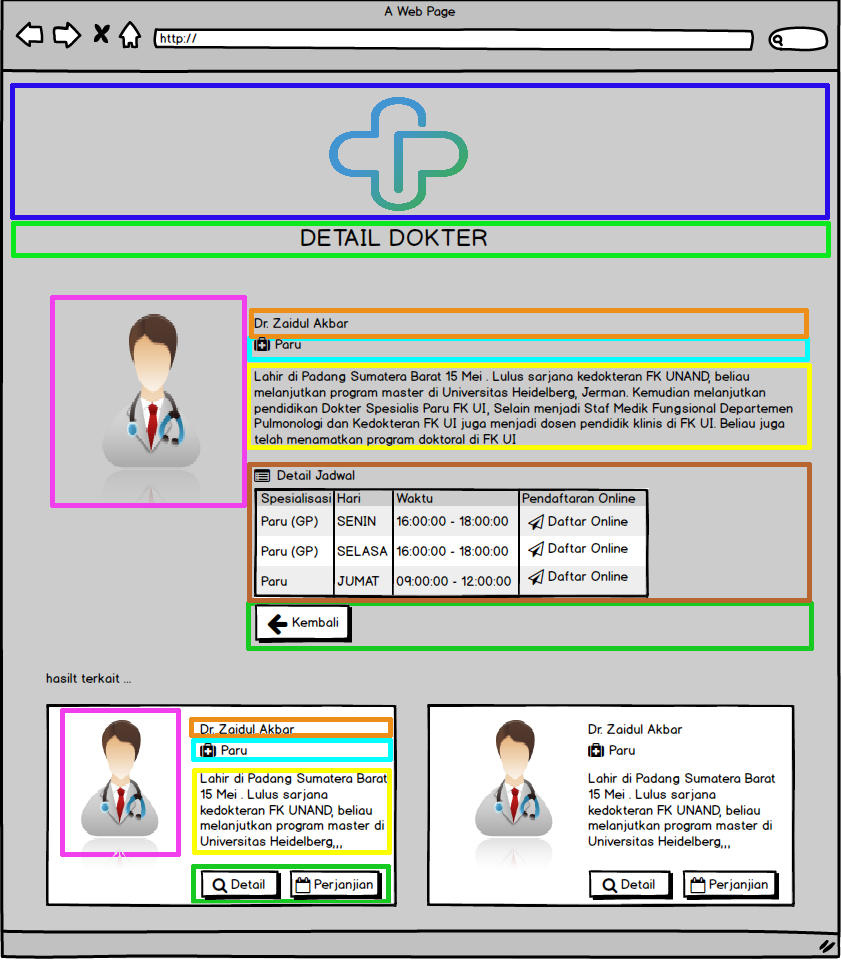

## bismillah

Kebetulan lagi melanjutkan [Project](projek) yang senpet tertunda, belajar ReactJS selama 30 hari, ya itu hasil translate manual gw sendiri, sekalian gw juga belajar, sebelumnya gw tulis dengan format doc/ dokumen word, tapi kurang sreg, akhirnya gw pake tools dokumentasi `docusaurus`, bisa diakses dihalaman ini: [30 Hari Belajar ReactJS](https://30hari.netlify.com/).

Pas dihari ke-4, ada pembahasan mengenai komponen **parent** dan komponen **child** kebetulan di mockup pencarian dokter, belum gw bahas hehehe. ya kesempatan deh gw bisa bahas, kalo mau liat postingannya silahkan cek postingan [mockup-design-aplikasi-pencarian-dokter](mockup-design-aplikasi-pencarian-dokter)

Postingan kali ini kita fokus untuk membagi bagi komponen-komponennya, pada halaman depan misalkan, bisa kita pecah komponen child menjadi 5, sebagi berikut:

> Penjelasan: TODO
