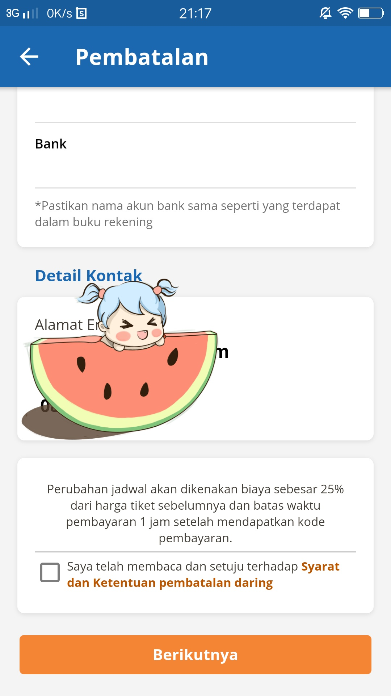

## bismillah

Kebetulan baca berita online danjuga dikasih tau Istri, bahwa Tiket Mudik bisa dikembalikan full 100% tanpa potongan 25% seperti biasa, alhasil gw cari info dan langsung hubungi KAI untuk cari kebenarannya, gw coba email ke alamat ini `cs@kai.id` Pada tgl 25 Maret 2020 dan dibalas kembali pada tanggal 28 Maret 2020 dengan email pengirim `kontak_pelanggan@kai.id`, berikut isinya:

```email
Dear, 

Bukankah pembatalan di masa pandemi corona tidak ada potongan sebesar 25%? 

Mohon kejelasan informasi.  
```

itu gw kirim ke `cs@kai.id`, dan dapat balasan seperti ini:

```text
Yth. Bapak Muchamad,

Terima kasih atas pertanyaan yang Bapak Muchamad sampaikan. Terhitung sejak tanggal 23 Maret 2020, tiket untuk keberangkatan 23 Maret-29 Mei 2020 jika dibatalkan maka dana akan dikembalikan 100%.  

Untuk proses pembatalan tiket dapat dilakukan di stasiun online (stasiun yang melayani proses pembatalan tiket) paling lambat 1 jam sebelum keberangkatan kereta dengan membawa bukti tiket asli, identitas asli dan fotokopi identitas penumpang. Berikut langkah-langkahnya:

• Prosesnya dilakukan di stasiun online yang melayani pembatalan, paling lambat 1 jam sebelum keberangkatan sudah ada di depan loket.
• Mengisi formulir pembatalan.
• Melampirkan identitas asli, fotokopi identitas dan tiket/boarding pass asli.
• Untuk pembatalan yang dilakukan jauh-jauh hari (di luar batas 7x24 jam sebelum keberangkatan) yang dilakukan di stasiun yang sudah memiliki mesin CIC (Check In Counter) maka tidak perlu melampirkan tiket fisik. Cukup langsung ke loket pembatalan melampirkan identitas asli, fotokopi identitas dan kode booking.
• Apabila diwakilkan maka melampirkan surat kuasa bermaterai dari pemilik tiket kepada pemohon untuk melakukan pembatalan tiket beserta fotokopi bukti identitas pemberi kuasa dan yang dikuasakan.
• Jika pemohon pembatalan adalah turis asing maka yang dilampirkan adalah paspor dengan nama yang tertera pada tiket (pengembalian dana langsung secara tunai).
• Jika tiket yang dibatalkan lebih dari satu penumpang namun dengan kode booking yang sama, maka fotokopi bukti identitas dan surat kuasa yang dilampirkan cukup salah satu dari penumpang dimaksud. Jika masih dalam 1 kode booking dan yang bersangkutan juga batal berangkat, maka tidak perlu surat kuasa. Apabila yang hendak membatalkan tetap berangkat walaupun dalam 1 kode booking maka harus dilengkapi surat kuasa.
• Apabila memilih cara tunai untuk pengembalian uang pembatalan tiket, maka di tanggal yang sudah ditentukan penumpang mengambil uangnya ke loket yang sudah ditentukan (seperti yang tertera di formulir pembatalan). Jika diwakilkan silakan membawa surat kuasa bermaterai 6000, formulir pembatalan, fotokopi identitas dan identitas asli atas nama penumpang yang dibatalkan tiketnya.
• Refund secara tunai akan memerlukan waktu 30 hari terhitung setelah tanggal pembatalan.
• Apabila memilih refund secara transfer, mohon membawa atau mencantumkan nomor rekening dan nomor telepon yang dapat dihubungi. Untuk proses pengembalian dana secara transfer akan membutuhkan waktu 30-45 hari.
• Sejak tanggal 01 Juli 2016, pengembalian bea tiket yang dibatalkan secara transfer, ditetapkan rekening bank yang dapat digunakan adalah Bank Mandiri, BRI, BCA, BNI, CIMB Niaga.

Silakan Bapak sebutkan ingin melakukan pembatalan tiket di stasiun mana, agar dapat kami informasikan jam operasional loketnya.

Untuk alternatif lain, pembatalan juga dapat dilakukan melalui aplikasi KAI Access. Berikut langkah-langkah pembatalan melalui aplikasi KAI Access:

 
• Nomor identitas pengguna yang melakukan login harus termasuk dalam data penumpang pada kode booking yang akan dibatalkan. Nomor identitas pengguna juga harus sama dengan yang ada di dalam tiket.

• Dapat dilakukan paling lambat 3 jam sebelum jadwal keberangkatan kereta. Untuk sistem operasi Android adalah versi 4.3.0 dan setelahnya. Untuk sistem operasi iOS adalah versi 25.0 dan setelahnya. Kode booking yang dimiliki harus berstatus "Paid", serta belum dicetak sebagai boarding pass. Jika kurang dari 24 jam maka proses pembatalan hanya dapat dilakukan di loket stasiun online.

• Status pemesanan telah lunas dibayarkan.

• Pada halaman utama KAI Access pilih menu "Tiket/My Ticket" atau "Pembatalan/Cancellation".

• Jika sudah memilih menu "Tiket/My Ticket" atau "Pembatalan/Cancellation" silahkan pilih kode booking yang akan dilakukan pembatalan.

• Pada tampilan E-Ticket pilih nama yang akan dilakukan proses pembatalan, dengan mencentang kolom yang ada pada samping kanan nama penumpang lalu pilih "Pembatalan/Cancellation".

• Pada halaman pembatalan, beri tanda centang untuk penumpang yang akan dibatalkan, lalu isi data:

- Bank Account Name diisi dengan nama pemilik rekening.

- Bank Account Number diisi dengan nomor rekening.

- Penumpang dapat memilih salah satu dari 5 bank yang melayani refund yaitu: Bank Mandiri, BNI, BRI, BCA, dan CIMB Niaga. Klik kolom persetujuan untuk melanjutkan transaksi lalu klik "Lanjut/Next".

• Pada halaman konfirmasi pembatalan akan muncul data perjalanan, akun bank yang digunakan untuk proses refund, serta jumlah pengembalian dana refund. Jika sudah sesuai semua, klik "Batalkan Tiket/Cancel Ticket".

• Proses pembatalan berhasil dilakukan dan pemesanan akan masuk ke menu Histori.

• Untuk pengembalian dana refund secara transfer akan memerlukan waktu 30-45 hari. Silakan menunggu hingga jangka waktu tersebut, jika setelah 45 hari dana belum diterima silakan konfirmasi kembali kepada kami. Apabila refund telah dilakukan transfer, maka akan ada SMS ke nomor handphone yang dicantumkan saat proses pembatalan.

Demikian kami sampaikan. Apabila Bapak Muchamad masih membutuhkan informasi atau memiliki saran, keluhan mengenai layanan PT. KAI, Bapak dapat menghubungi Contact Center 121 (layanan 24 jam) di nomor telepon 121/021-121 atau email ke kontak_pelanggan@kereta-api.co.id, akun Twitter: @kai121 dan Facebook: KAI121. Atas kerja sama yang baik kami ucapkan terima kasih.


"Anda adalah Prioritas Kami"

Salam Hormat,

Customer Relation & Digital Community 121

PT Kereta Api Indonesia (Persero)

Telepon : 121 / +6221-121

KAI121 | @KAI121 | www.kereta-api.co.id 
```

itu pengirimnya `kontak_pelanggan@kai.id`

---

Tunggu, ada point yang utama agar dapat 100% FULL, diantaranya:

1. **23 Maret-29 Mei 2020** Itu Range Tanggal Tiket Keberangkatan yang bakal REFUND FULL 100%
2. Prosesnya Wajib Dateng **Ke Loket Pembatalan** (Di Stasiun Gambir Tersedia). 😪😪😪
3. Tersedia Pengembalian **Tunai**, lebih cepat, 30 HARI saja, Jika **Transfer** 30-45 HARI.
4. Alternatif Retrun Melalui Aplikasi KAI Access.

Ohya, untuk melalui aplikasi KAI masih ada catatan 25% potongan, jadi gw masih confirmasi dulu ke mereka, karena kalo melalui Loket Pengembalian di Gambir, gw ngeri ngeri sedap dengan Pandemi Covid19 ini.



Have a nice day!
