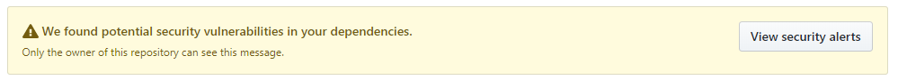
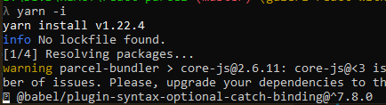

Bismillah...

Kebetulan kita project belajar gw ada notif error getu, kayak gini:


Alhasil kita harus install ulang modules yang di node, disini gw pake yarn sebagai package manager.

```bash
rm -rf node_modules .yarn-lock
```

Kalo udah, install deh dengan perintah `yarn -i`


Done!

Simple kan.

[SOURCE](https://itnext.io/fixing-security-vulnerabilities-in-npm-dependencies-in-less-than-3-mins-a53af735261d)
