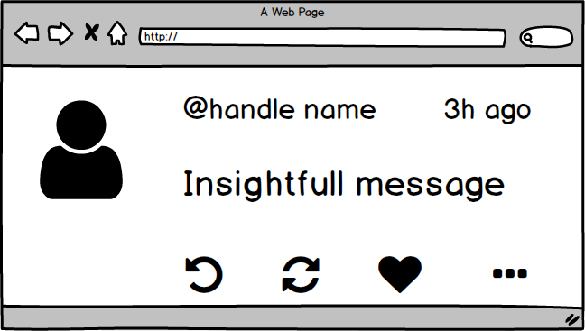
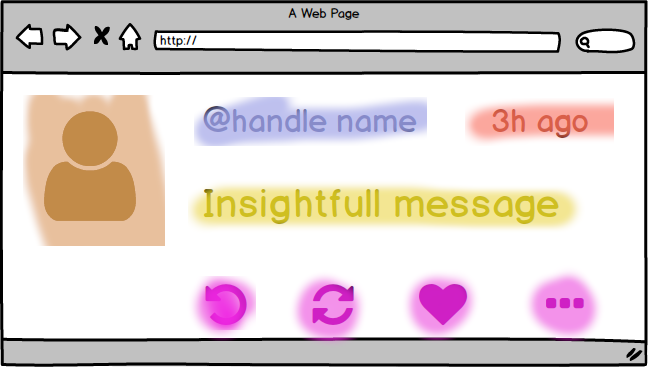
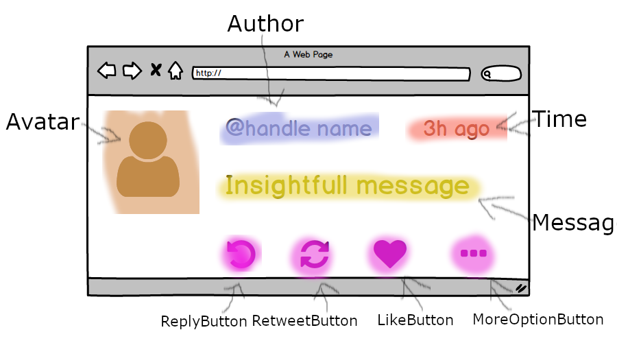
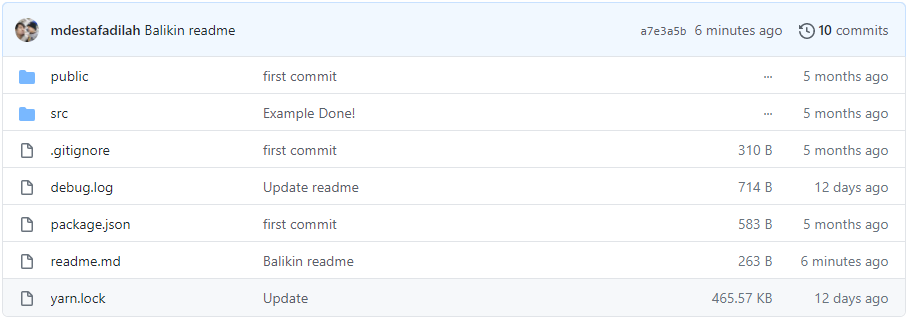
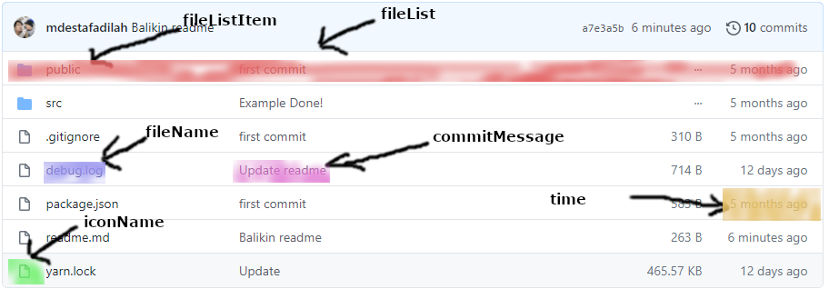

Bismillah...

Kebetulan lagi baca buku penulis [Davidceddia](https://daveceddia.com/pure-react/) tentang PureReact, ya sekalian aja gw jadiin postingan, soalnya ada project sederhana yang bisa gw share dan gw sembari belajar juga, dengan konsep [ATM (Amati-Tiru-Modifikasi)](konsep-belajar-atm-amati-tiru-modifikasi) dan hasil ketikannya gw taro dihalaman ini

`https://github.com/topidesta/purereact`

Baiklah, lanjut ya, ada catatan dari om david, ketika membuat sebuah komponen buat 4 langkah sederhana, yaitu

1. Buat sebuah **sketsa** (gw gunakan balsamiq mockup)
2. Membagi sketsa tersebut ke **komponen**
3. Tambahkan **nama** untuk setiap komponen
4. Baru tulis ke **kode**!

---

## ✔️Komponen Twitter

Baiklah, project pertama yaitu pembuatan komponen twitter

### 1. Buat sebuah sketas dahulu

### 2. Bagi-bagi sketsa dengan pewarnaan

### 3. Kita berikan nama setiap komponen

Setiap nama akan menjadi komponen, dan **A Web Page** akan menjadi _parent component_ dari semuanya, terdiri dari:

- A Web Page
  - Avatar
  - Author
  - Time
  - Message
  - ReplyButton
  - RetweetButton
  - LikeButton
  - MoreOptionButton

Lanjut kita bangun masuk fase ke-4.

### 4. Mulai Koding!

Kita bisa menentukan tehnik, **(Top - Down) atau (Bottom - Up)**

Misalkan kita buat dari Top ke Down, #1: Buat komponen _Web Page_, lalu buat komponen children, seperti avatar, author, time dan seterusnya.

Misalkan kita buat dari Bottom ke Up, #2: Buat komponen avatar, author, time dan digabungkan, dicek lalu gabung dengan komponen _Web Page_.

> Untuk hirarki yang sederhana, mana aja sih bisa, tapi kalo yang ruwet bisa dimulai dari bawah, buat dari yang terkecil lalu bungkus dan gabungkan dengan komponen lainnya dan juga mempermudah ujicoba dengan tools Jest dan Enzyme.

Untuk source ada di branch tweet:

`https://github.com/topidesta/purereact/tree/tweet`

---

## ❌Komponen List Github

Baiklah, Contoh dari Project Twitter kita melakukan 4 langkah, diantaranya:

1. Mulai dengan Skema/ Sketsa/ Mockup
2. Bagi kebeberapa bagian komponen
3. Beri nama komponen tersebut
4. Mulai bangun!

Kurang lebih tampilannya (mockup) akan seperti dibawah ini

Selanjut kita bagi kebeberapa bagian, seperti ini

Selanjutnya kita berinama dalam bentuk hirariki (top-down)

- fileList
  - fileListItem
    - fileName
      - fileIcon
    - commitMessage
    - Time

Penjelasan: next ... 

---

## ❌Komponen Shooping

---

[TOOLS]():

1. VSCodium
2. Balsamiq Mockup Desktop
3. GIMP
