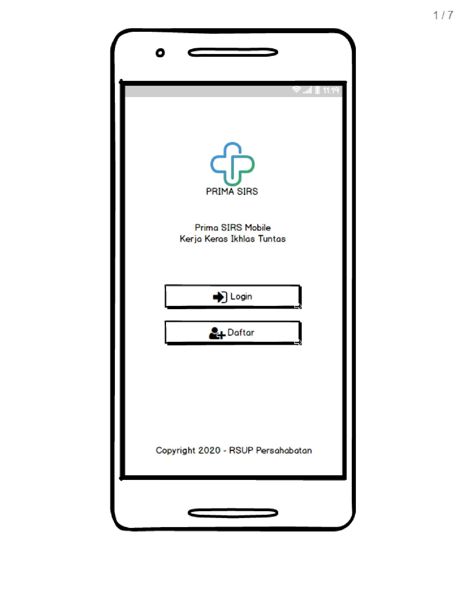
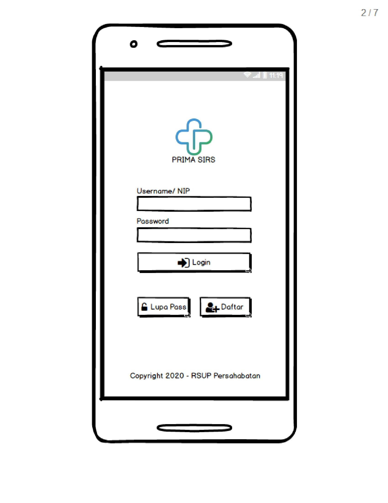
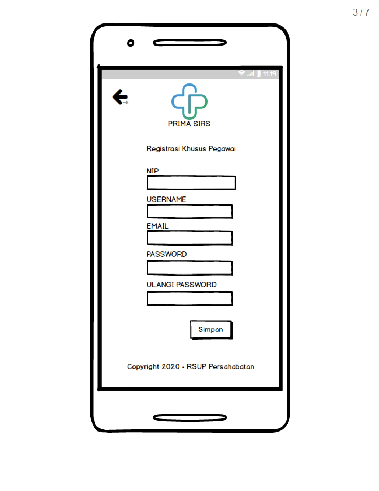
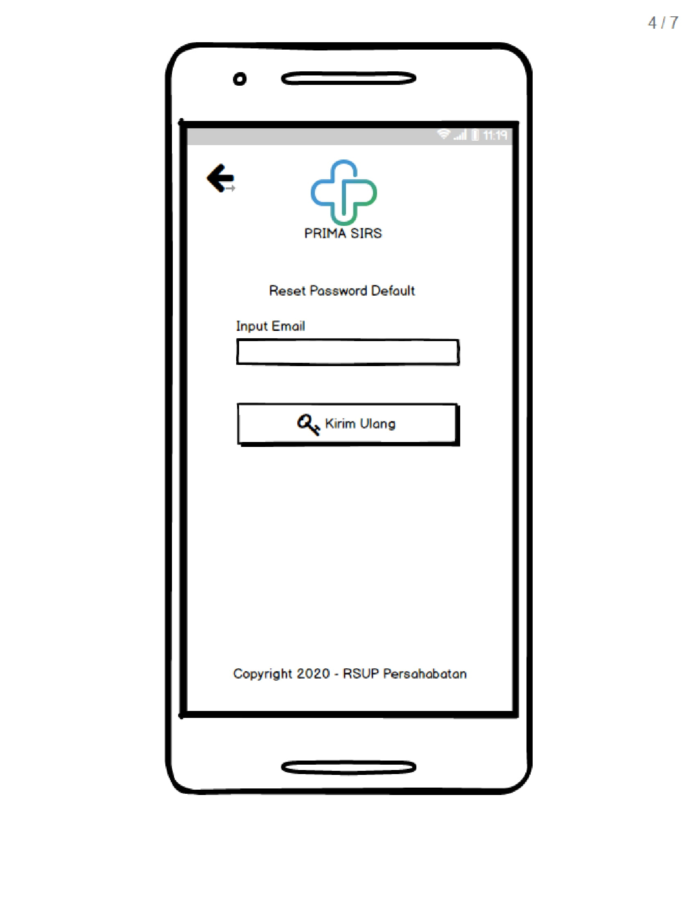
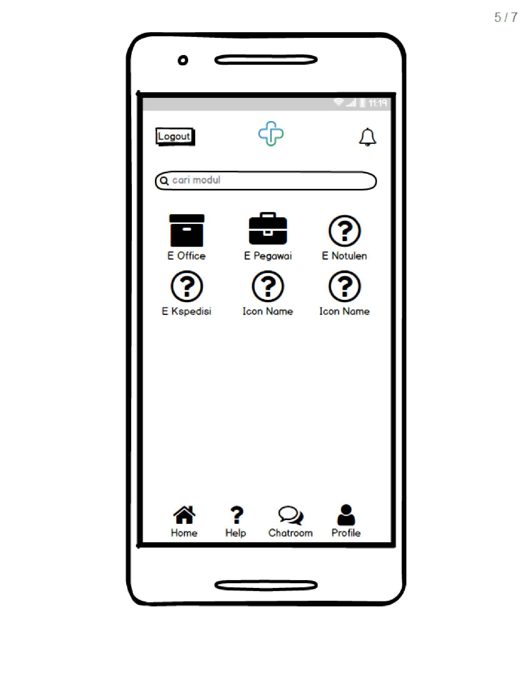
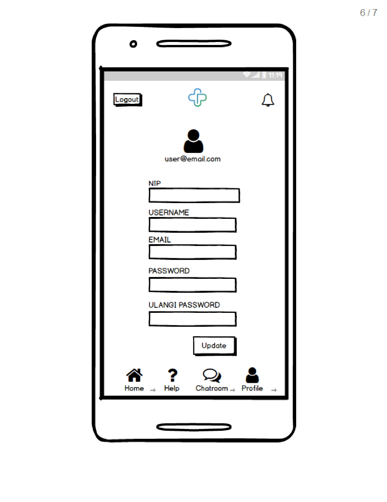

Bismillah

Kebetulan pencarian dokter sudah kelar, sekarang mau buat Prima versi Mobile dengan teknologi React Native, rencannya setiap module yang existing prima web, nanti mau gw buat **Package NPM** jadi setiap developer mengembangkan sesuai kebutuhan tanpa harus install semua module (pilih package sesuai kebutuhan yang diubah), hems... nice idea? ya, gw juga kudu belajar neh, mantap, balik lagi ke judulnya ... yaps, gw cuman sedikit share ajah, soalnya sekalian buat prototive gw sih, karena diruangan belum ada kesempatan buat menjelaskan dan sedikit ada waktu buat sharing, baiklah, ini di beberapa mockup yang udah gw coba buat.

### Halaman ketika dibuka pertama kali

### Ketika mengklik Login

### Halaman daftar Pegawai

### Halaman lupa email/ password

### Halaman Dashboard

### Halaman Profile Pengguna

---

Semuanya masih mockup, tambahan seperti _animation_, _background color_, dll. itu bisa nanti berjalan, baiklah, di **Halaman Dashboard** terlihat beberapa module dan seperti yang dijelaskan sebelumnya, module itu nanti akan gw bungkus menjadi package dengan **private source**, Semoga kepala ruangan gw baca kelebihan dan kekurangan memanfaatkan Git sebagai server cloud.

Baiklah, sekian informasinya.

Have a nice day.
