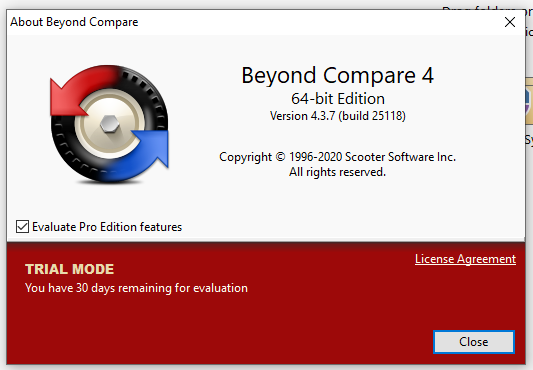

Bismillah

Kalo ini gw mau share compare tools buat para developer sangat bagus neh, terutama kalo servernya tidak memanfaatkan GIT setiap perubahan melainkan merge manual di lokal server, dimana setiap perubahan harus manual dicompare dan diwindows biasa pake **Beyond Compare 4** dan dilinux ada yang free, gw lupa, kurang lebih seperti ini.



Kalo lo punya duit, mending beli seharga $60 ... tapi kalo gak punya mending pake trick gw, ada 2 tools dengan trick yang sama, yaitu menghapus register **TRIAL MODE** si beyondcompare.  Berikut ini tools yang bisa gw share

1. Buat File CMD
2. Jalankan File EXE

```bash
reg delete "HKCU\Software\Scooter Software\Beyond Compare 4" /v CacheID /f
```

Done.

Sumber: 
1. https://gist.github.com/zsoumya/f7e8c6edc31ccedc7d51b0b1747b4f9f
2. https://www.youtube.com/watch?v=nQSRspyVYYA

Have a nice day.
