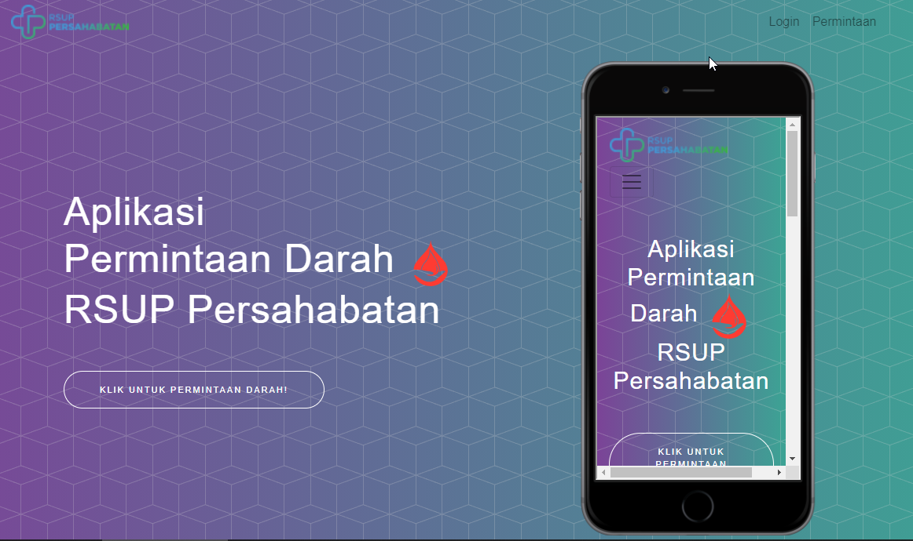

Bismillah

Sekedar mau share ide, setelah sebelumnya sudah selesai mengerjakan aplikasi sampingan maksudnya aplikasi dikantor gw juga, tapi gak jadi prioritas (melihat kondisi dilapangan, akhirnya gw kasih ide ke unit tersebut, dan masih bahasan user ke user, belum permintaan dari unit), maklum ide gw kadang gak terlalu diperhatikan jadi ya gw tulis diblog ajah, hehe. 

Yap, module bankdarah dikantor gw ada yang dibangun untuk unit tersebut, dan sekarang lagi zaman covid19 sivirus dari cina daratan yang  Kebetulan bankdarah dikantor gw juga memproduksi darah yang bisa di order/ permintaan dari rumah sakit lain, gw tanya prosesnya, dan ternyata gw kasih ide ini bisa kita ringkas prosesnya, unit cukup memvalidasi saja gak perlu isi data dasar, biar mereka (orang yang perlu darah) yang isi datanya, dan diterima.

`https://bankdarah.netlify.app/`

konsepnya sederhana kalo gw cermati dari unit bankdarah, unit hanya perlu data pasien (asal) dan darah apa yang diperlukan, yang jadi masalahnya, pasien plek dateng dengan berkas banyak, dan unit yang isi juga (ini yang bikin lama proses nyiapin darah).

Dan terciptalah ide ini, karena hanya form sementara, next ada fungsi login berdasaran **KTP** dan **Nomor Telpon** yang terdaftar, sehingga pasien cukup login dan request, tanpa isi data ulang.

Beberapa stack yang gw pake, dan ini bukan orisinil gw, inget konsep bekerja dan belajar gw itu ATM (Amati-Tiru-Modifikasi), jangan heran yoo...

## Teknologi

1. ReactJS (CRA Template ~Fronted)
2. Netlify (Domain dan Production Stage)
3. Github (Hosting ~private source)
4. Codeigniter 3 (Pengatur Data ~Backend)

### Library
#### Frontend

1. React
2. Bootstrap
3. Redux etc (Sekedar belajar, pilihan lain bisa pake MobX)
4. Axios
5. React Hook Form
6. Yup
7. HTML5 Mockup
8. React Client Captcha
9. NIK Parser
10. Node SASS (CSS System)

#### Backend 

1. Codeigniter 3
2. REST Server
3. JWT Firebase
4. Etc

Done, selanjutnya gw rencanya mau buat mobilenya, yang bisa untuk Android dulu, karena kalo untuk iOS gw harus punya MacOS dengan dibantu teknologi React, ya React Native. 

Have a nice Day!