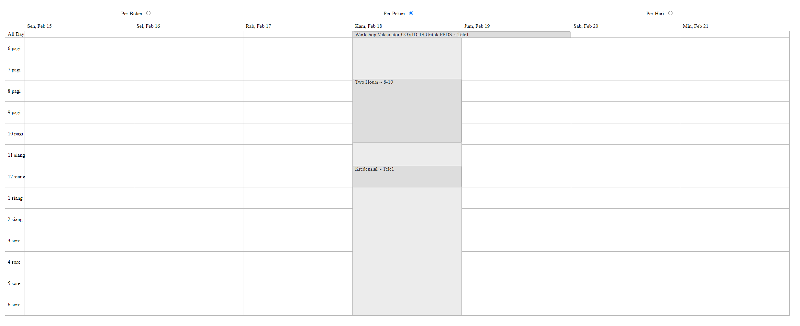

Bismillah

Sekedar mau share ide, aplikasi jadwal zoom sederhana sekali.

`https://jadwalzoom.netlify.app/`

konsepnya sederhana biar enak dipandang ajah. Beberapa stack yang gw pake, dan ini bukan orisinil gw, inget konsep bekerja dan belajar gw itu ATM (Amati-Tiru-Modifikasi), jangan heran yoo...

## Teknologi

1. ReactJS (CRA Template ~Fronted)
2. Netlify (Domain dan Production Stage)
3. Github (Hosting ~private source)
4. Codeigniter 3 (Pengatur Data ~Backend)

### Library
#### Frontend

1. React
2. Dayz
3. Redux etc (Sekedar belajar, pilihan lain bisa pake MobX)
4. Axios
5. Node SASS (CSS System)

#### Backend 

1. Codeigniter 3
2. REST Server
3. JWT Firebase
4. Etc

## TODO:

1. Tampilan dengan Styled-Components/ Emotion/  
2. Bikin Fungsi Service API REST
3. Added Redux

Have a nice Day!