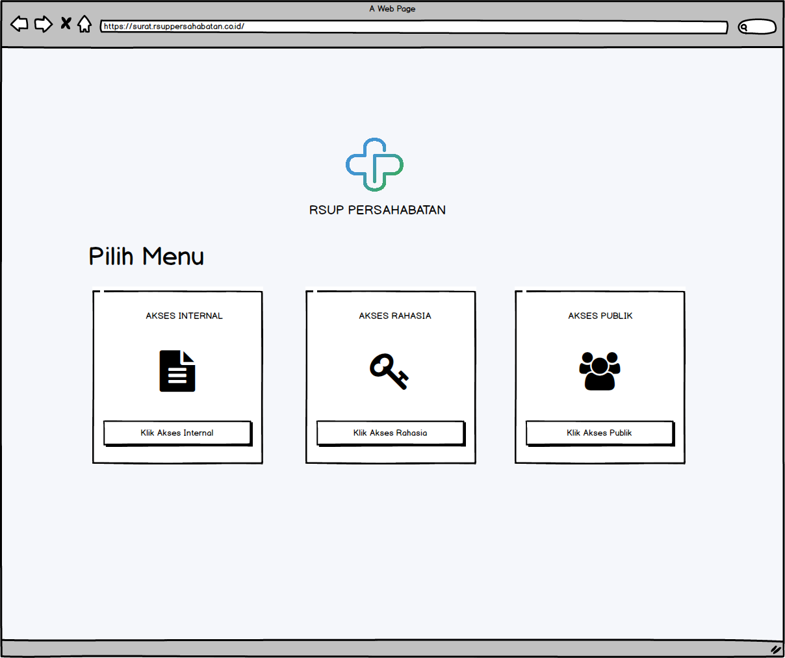
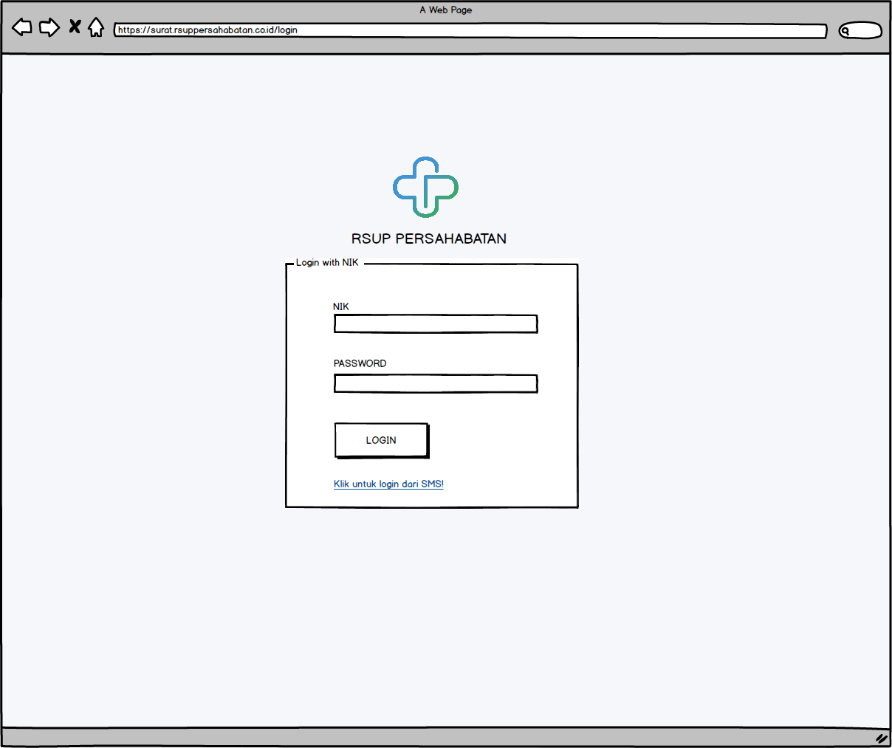
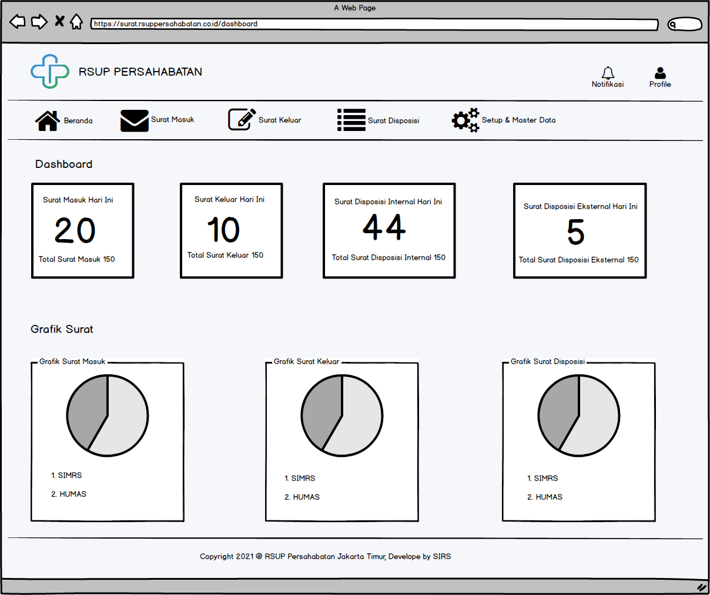
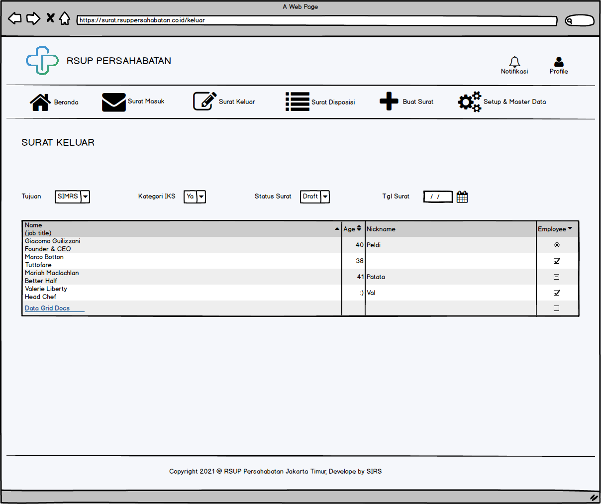
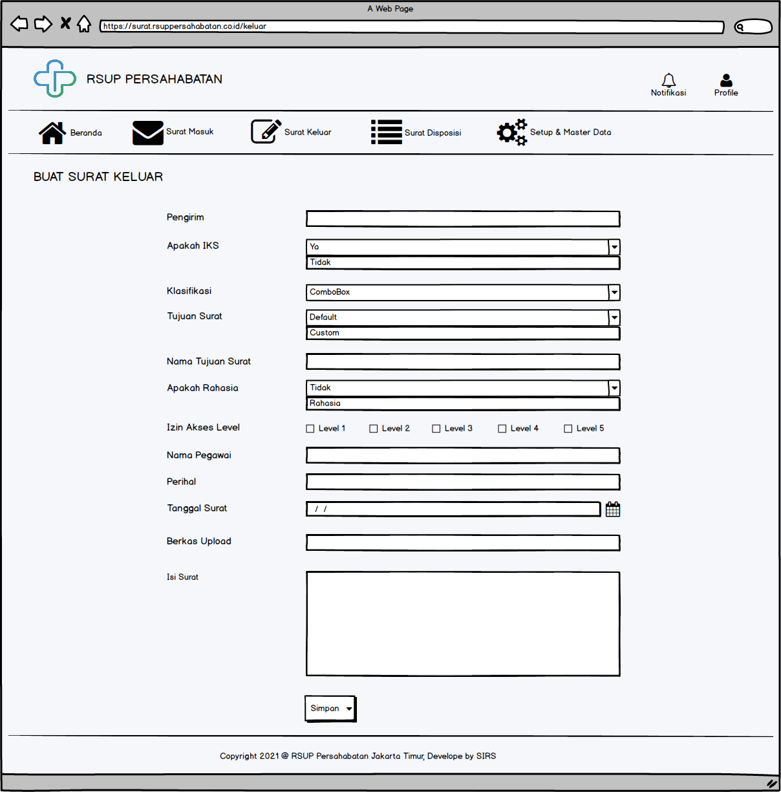
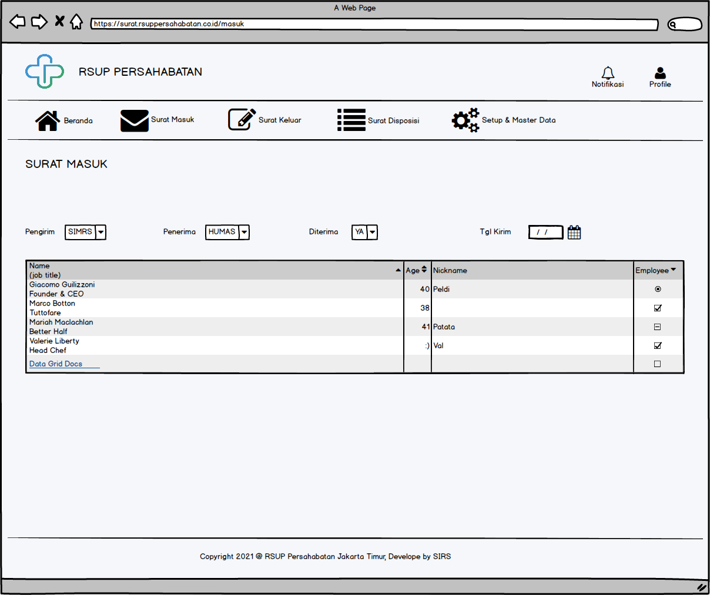
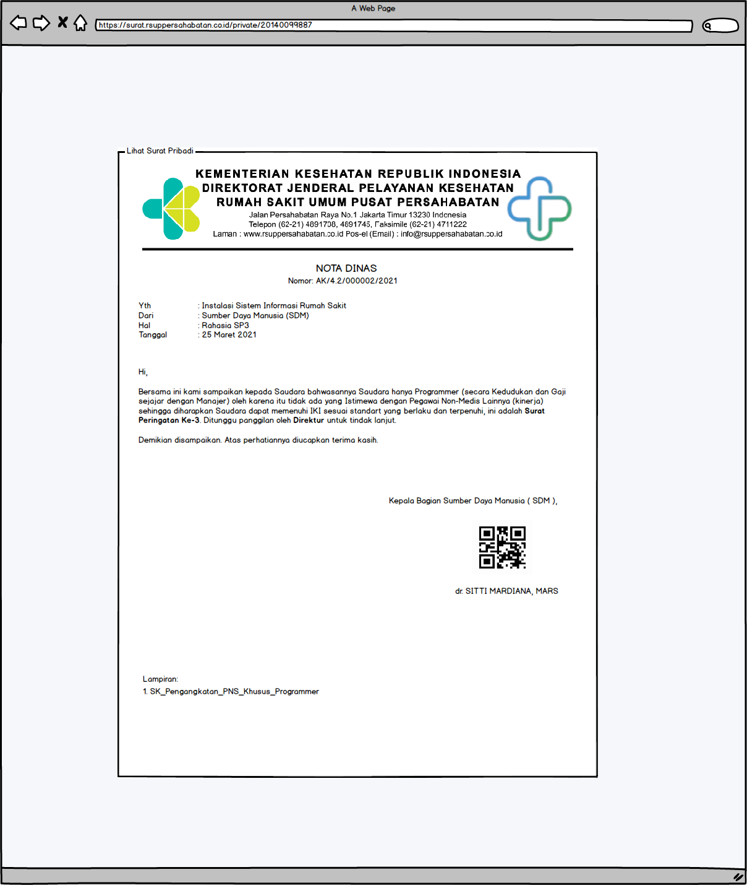
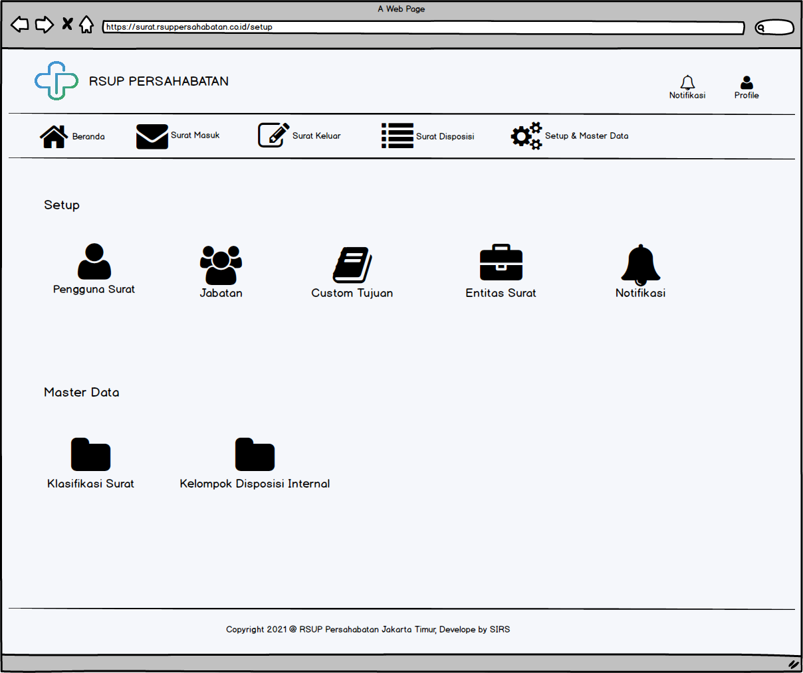

Bismillah

Mau share mockup, sebetulnya sudah jadi hasil mockupnya sekitar (70%) cuman nanti gw share lewat vidio ya, karena aplikasinya bersifat private (hanya untuk kalangan sendiri, kalo tertarik silahkan PM) sekarang gw mau share mockup/ design sederhana nyah dulu, yang bersifat web base.

### Landingpage Login 

### Form Login (dengan NIP)

### Form Login (dengan SMS)

### Form Login (Verifikasi OTP)

### Form Lihat Surat Pribadi

### Halaman Dashboard

### Halaman Surat Keluar

### Halaman Tulis Surat

### Halaman Surat Masuk

### Halaman Lihat Surat

### Halaman Setup & Maste Data

Sebetulnya masih ada lagi, ini yang sudah gw implementasikan ke web-base, jadi mockup ini saja yang gw share ya, nanti akan ada update lagi, tetap semangat.

Have a nice Day!