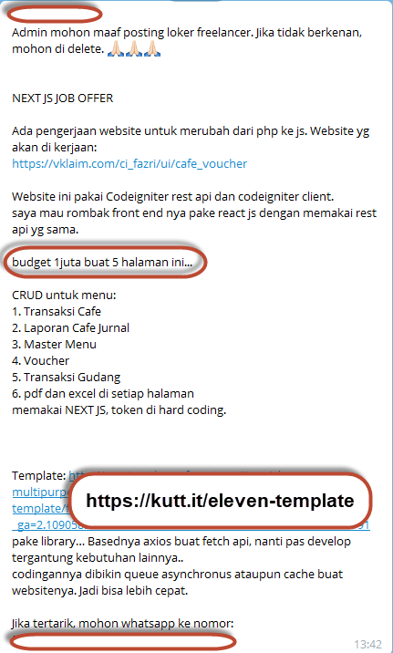
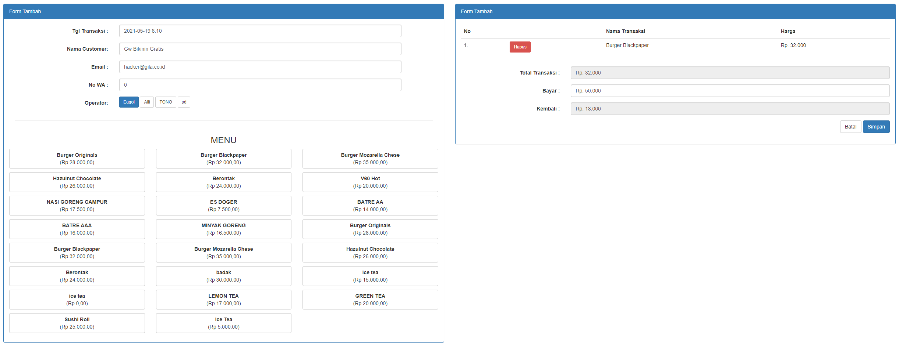
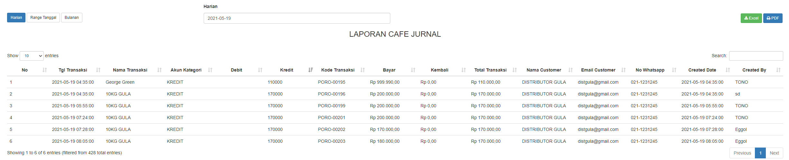
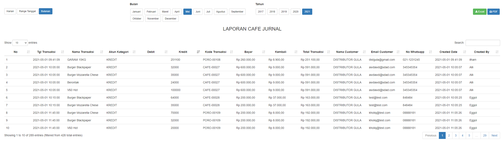
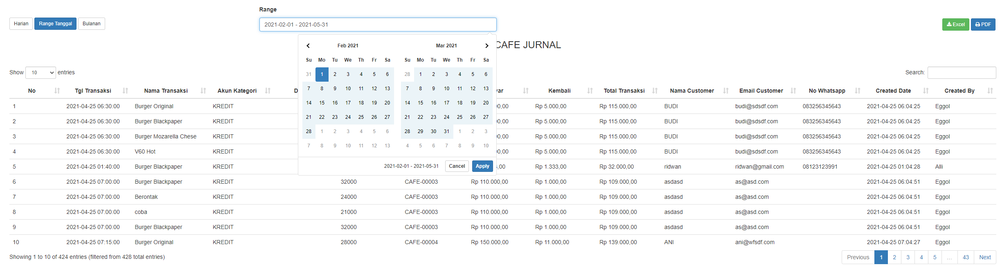
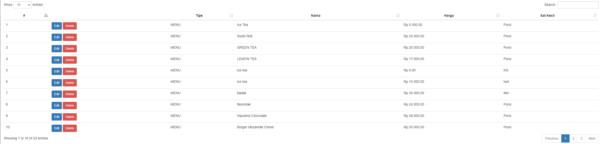
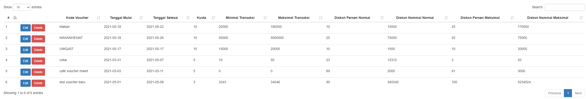
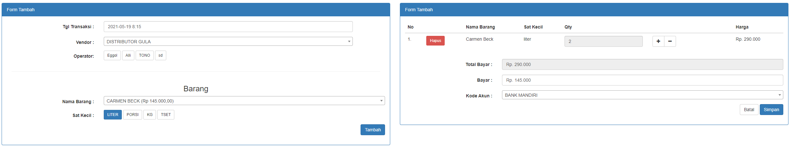
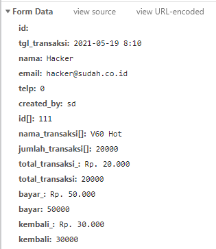

Bismillah ...

Sebetulnya gw lagi Gabut banget, gak semanget tuh dikantor juga (gegara THR) dan dapet penawaran kerjaan Remote 3x tapi belum ada yang berhasil belum rezeki kali yah atau sholat dhuhaa gw kurang kuat?!.
kali ini gw mau share ide, belum gw kerjain tapi akan gw kerjakan dan gw share demonya nanti sekaligus sourcecodenya (insyaAllah), ide ini didapat dari Group Telegram yang share tentang Freelance, tapi dihargainnya murah banget kayak kacang goreng, meskipun CRUD (copy paste dari google juga bisa) mungkin itu yang difikirkan kali, masalahnya ini *Waktu* dan *Usaha*, ini gw kasih ScreenSootnyah.

Coba itu lo lihat deh, 1 Juta buat 5 Halaman? tunggu, kan dishare templatenya juga, iya sih udah ready (emang gak perlu dipelajari, butuh waktu kan?) kalo penasaran ini link templatenya (reactjs f/w nextjs). Katanya cuman Frontend karena backend sudah dibuatkan (Gak Perlu backend, pake fake backend juga bisa, sebetulnya). 

[Template Admin](https://kutt.it/eleven-template)

Untuk yang mau nyari versi Gratis Template (Nulled) bisa kunjungin postingan gw yang pernah gw share, pasti ada, coba cek [dihalaman ini](daftar-website-penyedia-script-nulled) tapi saran gw kalo nanti diakses public mending lo beli deh, hitung hitung menghargai Developernya (hanya 14$), kurang lebih 200K.

## Mockup

Si pemberi Freelance juga kasih halaman mockup tampilan yang sudah dikerjakan dengan Codeigniter, berikut ini gw share ya hasil screenshoot.

1. Transaksi Cafe

2. Laporan Cafe

    2.1 Laporan Harian

    

    2.2 Laporan Bulanan

    

    2.3 Laporang Tanggal

    

3. Master Menu

4. Master Voucher

5. Transaksi Gudang

6. PDF/ Excel (Tambahan)

## Demo

**on progress**

Sekian, Update selanjutnya dihalaman ini ya.

Have a nice day!