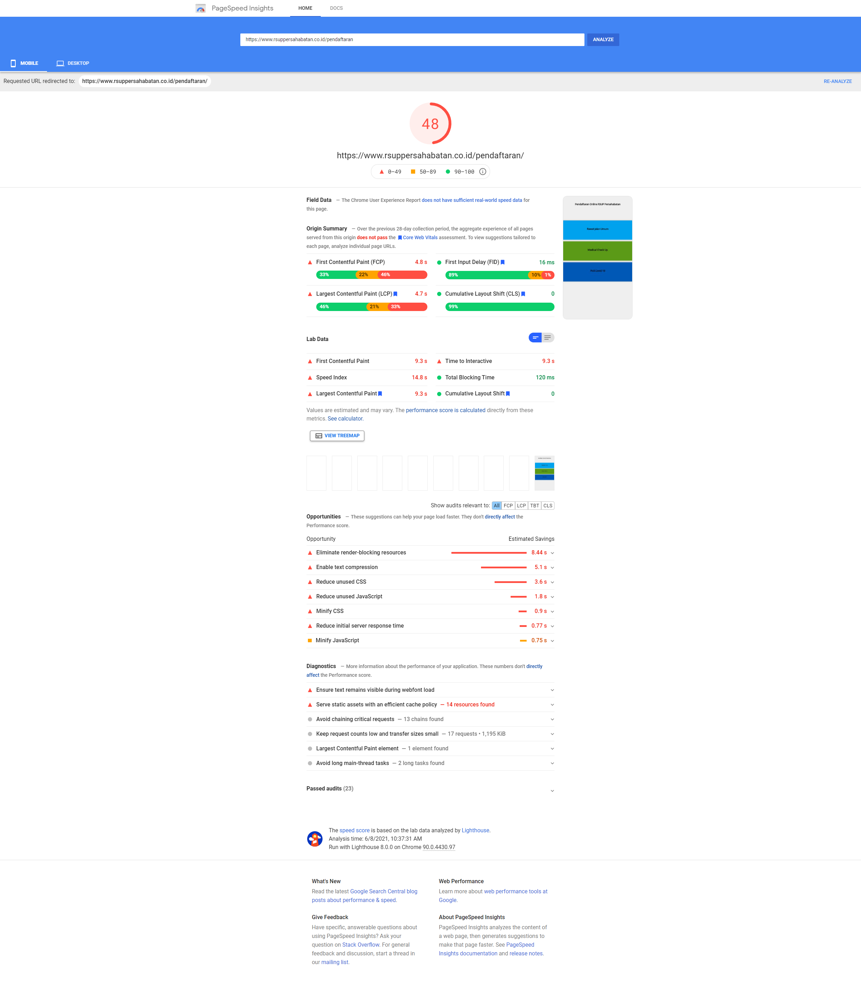
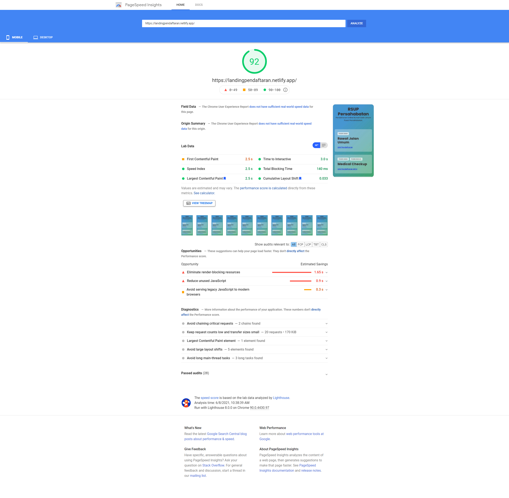
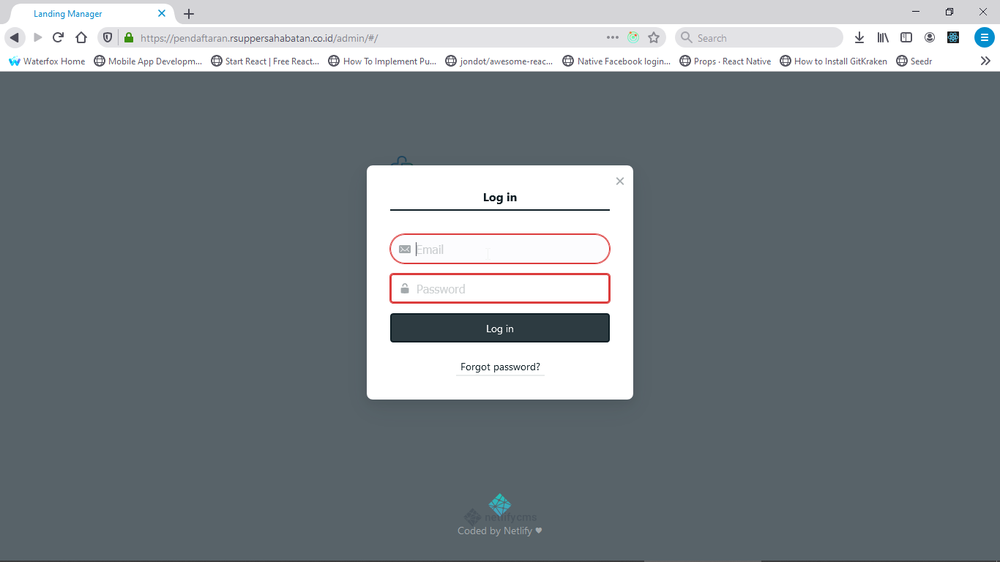
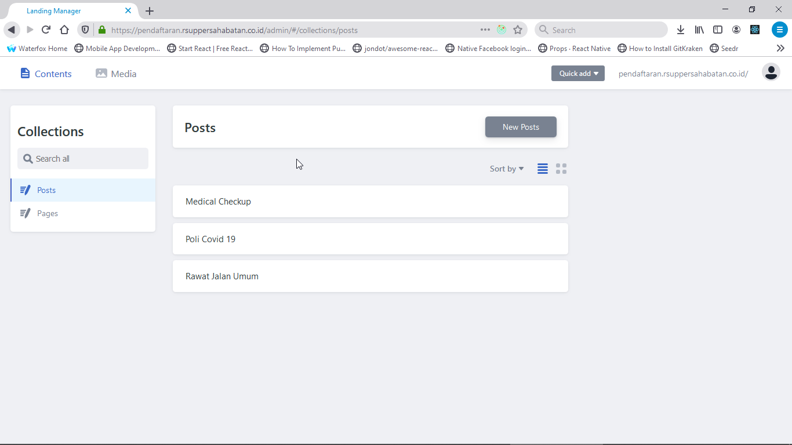

Bismillah

Sekedar mau share hasil [ATM (Amati-Tiru-Modifikasi)](projek) yang diadaptasi dari GasbyJS, dengan menggunakan Template [Gasby Glasess](https://github.com/yinkakun/gatsby-starter-glass.git), alasannya karena halaman sebelumnya bersifat statis dan pagerange dari google lumayan kecil, dan penambahan harus hard-code.

> Untuk review dari Google Speed, ini untuk landing-page versi Pertama: [48](https://developers.google.com/speed/pagespeed/insights/?url=https%3A%2F%2Fwww.rsuppersahabatan.co.id%2Fpendaftaran)

> Untuk review dari Google Speed, ini untuk landing-page versi Kedua: [92](https://developers.google.com/speed/pagespeed/insights/?url=https%3A%2F%2Flandingpendaftaran.netlify.app%2F)

Kenapa harus diubah? beberapa kelebihannya diantaranya:

1. Waktu Load Data Kecil
2. Penambahan Data Mudah (Menggunakan NetlifyCMS)

Udah Segitu ajah, dan sesederhana itu, kalo mau cek silahkan ke halaman ini:

`https://landingpendaftaran.netlify.app/`

Beberapa stack yang gw pake, dan ini bukan orisinil gw, inget konsep bekerja dan belajar gw itu ATM (Amati-Tiru-Modifikasi), jangan heran yoo...

## Teknologi

1. Gatsby for Static Site Generation
2. Netlify CMS for content management
3. Styled Component for styling

Done.

Have a nice Day!
