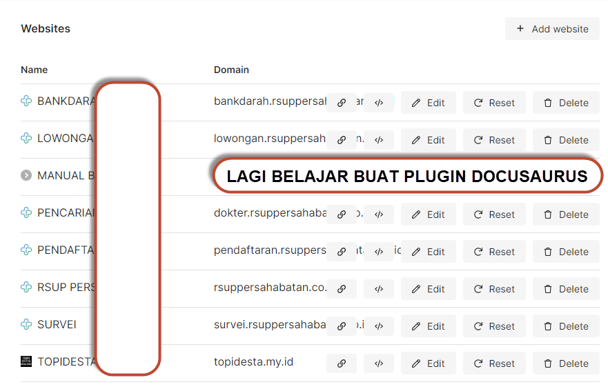
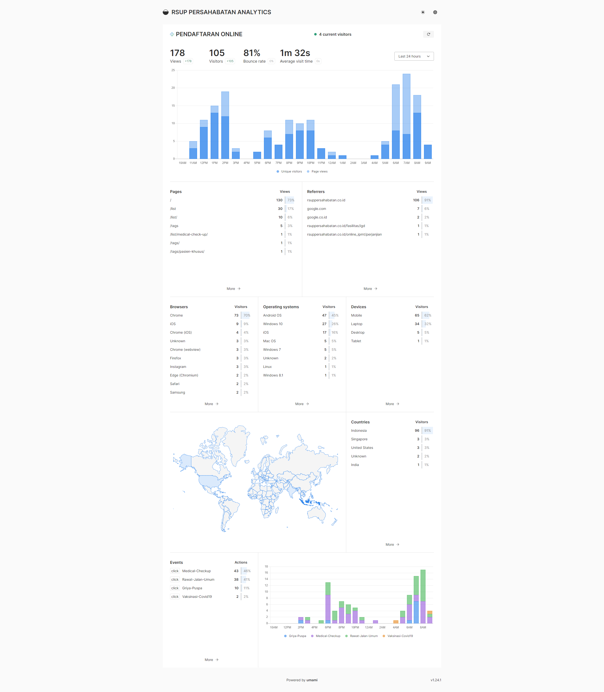

Bismillah ....

Biasanya setiap orang akan memanfaatkan Google Analytics sebagai Default untuk tracking website, termasuk salah satu project gw, landing pendaftaran online, kenapa gak pake google? sebetulnya enakan pake google sih, terserah deh datanya mau diapain, hehe...  tapi, karena gw React mindset haha ... jadi pas ada Developer yang buat aplikasi dengan React (NextJS Framwork) yaitu Umami dan kebetulan juga tools analytics, langsung aja Install, mudah dan gampang!

Untuk detailnya berikut ini project yang gw install umami

Bahkan project Umami ini terbilang baru loh tapi sudah aktif pengembangannya, oya, kebetulan ada 1 project gw yang pake Docusaurus (Dokumentasi tools) tapi belum ada pluginnya, sekalinya ada itu plugin untuk google analytic, dan gw males pakenya hehe, terlihat disana **LAGI BELAJAR BUAT PLUGIN DOCUSAURUS** hehehe, sabar ya, nanti kalo sempet gw buat kalo gak sempet pake yang developer lain buat, hehe. *developerMales detected!.

Tapi gw udah posting di Official Github Umami terkait plugin/ tools yang dibuat untuk Umami.

> https://github.com/mikecao/umami/issues/878

Oya, kalo mau contoh tampilannya silahkan akses ke [landing pendaftaran](https://live.simrspersahabatan.co.id/share/XMQMDVbJ/PENDAFTARAN%20ONLINE) ya.

Oke sekian pembahasannya, next mungkin gw share juga hasil plugin docusaurusu ya, doakan ya. 

have a nice day!