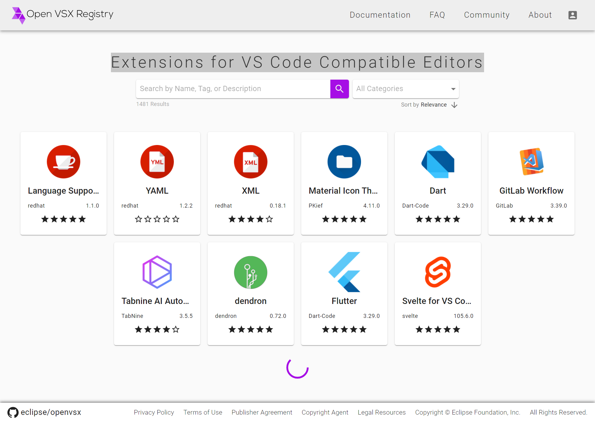
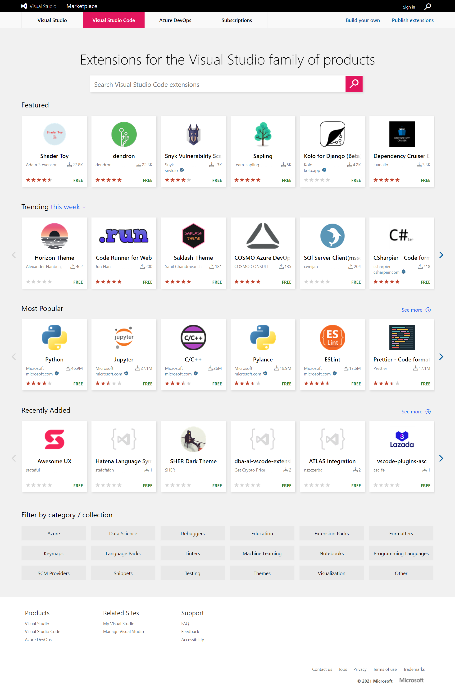
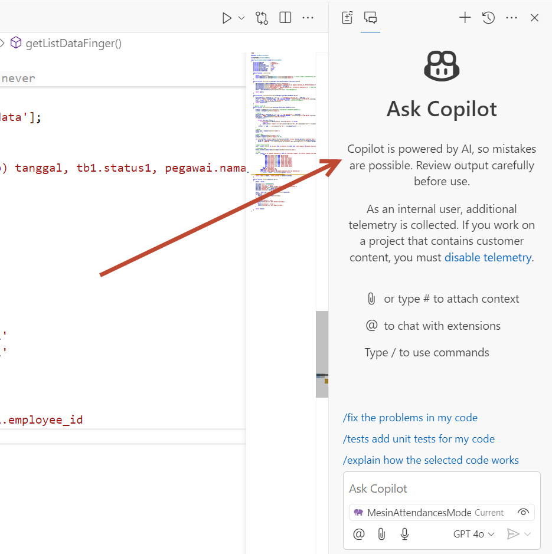

Bismillah ....

Kebetulan blog ini cuman sekedar share keanehan yang gw alami pas install VSCodium di windows 10 di Laptop. Ini detail VSCodium yang gw install.

```
Version: 1.62.3 (user setup)
Commit: ccbaa2d27e38e5afa3e5c21c1c7bef4657064247
Date: 2021-11-19T00:29:50.377Z
Electron: 13.5.2
Chrome: 91.0.4472.164
Node.js: 14.16.0
V8: 9.1.269.39-electron.0
OS: Windows_NT x64 10.0.19042
```

Keanehannya ituh gw gak bisa lagi install **workspace-explorer**, padahal sebelumnya bisa, gw install di PC dengan detail versi yang sama, alhasil gw coba cari tau dan ternyata, betul dugaan gw, ada 2 website penyedia extenstion untuk vscode variant.

untuk instalasi vscodium yang dilaptop itu diarahkan ke [open-vsx.org](https://open-vsx.org/) bukan lagi ke [marketplace-vscode ](https://marketplace.visualstudio.com/vscode), alhasil gak ketemu deh extenstion yang gw butuhin, cuman kita masih bisa install dengan format **.vsix** kok.

Keduanya memiliki moto yang berbeda, tapi punya manfaat yang sama. hehe.

> https://open-vsx.org/
> Extensions for VS Code Compatible Editors



---

> https://marketplace.visualstudio.com/vscode
> Extensions for the Visual Studio family of products



Berikut ini gw share tools yang gw pake dalam format **.vsix** silahkan akses githubnya ya.

> https://github.com/topidesta/vscodium-ext-for-fullstack-dev


## Update

Github Copilot di Vscodium.




Have a nice day!