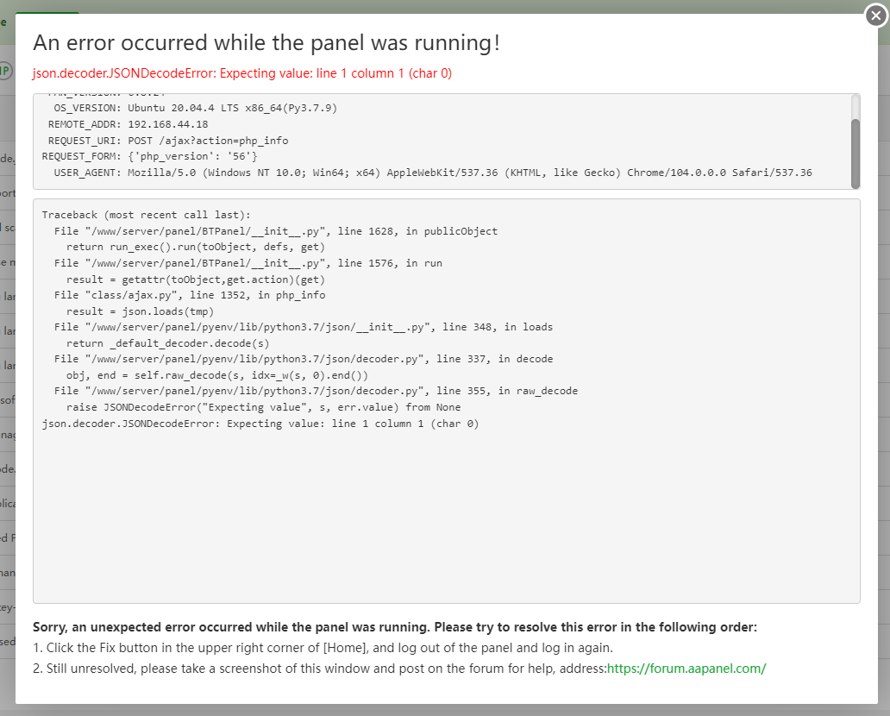
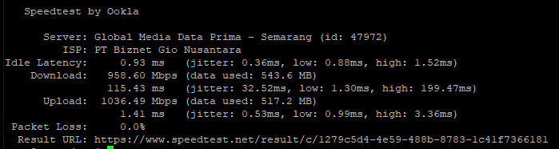
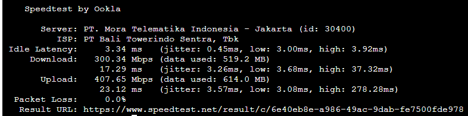
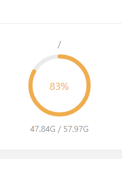
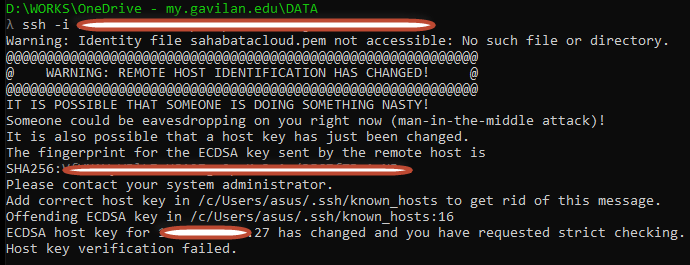
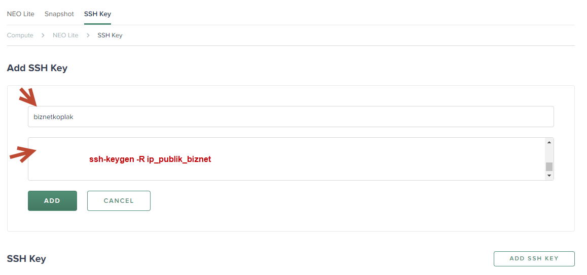
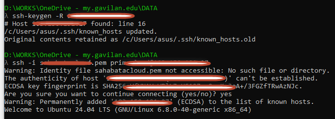
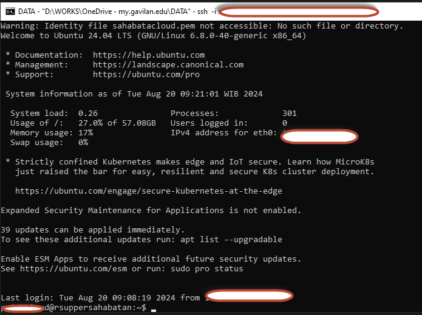
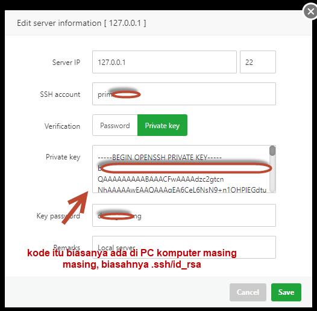

Bismillah ....

Baru kesempatan nulis lagi, karena belakang ini load pembuatan modul sekaligus aplikasi (UTDRS/ Mini PMI) ditambah Setup Server untuk domain `persahabatan.co.id` yang digunakan untuk Staging Area Pengembangan Aplikasi Programmer lainnya dan berbagai kesibukan offline (bermain dengan anak dan istri, hehe) bikin lupa untuk nulis hal tekhnis hehe...

Share kali ini gw mau bahas tentang Membangun server VPS untuk berbagai aplikasi, mulai dari PHP, NodeJS, Python hingga Golang. Mungkin bahasan yang sama di halaman ini juga, terutama mulai persiapan hingga siap digunakan. Sekedar informasi, sebelum menggunakan panel yang sekarang [aaPanel](https://www.aapanel.com?referral_code=FDoEEhxd) gw udah coba install [NasiHosting](https://github.com/kurniawandata/nasihosting.git) dan explorer beberapa panel namun, melihat support, akhirnya apanel pilihannya.

Untuk Project jadi, ada dihalaman ini https://persahabatan.co.id/ dan https://dev.persahabatan.co.id/ untuk bahannya kurang lebih sebagai berikut:

1. VPS dengan IP Publik
2. Ubuntu Server 20.04
3. AAPanel (Free Forever, Plugin Pro Bayar!)
4. DNS CloudFlare (Free-Tier Version)

Yaps, 4 bahan itu yang akan membantu kita membangun sebuah server yang sederhana yang bisa kita gunakan untuk kebutuhan pribadi (bukan untuk dijual lagi sebagai hosting ya). Kita bisa buat aplikasi Multi PHP Version, mulai dari Framework sampai CMS yang terkenal, bisa multi NodeJS atau aplikasi Statis Javascript, Python hingga Golang pun bisa... mantap kali kan... haha, untuk Docker hanya Pengguna Profesional alias Berbayar.

## Persiapan

### Download aaPanel
1. Login ssh menggunakan Putty atau lainnya.
2. Install aaPanel `wget -O install.sh http://www.aapanel.com/script/install-ubuntu_6.0_en.sh && sudo bash install.sh 93684c35`
3. Done

### Daftarkan Domain Ke Cloudflare

1. Daftar seperti biasa
2. Add domain
3. Done

> https://doc.aapanel.com/web/#/3?page_id=180

Untuk Pengecekan apakah IP VPS (Public) sudah mengarah ke DNS Cloudflare silahkan cek IP publik ya bukan domain utamanya dengan alamat berikut

1. https://intodns.com/
2. https://dnschecker.org/all-dns-records-of-domain.php
3. https://dnschecker.org/port-scanner.php
4. https://zonemaster.se/en/

## Permasalahan

Dalam Instalasi tak semudah membalikkan tangan, ada beberapa configurasi lanjutan, ikuti saja manual booknya/ dokumentasi aapanel. Untuk Staging kebutuhan gw misalnya, masih menggunakan PHP 5 untuk kebutuhan internal aplikasi, dan si aapanel tidak fully support, tapi masih menyediakan untuk di pasang diserver kita, misal, ada error seperti ini.



gw share di forum aapanel -> https://forum.aapanel.com/d/13472-error-php-info

dan oleh Kern, salah satu Tim Support menjawab, kurang lebih disuruh install ``` sudo apt-get install libc-ares-dev  ```

Sebetulnya ada banyak trouble saat pertama kali gw ngebangung server VPS dengan aaPanel ini, mulai DNS yang tak kunjung resolve, port ip public yang tertutup, dan aapanel yang sering ngecrash, hingga ada 1 insiden yang bikin gw panik, gegara menjalankan perintah aneh, kurang lebih perintah anehnya seperti ini

```bash
firewall-cmd --permanent --zone=public --add-port=80/tcp > /dev/null 2>&1
firewall-cmd --permanent --zone=public --add-port=443/tcp > /dev/null 2>&1
firewall-cmd --reload

ufw allow 80/tcp
ufw allow 443/tcp
ufw reload
```

Akhirnya gw diminta email ke si kern, semua detailnya, wishlah kasih ajah toh ini project testing. hehe, singkat cerita gw email dibalas dalam beberapa jam, cepet banget coy, kurang lebih resolve seperti ini.

```
Hello, run the following command to see:
panelPort=$(cat /www/server/panel/data/port.pl)
echo ${panelPort}
firewall-cmd --permanent --zone=public --add-port=20/tcp >/dev/null 2>&1
firewall-cmd --permanent --zone=public --add-port=21/tcp >/dev/null 2>&1
firewall-cmd --permanent --zone=public --add-port=22/tcp >/dev/null 2>&1
firewall-cmd --permanent --zone=public --add-port=80/tcp >/dev/null 2>&1
firewall-cmd --permanent --zone=public --add-port=${panelPort}/tcp >/dev/null 2>&1
firewall-cmd --permanent --zone=public --add-port=39000-40000/tcp >/dev/null 2>&1
firewall-cmd --reload
firewall-cmd --list-all
---------
bt 14
--------
bt status
```

and done. semua bisa diakses.
## Implementasi di Server

Saat ini implementasi diserver baru sebatas aplikasi PHP dan NodeJS, untuk Python dan Golang belum gw implementasi, mungkin yang Golang akan gw coba buat service, REST API sederhana ya, karena ada fiture Docker (versi demo yang terbatas), jadi gw bungkus pake Docker ajah. dan belum terimplentasi, dan .NET 6 core, sudah terinstall.

Untuk sekarang hanya berjalan aplikasi PHP (5,7,8) dan NodeJS (Api Whatsapp).

## Link Belajar

1. [aaPanel Bahasa Indonesia](https://www.youtube.com/playlist?list=PLTErGYUpf8x1LumYtc0QpBS4WsUohJadN)
2. [Api aaPanel](https://topidesta.files.wordpress.com/2022/08/api-aapanel.pdf)
3. [aaPanel Plugin Development](https://topidesta.files.wordpress.com/2022/08/aapanel_linux_panel_plug-in_development_documentation_v1.1.pdf)
4. [aaPanel Install Setup](https://topidesta.files.wordpress.com/2022/08/aapanel-nodejs-centos7-setup.pdf)


## API Service 

aaPanel menyediakan API untuk mengakses informasi tanpa login ke aaPanel, informansinya ada dihalaman berikut

> https://forum.aapanel.com/d/482-api-interface-tutorial

disana sudah ada dan detail, berhubung, saya develop di dunia PHP jadi saya share juga api nya

> https://github.com/rsuppersahabatan/api_aapanel

Kalo mau liat service mana yang jalan, tinggal liat deh di modul Prima SIMRS.

## UPDATE ~ 10 NOVEMBER 2023

Server Hosting terbagi menjadi 2, Internet dan Local access, 1 ke Biznet 1 nya lagi ke Bali Tower. Hal ini dilakukan Setelah ada kejadian IP Public gak bisa akses CloudFlare untuk Provider Bali Tower.
Berikut detail masing masing untuk speedtest.


[Biznet Cloud](https://www.speedtest.net/result/c/1279c5d4-4e59-488b-8783-1c41f7366181)
> https://persahabatan.co.id


[Bali Tower](https://www.speedtest.net/result/c/6e40eb8e-a986-49ac-9dab-fe7500fde978)
> https://dev.persahabatan.co.id

## UPDATE ~ 1 JANUARI 2024

Alhamdulillah, bisa configurasi server untuk [Halo Bayi Indonesia](https://halobayi.co.id), mulai migrasi domain name, pembelian vps dan configurasi untuk mail server juga. hihi, banyak yak. untuk mail server sempet masih dianggap spam, mungkin domain ini baru netes dan terindex di dns secara global jadi gak anggep domain spammer. ada beberapa kendala waktu itu diantaranya

1. Mail server tidak bisa mengirim pesan
2. Service mail server mati
3. Setting Terminal di aaPanel

Untuk yang mail server tidak bisa mengirim pesan, di aapanel sudah dishare tricknya dihalaman forum, certnya suruh di arahkan ke subdomain mail server yang kita buat.

> https://forum.aapanel.com/d/1254-how-to-use-the-mail-server-relay-function/22


Selanjutnya service mail server mati, gak bisa login, ternyata service postfix mati, restart lah, dan berhasil, alhasil, masa harus tiap hari ngecek? gak mau kan, buat aja cronjob, ada juga yang share di forum aapanel, berikut ini linknya.

> https://forum.aapanel.com/d/19112-notification-for-mail-server-status
> https://gist.github.com/mdestafadilah/b862c95f12790b31b2cedc6ee184ab9c
> http://go.topidesta.my.id/root-cmd
> https://youtu.be/BPJb6tx9PSc?si=rJeTrg9emlDlAf5Z

*Saya pake nginx dan server ubuntu ya.

## Testing Out dan In Email

### Testing Email Keluar
> https://www.appmaildev.com/en/dkim

Jika ada error **DKIM** none, silahkan lakukan perintah berikut:

```bash
chmod 644 /www/server/dkim/xx.com/default.private
systemctl restart rspamd
```

### Testing Email Masuk
> https://www.gmass.co/smtp-test

Isi sesuai dengan configurasi mail servernya ya.

### Email SMPT Alternative

> https://www.mailersend.com/pricing
> https://www.smtp2go.com/pricing/
> https://sendpulse.com/prices
> https://www.brevo.com/pricing/
> https://ahasend.com/pricing
> https://www.mailjet.com/pricing/

## Test Jaringan

```bash
Hi, Welcome to Bench.sh

You are able to use this tool to view system information and test the network, disk of your Linux server by using the command as follows

wget -qO- bench.sh | bash

Or

curl -Lso- bench.sh | bash
```

## HDD Penuh

Terkadang aplikasi sedikit tapi tetiba hdd sudah mencapai 80%, bisa jadi itu cache/ log dari aplikasi yang tersimpan, seperti dibawah ini:



```bash
$ sudo du -sh /www/wwwroot
```
atau
```bash
$ ncdu -x /
```

[Sumber Trick](https://askubuntu.com/questions/5444/how-to-find-out-how-much-disk-space-is-remaining)

## Gak bisa Login ke ssh



itu karena ssh keypair di portal biznet kita sudah ubah. langkah selanjutnya kita login dengan keypair baru.



```bash
λ ssh-keygen -R 192.168.132.2
```

nanti konfirmasi keypair baru, seperti berikut:



kalo udah tinggal login dengan file *.pem dari biznet.

```bash
λ ssh -i namafilecloud.pem username@ip_publik_biznet
```



Jika sudah bisa login tinggal ubah deh Password, ikuti arahan berikut ini ya [[Rubah-root-password-server]](#3).

Oh iya, jangan lupa copy id_rsa.pub ke terminal web base (terminal aapanel), seperti berikut:



## ModSecurity Install

<ul>
<ol>https://www.youtube.com/watch?v=pNDH437ih6I</ol>
<ol>https://www.youtube.com/watch?v=478ku0_2LvI</ol>
</ul>

## Ganti Password

```bash
root@UbuntuServer:~# sudo passwd root
New password:
Retype new password:
passwd: password updated successfully
root@UbuntuServer:~#
```

```bash
root@UbuntuServer:~# passwd
New Password:
Retype new password:
passwd: password updated successfully
root@UbuntuServer:~#
```

## Kesimpulan

Rasanya perlu juga ada kesimpulan? hehe.. baiklah, intinya **Belajar bukan tentang kompetisi, tapi disiplin diri untuk menghadapi berbagai tantangan [[1]](#1)**

### Reference

<ul>
<ol><a id="1">[1] http://go.topidesta.my.id/belajar-niru</a></ol>
<ol><a id="2">[2] http://go.topidesta.my.id/akses-ssh-biznet</a></ol>
<ol><a id="3">[3] http://go.topidesta.my.id/root-instance-server</a></ol>
</ul>

Have a nice day!
