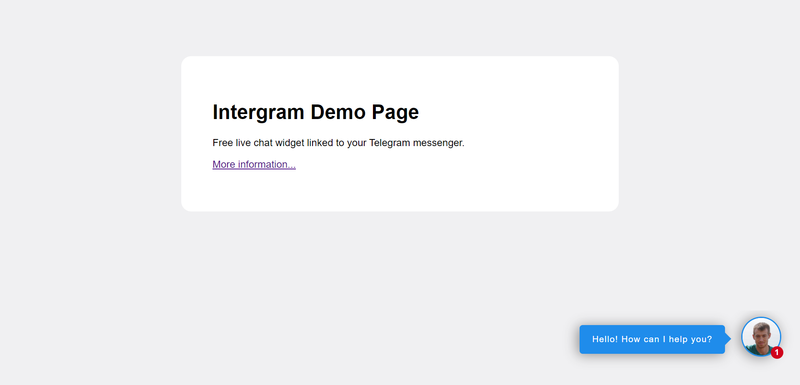
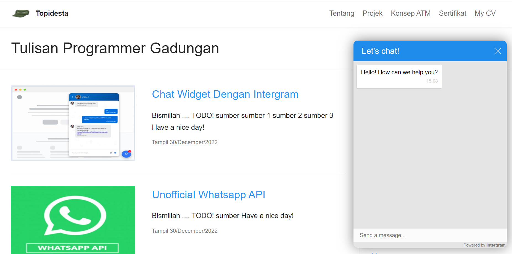

Bismillah ....

Sebetulnya gw pake yang contact-form dengan memanfaatkan cloudflare worker sebagai backend server, tapi entah kenapa gak ada chat yang masuk ke telegram, di GatsbyJS template gw tempel di layout 

```javascript
<script src="https://cdn.jsdelivr.net/gh/anshumanfauzdar/contact-form@v3/src/contact-form.js" id="contactform" form_worker_url="https://v1.formtopidesta.workers.dev/"></script>
```

pusing akh, akhirnya mulai searching lagi, dapetlah *intergram* cara kerjanya sama memanfaatkan bot resmi dari Telegram. Tapi, kalo kita langsung akses via intergram.xyz itu akan membebankan server mereka, meskipun free. Jadi akhirnya gw install intergram di server persahabatan.co.id di alamat [telegram.persahabatan.co.id](https://telegram.persahabatan.co.id).

Untuk instalasi silahkan klik sumber ke 3 dibawah ini, Tutorial Install Integram, ikuti langkah secara detail, namun saat instalasi selesai muncul halaman seperti ini:



Itu berhasil terinstall, tapi ada yang aneh meski sudah menambahan script untuk menambahkan di website kita seperti ini

```javascript
<script>
  window.intergramId = "717698723";
  window.intergramServer = "https://telegram.persahabatan.co.id";
</script>
```

pesan tidak masuk ke telegram kita, akhirnya gw coba bukan Issue di github 

https://github.com/idoco/intergram/issues/121#issue-1493738944

Silahkan baca, disana gw jelaskan kalo nodejs masih v3 makan tambahkan script ini di `server.js`, sebagai berikut:

```javascript
const io = require('socket.io')(http,{
    allowEIO3: true
});
```

Boom akhirnya bisa diakses chat dengan enggine telegram bot. seperti dibawah ini:



Dan pesan akan masuk ke Bot Telegram ini https://t.me/topidestabot


Have a nice day!


sumber
- [Contact-Form](https://github.com/tuhinpal/Contact-Form)
- [Intergram](https://github.com/idoco/intergram)
- [Tutorial Install Intergram](https://ictis.cz/telegram-chat-widget-self-hosted-debian-linux-intergram-github-skript-nodejs/)
