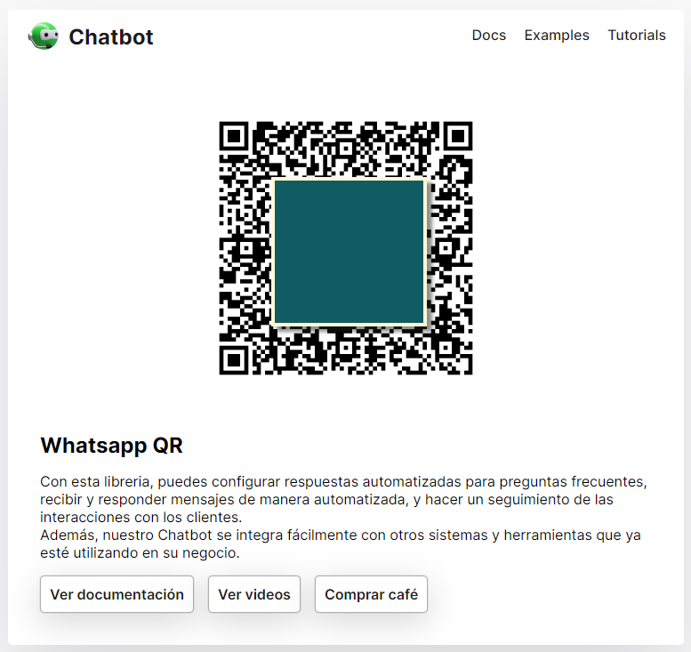

Bismillah ....

Sebetulnya ini bukan untuk ditiru ya, kalo perusahaan kalian gak pelit banget, dan mau centang biru mending ambil API yang berbayar

> https://business.whatsapp.com/products/platform-pricing

tapi tenang, diluar sana ada juga kok yang memanfaatkan API yang free alias Gratis dengan memanfaatkan web whatsapp

> https://web.whatsapp.com

beberapa library yang terkenal seperti [Baileys](https://github.com/WhiskeySockets/Baileys), [Whatsapp-web.js](https://github.com/pedroslopez/whatsapp-web.js), [WWPConnect](https://github.com/wppconnect-team/wppconnect) dan [Venom-BOT](https://github.com/orkestral/venom), yang menggunakan bahasa typescript/ javascript, ada juga yang menggunakan python atau golang loh, mantap kan ya.

lanjut, karena lingkup kerja gw butuh hasil ketimbang proses, dan gw sendiri lebih familiar dengan javascript, akhirnya coba hunting deh API yang ready to production. liat aja di pojok kanan github library tersebut, **Used by** nah, dapat deh beberapa yang berhasil mengembangkan yang sudah ada API Rest. Tinggal test deh endpointnya dengan postman atau insomnia, kalo udah bisa, running deh diserver, ouh iya, kalo mau di onlinekan, sebisa mungkin gunakan domain ya, jangan pake IP Publik, karena nanti port nodejsnya terexpose.

Untuk server pernah gw bahas di postingan [membangun server dengan aapanel](/membangun-server-ubuntu-aapanel), gw taro service di sana, dengan memaksimalkan Whatsapp Pairing, ada 4 device yang bisa kita pairing. Ouh iya, sebelum pake API Whatsapp Un-Official, gw pake service zenziva yang berbayar pake kredit, kalo sekarang itu hanya untuk Backup saja, baiklah gw share ya, beberapa API yang bisa dipakai tapi dengan terbatas

## Freemium

1. https://whatsva.id // 100 Pesan per hari (Free Version)
2. https://console.zenziva.net // Bayar dengan Kredit
3. https://api.kirimwa.id // 100 Pesan per hari (Free Version)

## Freedom

1. https://github.com/syifarahmat/baileys.api.server
2. https://github.com/canove/whaticket-community
3. https://github.com/salman0ansari/whatsapp-api-nodejs
4. https://github.com/aamdsam/wa-chat-bot (Dari Group PETIRS Telegram)
5. https://github.com/ngekoding/whatsapp-api-tutorial
6. https://github.com/novaariyanto/Panel-WhatsApp-Gateway

## Bonus

Ini bonus, service wa-unofficial yang gw implementasi di RS Persahabatan.

7. https://go.topidesta.my.id/v1
8. https://go.topidesta.my.id/v1-2 ✔️
9. https://go.topidesta.my.id/v2 ✔️
10. https://go.topidesta.my.id/v3 ✔️
11. https://go.topidesta.my.id/v4
12. https://go.topidesta.my.id/v4-2 ✔️
13. https://go.topidesta.my.id/v5
14. https://go.topidesta.my.id/v6
15. https://go.topidesta.my.id/v7
16. https://go.topidesta.my.id/v8
17. https://go.topidesta.my.id/v9
18. https://go.topidesta.my.id/v10 ✔️

Ada kelebihan ada kekurangan masing masing API Restfull Whatsapp, misalkan ada yang bisa kirim sticker ada yang bisa kirim ke group saja, ada yang gak bisa kirim ke group, dan lain sebagianya, tapi secara umum semuanya bisa **kirim ke nomor whatsapp perorangan**

Di group Petirs (Pengguna TI Rumah Sakit) pernah dibahas juga, tentang memanfaatkan Whatsapp API Free untuk mesin penjawab otomatis, lihat di point #4 salah satu contoh kodingannya, next mungkin gw bisa research deh, kalo ada yang mau pdf nya ini gw share ya.

[Chatbot by Petirs](https://github.com/topidesta/topidesta/raw/master/content/images/chat-bot-petirs.pdf)

### PM2

```bash
# Trick 1
sudo pm2 start 'npm run start:prod' --name nama_aplikasi --cron-restart="0 */6 * * *" -- start --node-args="--max-old-space-size=4096" --max-memory-restart 4G
```

```bash
# Trick 2
sudo pm2 start 'npm run start' --name nama_aplikasi --cron-restart="0 */6 * * *" -- start --node-args="--max-old-space-size=4096" --max-memory-restart 4G --interpreter=/www/server/nodejs/v18.20.4
```

### USE NPM

```bash
npm install -g npm@latest
npm cache clean --force
npm install
```


## UPDATE

Ternyata dispanyol udah ada yang mengembangkan chatbot secara mudah difahami, cek di sini:

https://github.com/codigoencasa/bot-whatsapp

Kurang lebih akan muncul seperti ini



## SERVICE OFFERING

Buat yang butuh configurasi server wa un-official bisa [kontak gw ya](https://api.whatsapp.com/send?phone=6283898973731&text=halo%20desta%20saya%20mau%20build%20server%20whatsapp).

Done.

Have a nice day!
