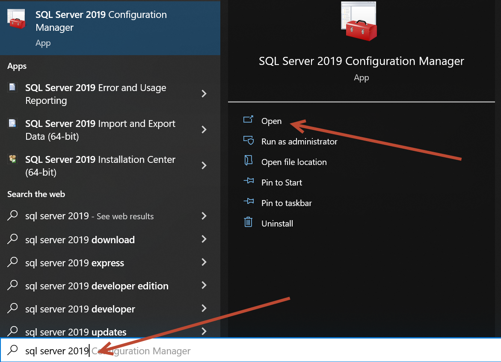
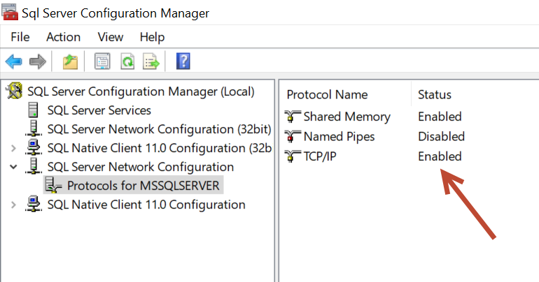
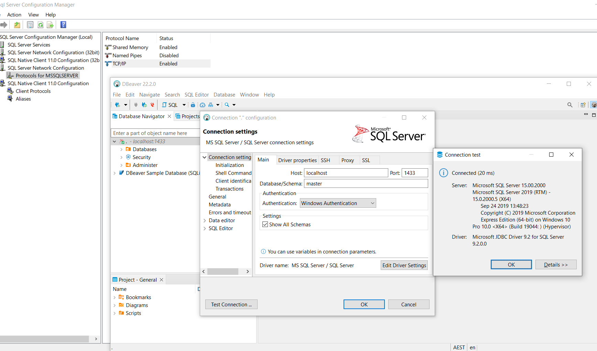

Bismillah ....

Postingan kali ini tentang CRUD DotNet dengan ReactJS, langsung saja ke Repositorinya ya.

> https://github.com/mdestafadilah/crud-dot-net-reactjs

## Pembukaan

Sebetulnya gw belajar Dotnet/ C# itu karena ada tugas membuat CRUD sebelum masuk wawancara kerja Freelance eh ternyata enak juga ya ngoding di C# terutama .Net,, udah all in one, windows linux macos, desktop mobile web .. semua 1 kode bisa semua device, seperti ReactJS, balik lagi kenapa gw belajar C# karena gw butuh Penghasilan tambahan lewat kerja freelance, ini gak bercanda gw, hehe. tapi setelah baca baca, ternyata C# DotNet itu bahasa pemograman Enterprise Level, yang artinya bahasa pemograman ini dilevel bisnis, wow... awal kuliah gw pernah sih nyoba dotnet pake visual studio, serba otomatis saat import paket tapi lemot buat laptop gw waktu itu dan juga tren waktu dikampus php sama java jadinya belajar php deh haha tapi langsung pake framework, percis belajar dotnet sekarang, gw langsung belajar ke dotnet nyah hehe, C# sembari belajar dotnet, ibaratnya sekali gayuh 2 teknologi gw pelajari di tahun 2023 ini terlepas diterima atau tidak freelance gw, Semoga Allah Mudahkan ya. Aamiin,

## Persiapan

## Permasalahan

Database bisa pake MySQL, berhubung ini DotNet sekalian aja pake SQLServer 2019, install seperti biasa. nah muncul masalah saat koneksi ke tools dbeavear, pesan erronya kyak gini

> The TCP/IP connection to the host localhost, port 1433 has failed

coba browsing duckduckgo, mampir ke halaman ini -> https://stackoverflow.com/a/18981672

Simplenya ketik aja **sql server 2019** seperti dibawah ini



kalo udah kebuka, lanjutkan dengan enable TCP/ IP, seperti berikut ini



Kalo udah lanjut deh config connection di dbeaver seperti berikut ini



> Koneksi SQLServer mau pakai Username dan Password

Default koneksi dengan **Windows Authentication** pasti berhasil, jika sudah lakukan perintah SQL berikut ini, satu satu ya.

```sql
EXEC xp_instance_regwrite N'HKEY_LOCAL_MACHINE', N'Software\Microsoft\MSSQLServer\MSSQLServer', N'LoginMode', REG_DWORD, 2;

ALTER LOGIN [sa] WITH PASSWORD='newpassword', CHECK_POLICY=OFF;

ALTER LOGIN [sa] ENABLE;
```

disana kita akan enable default username **sa** dengan password **newpassword** dan ada angka [2] yang artinya kita akan mengaktifkan kombinasi authentikasi login [[1]](#1).

Jika sudah jangan lupa restart SQL Servernya.

> VSCode Tidak Cukup, harus Pakai Visual Studio

ini yang bikin heran, karena pada dasarnya ada beberapa perbedaan, seperti autocompletion dan sifat dari VSCode dengan Visual Studio yang berbeda, kalo vscode project perfolder dan visual studio project based tapi vscode like visual studio juga bisa dengan install beberapa plugin, diantaranya[[2]](#2):

1. Rosylnator
2. .NET Core Test Explorer
3. Auto-using for C#
4. C# Namespace Autocompletion
5. C# XML Documentation Comments
6. NuGet Reverse Package Search
7. Code Spell Checker
8. Path Intellisense
9. EditorConfig for VS Code
10. SQL Server (mssql)
11. Github Copilot
12. REST Client
13. VS Browser
14. Highlight Trailing White Spaces
15. Jwt-Decoder

Akhirnya gw tau koneksi yang seharusnya setelah install Visual Studio. haha

## Sumber Belajar

1. http://go.topidesta.my.id/dotnet5-crud
2. http://go.topidesta.my.id/react-hook-crud
3. http://go.topidesta.my.id/react-crud-simple
4. http://go.topidesta.my.id/orm-entity-framework
5. http://go.topidesta.my.id/orm-entity-framework-official
6. <a id="1">[1] https://superuser.com/a/731047</a>
7. <a id="2">[2] https://www.youtube.com/watch?v=m9HvsB1-hAo&t=857s</a>
8. http://go.topidesta.my.id/reactjs-dotnet-official

TODO:

Have a nice day!
