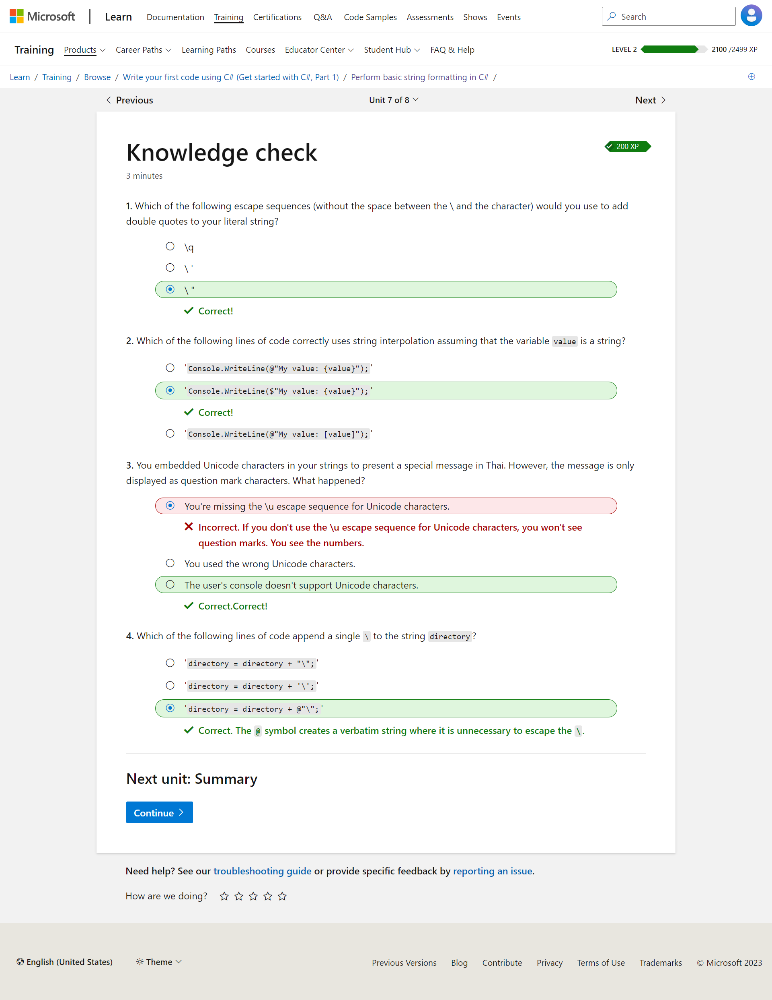
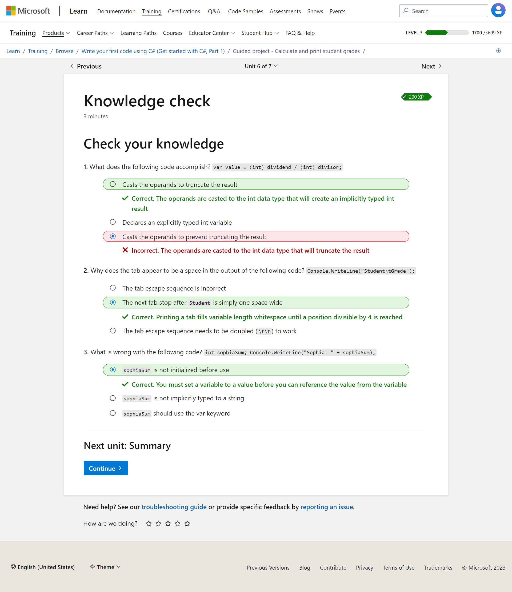

Bismillah ....

## Intro

Sesuai judulnya, catatan kali ini tentang belajar C# dari sang Empu alias creatornya langsung, Microsoft! oh iya dalam pelatihannya ada Progressnya, mirip kayak pelatihan gw waktu di Progate (Bahasa Go-Lang tapi) kurang lebih ada beberapa path yang harus dilewati dan memiliki points power, berikut ini path yang harus kita pelajari agar lebih terarah belajarnya.

source: http://go.topidesta.my.id/csharp

Untuk video seriesnya juga banyak, kurang lebih kayak gini

source: http://go.topidesta.my.id/dotnet-series

Jadi, terus lah haus akan ilmu, teruslah belajar!

Have a nice day!

## WARNING ERROR

---

### Level 2

> (5,22): error CS1009: Unrecognized escape sequence

> Console.WriteLine(@"c:\invoices");

> Penulisan dengan *Verbatim string literals*

> Console.WriteLine("c:\\source\\repos");

> Penulisan dengan *double backslash*

> Console.WriteLine("\u3053\u3093\u306B\u3061\u306F World!");

> Penulisan dengan *unicode escape*

> string message = greeting + " " +  firstName;

> *String Intervolation* dengan menggunakan **{ }** seperti berikut

> string message = $"{greeting} {firstName}!";

---

### Level 3

- Matematika dasar dengan POMDAS style. alias, dikerjakan aritmatika tertinggi dulu.

