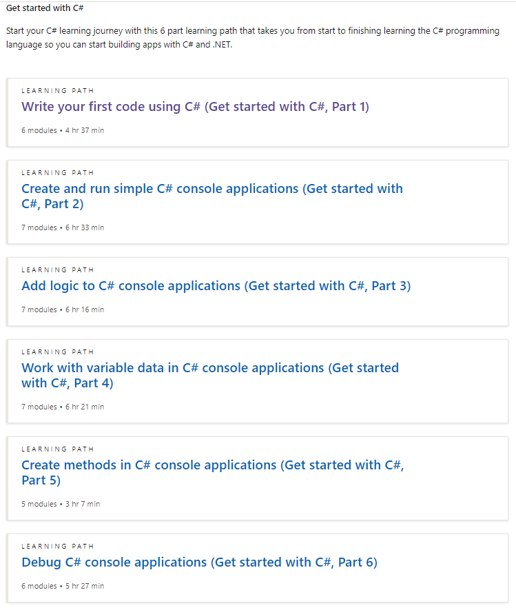
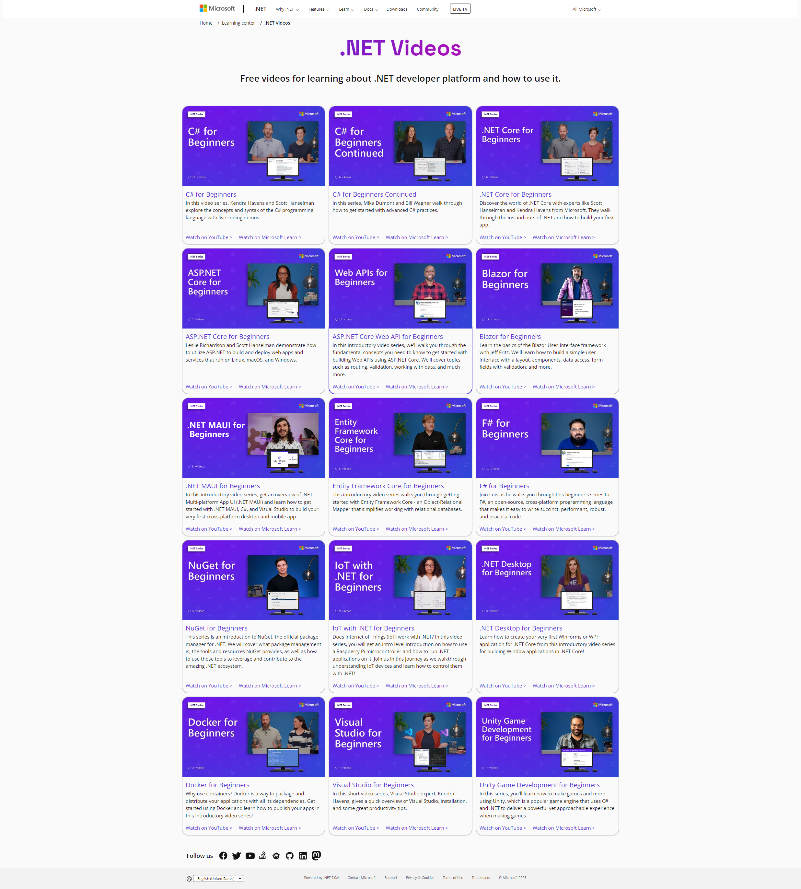
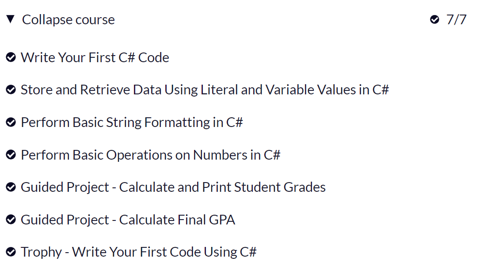
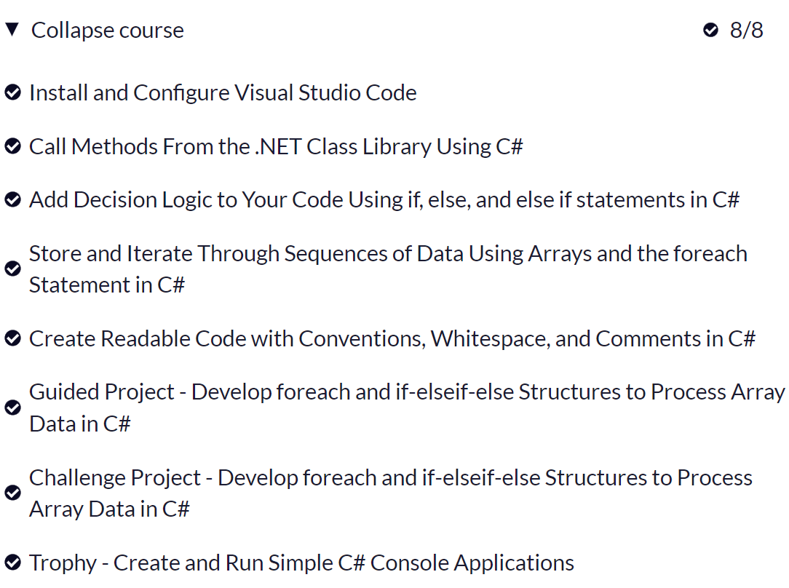
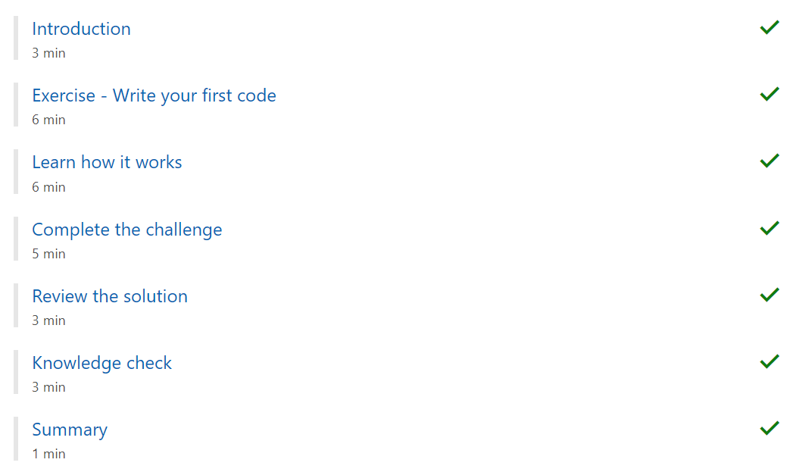
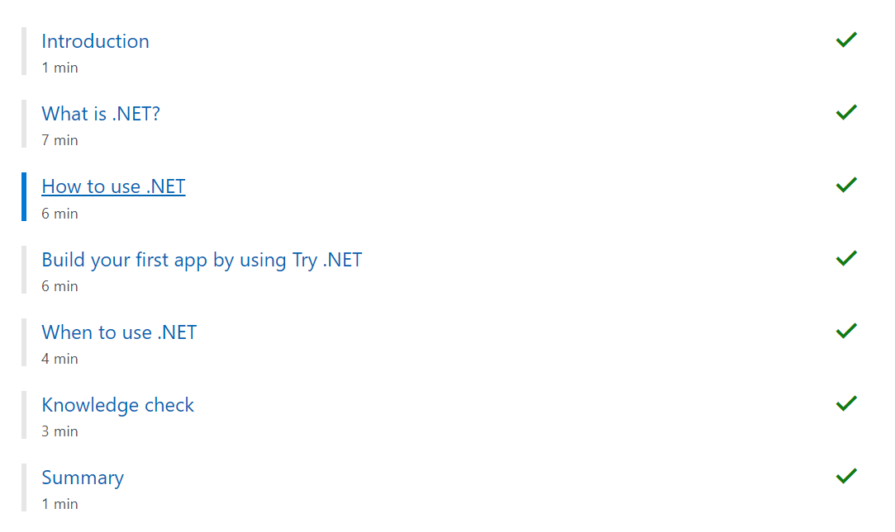

Bismillah ....

## Intro

Sesuai judulnya, catatan kali ini tentang belajar C# dari sang Empu alias creatornya langsung, Microsoft! oh iya dalam pelatihannya ada Progressnya, mirip kayak pelatihan gw waktu di Progate (Bahasa Go-Lang waktu itu) kurang lebih ada beberapa path yang harus dilewati dan memiliki points power, yang bisa digunakan untuk Claim Achivement di FreeCodeCamp, berikut ini path yang harus kita pelajari agar lebih terarah belajarnya.

source: http://go.topidesta.my.id/csharp

Untuk video seriesnya juga banyak, kurang lebih kayak gini

source: http://go.topidesta.my.id/dotnet-series

## Foundational C# with Microsoft

---

### Write Your First Code Using C#

### Create and Run Simple C# Console Applications

## Build .NET applications with C#
---

### Write your first C# code

### Introduction to .NET

### Create a new .NET project and work with dependencies

-
### Interactively debug .NET apps with the Visual Studio Code debugger

-
### Work with files and directories in a .NET app

- 
### Create a web API with ASP.NET Core controllers

-

### Link Bermanfaat

[Repositori Belajar](https://github.com/amati-tiru-modifikasi/c-sharp-dasar)
[Foundational C# with Microsoft](http://go.topidesta.my.id/c-sharp-foundation)
[Build .NET applications with C#](http://go.topidesta.my.id/dot-net-path)

Have a nice day!