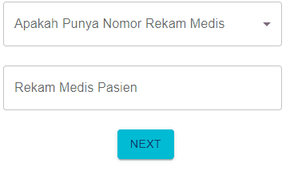

## Bismillah

Kali ini share trick validasi kolom yang terikat dengan kolom lain dengan Formik+Yup+MUI, langsung ke kasusnya aja ya, di halaman [survey keluhan](https://keluhan.survey.rsuppersahabatan.co.id) disana ada 1 kolom yang boleh kosong, sebut saja kolom B, kalo kolom A dipilih `tidak` , begitu juga sebaliknya kalo kolom A dipilih `ya` maka wajib diisi.

silahkan lihat vidio singkatnya berikut:



Sebetulnya itu lebih kompleks, logikanya, ini script sederhananya, ada 3 cara di formik.

```javascript
  // source: https://stackoverflow.com/a/66917809
  .test("punyaRm",'Wajib Di Isi Bila Punya Nomor Rekam Medis!', function(value) {
      return this.parent.punyaRm === 'Tidak';
  })

  // source: https://stackoverflow.com/a/66342990
  .when("punyaRm", {
      is: (punyaRm) => punyaRm === 'Tidak',
      then: Yup.string().nullable(),
      otherwise: Yup.string().required('Wajib Di Isi Bila Punya Nomor Rekam Medis!'),
  })

  // source: https://stackoverflow.com/a/56247127
  .when("punyaRm", (punyaRm, schema) => {
      return schema.test({
          test: rmPasien => !!punyaRm && punyaRm === 'Tidak',
          message: 'Wajib Di Isi Bila Punya Nomor Rekam Medis!'
      })
  })
```

Sumbernya sudah gw sertakan ya, nah kalo mau perisis seperti logika diatas ini dia scriptnya

```javascript
  .test("punyaRm",`${rmPasien.requiredErrorMsg}`, function() {
      // Pilihan Tidak dan RM Pasien Kosong, dibolehkan!
      if (this.parent.punyaRm === 'Tidak' && typeof this.parent.rmPasien === 'undefined') {
          return true;
      // Pilihan Ya dan RM Wajib ISI
      } else if(this.parent.punyaRm === 'Ya' && typeof this.parent.rmPasien !== 'undefined') {
          return true;
      }
  })
```

Haha, kudu dijelasin? kga usah yak, tinggal analogikan saja sendiri ya. hehe

Have a nice day!