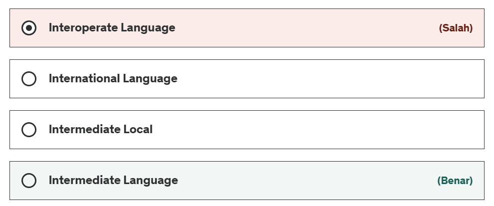
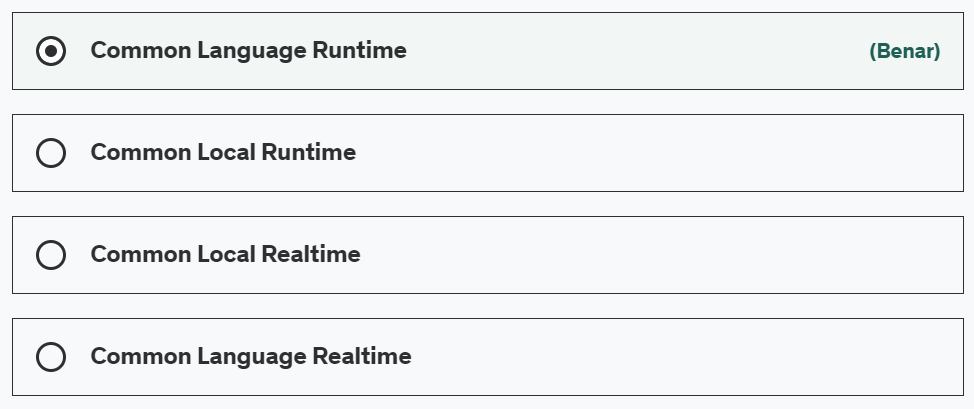

## Bismillah

Bahasan kali ini, Kita akan belajar C# dari sebuah pertanyaan, langsung aja pertanyaan sebagai berikut:

1. IL di dalam .NET berarti?

> (EN) Intermediate language (IL) is an object-oriented programming language designed to be used by compilers for the .NET Framework. The .NET Framework uses IL to generate machine-independent code as the output from compiling source code written in any .NET programming language.

> (ID) Intermediete Language (IL) ialah bahasa pemograman OOP yang didesign sebagai compiler di lingkup .NET. sebuah compiler akan menghasilan sebuah kode bernama machine-independent, yang bisa digunakan di pemograman bahasa .NET

2. CLR artinya?

> The CLR (Common Language Runtime) is a runtime environment that is part of the Microsoft .NET Framework. CLR manages the execution of programs written in different supported languages.

> Sebuah CLR (Common Language Runtime) merupakan bagian dari .NET Framework yang dapat mengatur eksekusi sebuah program dibuat dalam bahasa pemograman yang berbeda.