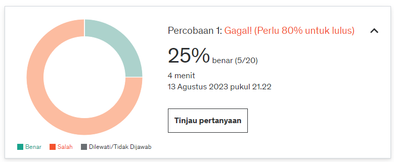
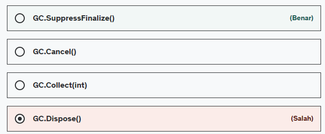
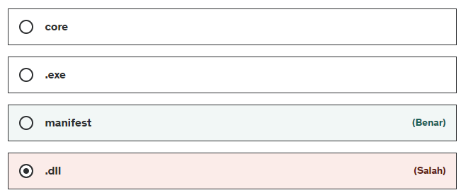
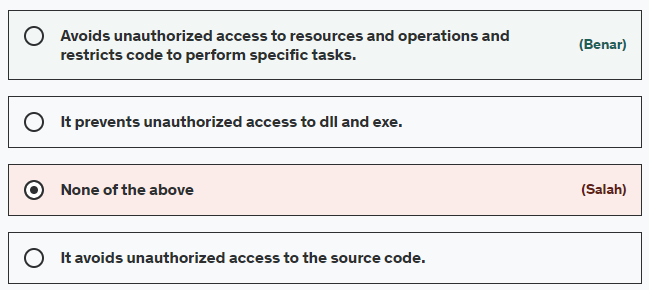
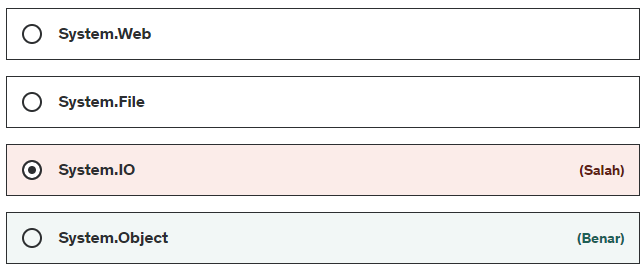

## Bismillah

Bahasan kali ini, Kita akan belajar .NET C# dari sebuah pertanyaan, langsung aja pertanyaan sebagai berikut, pertanyaan tahap 1, terdiri dari 20 soal, hasilnya **Mengecewakan**. hehe, semangat lagi belajarnya!

1. IL di dalam .NET berarti?

> (EN) Intermediate language (IL) is an object-oriented programming language designed to be used by compilers for the .NET Framework. The .NET Framework uses IL to generate machine-independent code as the output from compiling source code written in any .NET programming language.

> (ID) Intermediete Language (IL) ialah bahasa pemograman OOP yang didesign sebagai compiler di lingkup .NET. sebuah compiler akan menghasilan sebuah kode bernama machine-independent, yang bisa digunakan di pemograman bahasa .NET

2. CLR artinya?

> (EN) The CLR (Common Language Runtime) is a runtime environment that is part of the Microsoft .NET Framework. CLR manages the execution of programs written in different supported languages. CLR transforms the source code into a form of secondary code called CIL (Common Intermediate Language). At runtime, CLR manages the execution of the CIL code.

> (ID) Sebuah CLR (Common Language Runtime) merupakan bagian dari .NET Framework yang dapat mengatur eksekusi sebuah program dibuat dalam bahasa pemograman yang berbeda. Seubah CLR dapat merubah kodeke bahasa CIL, ketika berjalan, CLR dapat mengatur sebuah kode CIL. 

3. Garbage collector (GC) terdiri dari berapa tahap?

> (EN) 
> - The 0 generation identifies a newly created object that has never been marked for collection.
> - The 1st generation identifies an object that survived a GC (marked for collection but not deleted because there was enough heap space)
> - The 2nd generation identifies an object that has survived more than one GC scan.

4. Manakah yang termasuk perintah *garbage-collector* yang tidak terselesaikan?

> (EN) “SuppressFinalize” should only be called by a class that has a “finalizer”. It tells the Garbage Collector (GC) that this object has been completely cleaned up.

5. Sebuah metadata dari assembling .NET tersimpan difile apa?

> (EN) The manifest contains this assembly metadata. A manifest contains all the metadata necessary to specify the assembly requirements and security identity, as well as all the metadata necessary to define the scope of the assembly and resolve references to resources and classes. The manifest can be stored in a PE file (an .exe or .dll file) with MSIL (Microsoft Intermediate Language) code or in a standalone PE file containing only the manifest information.

6. Apa arti dari CAS (Code Access Secutriy)?

> (EN) CAS is the solution to block unapproved code from performing privileged actions. When the CLR loads an assembly, it gets proof of the assembly and uses it to identify the code group to which the assembly belongs. A code group contains a set of permissions (one or more permissions).

7. Apa nama *namespace* yang terhubung kesemua tipe diframework .NET?

> (EN) C# has a unified type system, which means that all types inherit, directly or indirectly, from Object (System.Object). This includes reference and value types. It also includes all primitive types, such as int and bool, as well as all types provided in the .NET Framework and any custom types you define.