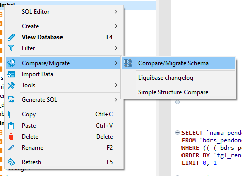
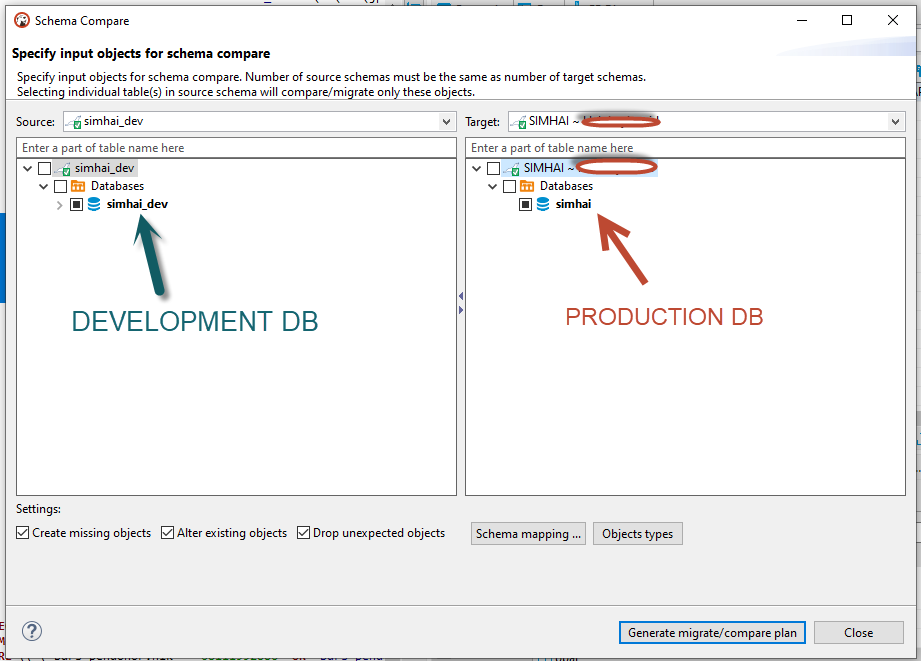

## Bismillah

Ini terinspirasi dari project gw yang di halobayi, karena database ada 2, untuk production dan development. terkadang kita lupa, didevelopment ada perubahan, dan aplikasi production error, karena kurang kolom, nah bisa kita manfaatkan fiture dari dbvear, **Compare/ Migrate Schema** seperti dibawah ini.

Caranya, klik kanan ke database production, pastikan bagian kiri adalah database development dan kanan adalah database production, seperti dibawah ini.

Tunggu beberapa saat... nanti akan muncul result yang memperlihatkan perbedaan strukture table development dengan production seperti dibawah ini.

Sekian Trick kali ini.

Have a nice day!