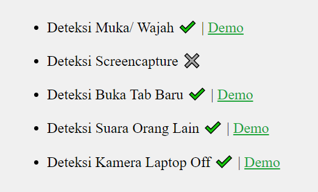

## Bismillah

Mulai tanggal 19 April 2024 gw gak lanjut di Catalyst sebagai Freelance. Selama 2 bulan gw research dan bertanya tanya dengan TIM Psikologi Catalyst tentang Proctoring. Semacam teknik anti-curang dalam Ujian Online getu.

Dan didapatlah beberapa kecurangan yang sering terjadi, yang bisa di deteksi melalui sebuah Browser peserta test diantarnya,

1. Detect buka tab/ tutup tab
2. Detect camera aktif/ tidak aktif
3. Detect muka/ wajah pesert test
4. Detect suara disekitar peserta test
5. Detect screen capture

Awal pengembangan masih file JS yang comot dari Github. berikut ini list yang berhasil gw research.

Sayangnya, yang dibutuhkan itu file **.JS** only, alias bundling. Yaps, gw putuskan untuk membuka source dalam versi Bundler (Opensource App).

### Apa Itu Proctoring?

TODO

### Teknologi yang Digunakan!

TODO

### Refrensi

1. https://kumparan.com/ragam-info/proctoring-definisi-dan-cara-kerja-sistemnya-20nteGRLsZM/2
2. https://blog.mettl.com/guide/online-remote-proctoring/
3. https://raccoongang.com/blog/online-proctoring-everything-you-need-know/