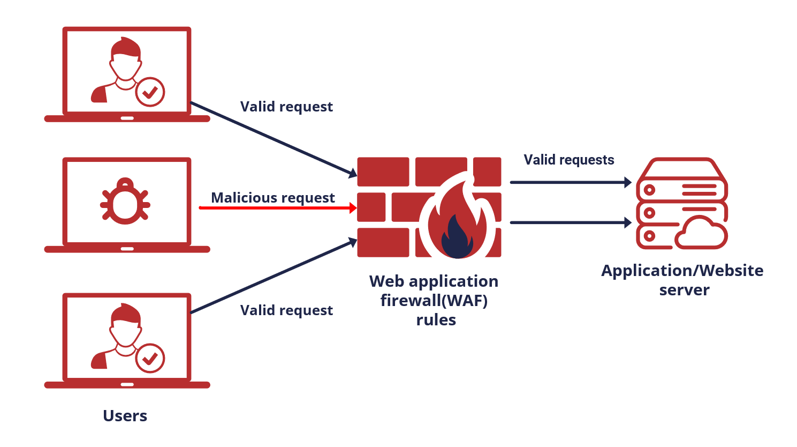
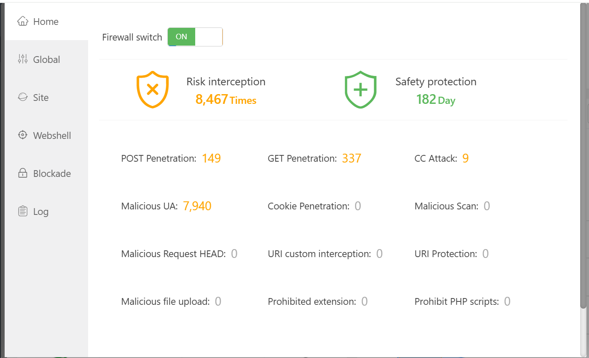
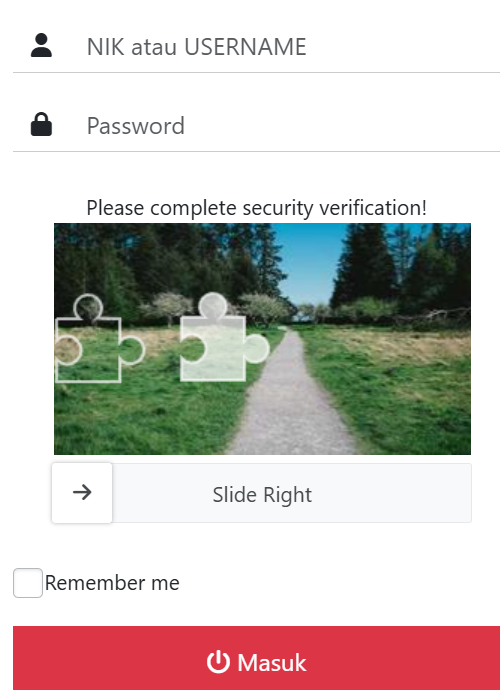
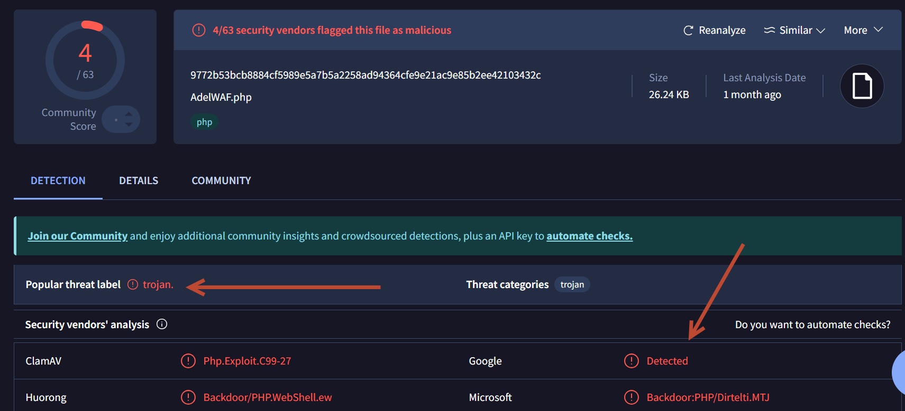
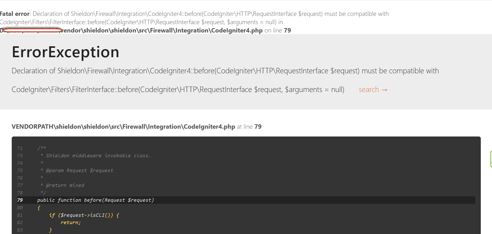
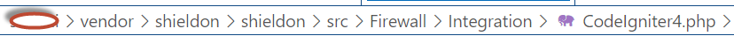
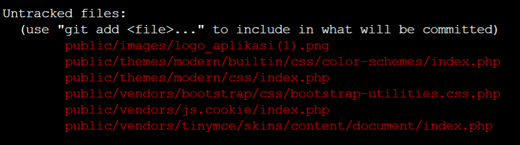
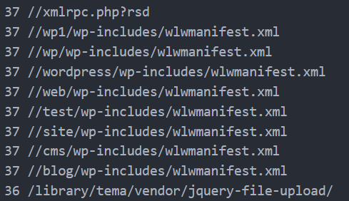

## Bismillah

Alhamdulilah, lagi dipaksa buat nulis lagi, meski lagi sibuk banget ini, tulisan kali ini adalah security trick yang gw implentasikan di **Aplikasi Klinik Hazika** yang digunakan di halo bayi indonesia, menggunakan WAF. Web Application Firewall, sebuah layer keamanan aplikasi dari sisi aplikasi, dari sisi cara aksesnya. berikut ini gambaran sederhana bagaimana sebuah WAF melindungi aplikasi kita.


source: https://www.stormit.cloud/blog/what-is-a-web-application-firewall/

Selain menggunakan WAF dari sisi server gw implentasikan juga **Nginx Free Firewall** dari aaPanel, berikut ini tampilannya.



kita bisa setting *whitelist* atau *blacklist* sebuah IP Address, apakah mencurigkan atau tidak dan menambahkan filter seperti berikut untuk menolak aplikasi web kita di scan oleh orang yang tidak berkepentingan.

```bash
2ip\ bot|360Spider|404checker|404enemy|80legs|Abonti|Aboundex|Aboundexbot|Acunetix|ADmantX|adscanner|AdsTxtCrawlerTP|AfD-Verbotsverfahren|AHC|AIBOT|AiHitBot|Aipbot|Alexibot|ALittle\ Client|Alligator|AllSubmitter|AlphaBot|Amazonbot|Anarchie|Anarchy|Anarchy99|Ankit|Anthill|anthropic-ai|Apache-HttpClient|Apexoo|archive.org_bot|arquivo-web-crawler|arquivo.pt|Aspiegel|ASPSeek|Asterias|Atomseobot|Attach|autoemailspider|Awario|AwarioBot|AwarioRssBot|AwarioSmartBot|BackDoorBot|Backlink-Ceck|backlink-check|BacklinkCrawler|BackStreet|BackWeb|Badass|Bandit|Barkrowler|BatchFTP|Battleztar\ Bazinga|BBBike|BDCbot|BDFetch|BetaBot|bidswitchbot|Bigfoot|Bitacle|Black\ Hole|Blackboard|BlackWidow|BLEXBot|Blow|BlowFish|Boardreader|Bolt|BotALot|Brandprotect|Brandwatch|Buck|Buddy|BuiltBotTough|BuiltWith|Bullseye|BunnySlippers|BuzzSumo|Bytedance|Bytespider|cah.io.community|Calculon|CATExplorador|CazoodleBot|CCBot|Cegbfeieh|CensysInspect|CF-UC|ChatGPT-User|check1.exe|CheeseBot|CherryPicker|CheTeam|ChinaClaw|Chlooe|Citoid|Claritybot|clark-crawler|Cliqzbot|Cloud\ mapping|coccocbot|Cocolyzebot|CODE87|Cogentbot|cognitiveseo|cohere-ai|Collector|com.plumanalytics|comscore|Copier|CopyRightCheck|Copyscape|Cosmos|Craftbot|crawl.sogou.com|crawler.feedback|crawler4j|Crawling\ at\ Home\ Project|CrazyWebCrawler|Crescent|CriteoBot|CrunchBot|CSHttp|Curious|Custo|CyotekWebCopy|DatabaseDriverMysqli|DataCha0s|dataforseo.com|DataForSeoBot|dataforseobot|DBLBot|demandbase-bot|Demon|Deusu|Devil|Digincore|DigitalPebble|DIIbot|Dirbuster|dirbuster|Disco|Discobot|Discoverybot|Dispatch|DittoSpyder|DnBCrawler-Analytics|DnyzBot|DomainAppender|DomainCrawler|Domains\ Project|DomainSigmaCrawler|domainsproject.org|DomainStatsBot|DomCopBot|Download\ Wonder|Dragonfly|Drip|DSearch|DTS\ Agent|EasyDL|Ebingbong|eCatch|ECCP/1.0|Ecxi|EirGrabber|EMail\ Siphon|EMail\ Wolf|EroCrawler|evc-batch|Evil|Exabot|Expanse|Express\ WebPictures|ExtLinksBot|Extractor|ExtractorPro|Extreme\ Picture\ Finder|EyeNetIE|Ezooms|FacebookBot|facebookscraper|FDM|FemtosearchBot|FHscan|Fimap|Firefox/7.0|FlashGet|Flunky|Foobot|Freeuploader|FriendlyCrawler|FrontPage|Fuzz|FyberSpider|Fyrebot|G-i-g-a-b-o-t|Gabanzabot|GalaxyBot|Genieo|GermCrawler|Getintent|GetRight|GetWeb|Gigabot|Go-Ahead-Got-It|Go-http-client|Go!Zilla|gopher|Gotit|GoZilla|GPTBot|Grabber|GrabNet|Grafula|GrapeFX|GrapeshotCrawler|GridBot|GT::WWW|Haansoft|HaosouSpider|harvest|Harvest|Havij|HEADMasterSEO|Heritrix|heritrix|Hloader|HMView|HonoluluBot|HTMLparser|HTTP::Lite|HTTrack|Humanlinks|HybridBot|Iblog|Id-search|IDBot|IDBTE4M|IlseBot|Image\ Fetch|Image\ Sucker|imagesift.com|ImagesiftBot|IndeedBot|Indy\ Library|InfoNaviRobot|InfoTekies|instabid|Intelliseek|InterGET|Internet\ Ninja|InternetSeer|internetVista\ monitor|IonCrawl|ips-agent|Iria|IRLbot|isitwp.com|Iskanie|IstellaBot|iubenda-radar|JamesBOT|Java|Jbrofuzz|JennyBot|JetCar|Jetty|JikeSpider|JOC\ Web\ Spider|Joomla|Jorgee|JustView|Jyxobot|Kenjin\ Spider|Keybot\ Translation-Search-Machine|Keyword\ Density|Kinza|Kozmosbot|Lanshanbot|Larbin|Leap|LeechFTP|LeechGet|LexiBot|Lftp|LibWeb|Libwhisker|LieBaoFast|Lightspeedsystems|Likse|Linkbot|linkdexbot|LinkextractorPro|LinkpadBot|LinkScan|LinksManager|LinkWalker|LinqiaMetadataDownloaderBot|LinqiaRSSBot|LinqiaScrapeBot|Lipperhey|Lipperhey\ Spider|Litemage_walker|Lmspider|LNSpiderguy|Ltx71|lwp-request|lwp-trivial|LWP::Simple|Mag-Net|Magnet|magpie-crawler|Mail.RU_Bot|Majestic-SEO|Majestic\ SEO|Majestic12|MarkMonitor|MarkWatch|Mass\ Downloader|Masscan|Mata\ Hari|MauiBot|Mb2345Browser|MBCrawler|MeanPath\ Bot|Meanpathbot|meanpathbot|Mediatoolkitbot|mediawords|MegaIndex.ru|Metauri|MFC_Tear_Sample|MicroMessenger|Microsoft\ Data\ Access|Microsoft\ URL\ Control|MIDown\ tool|MIIxpc|Minefield|Mister\ PiX|MJ12bot|MJ12Bot|Moblie\ Safari|Mojeek|Mojolicious|MolokaiBot|Morfeus\ Fucking\ Scanner|Mozlila|MQQBrowser|Mr.4x3|MSFrontPage|MSIECrawler|Msrabot|MTRobot|muhstik-scan)
```

Selain itu gw juga menambahan security lainnya, seperti **nG Firewall** dari sisi Server, menggunakan tools dari Perishable Press.

Untuk sisi aplikasi, gw gunakan Shieldon yang compatible dengan PSR-4 (Composer), karena aplikasi klinik hazika menggunakan codeigniter 4, dan tersedia secara *opensource.*

masih kurang? yaps, dari tampilan sebelum masuk ke sistem, gw implentasikan sebuah captcha slider, untuk masuk ke sistem, seperti berikut.



Ouh iya, waktu itu gw juga pake WAF diaplikasi klinik hazika dengan [Adel-WAF](https://github.com/Adel-Qusay/ADEL-WAF/issues/10) tapi ada keanehan, diserver aaPanel gw gak kedetect kalo scriptnya mengandung trojan, tapi di server laen yang pake directadmin malah kedetect dan langsung di delete filenya, penasaran akhirnya coba cek menggunakan VirusTotal, jreng bener aja ada trojan script



> https://www.virustotal.com/gui/file/9772b53bcb8884cf5989e5a7b5a2258ad94364cfe9e21ac9e85b2ee42103432c?nocache=1

Semoga owner repo tau apa yang dia share, kalo WAF nyah sangat tidak aman untuk server, dan gw juga udah kasih tau dan gw share juga alternatifnya, seperti [Shieldon](https://github.com/terrylinooo/shieldon) dan lainnya.

> https://github.com/Adel-Qusay/ADEL-WAF/issues/10


## Catatan Implementasi WAF Shieldon

gw udah buat Pull Request (PR) tapi belom di acc sama ownernya, jadi mau gak mau langsung ubah aja di folder **vendor** ya.

> https://github.com/terrylinooo/shieldon/pull/68

Saat implentasi shieldon agak sedikit tricky, karena ada sedikit error seperti ini



Kita harus ubah di folder **vendor** dimana shieldon terinstall dan ubah scriptnya dengan ini di folder



```php
<?php
/*
 * This file is part of the Shieldon package.
 *
 * (c) Terry L. <contact@terryl.in>
 *
 * For the full copyright and license information, please view the LICENSE
 * file that was distributed with this source code.
 * 
 * File Correction: APP\vendor\Shieldon\src\Firewall\Integration\CodeIgniter4
 * Source instalation: https://shieldon.io/en/guide/codeigniter.html#codeigniter-4
 * Source Correction: https://forum.codeigniter.com/showthread.php?tid=78109&pid=382427#pid382427
 * 
 */

declare(strict_types=1);

namespace Shieldon\Firewall\Integration;

use Shieldon\Firewall\Firewall;
use Shieldon\Firewall\HttpResolver;
use CodeIgniter\HTTP\RequestInterface as Request;
use CodeIgniter\HTTP\ResponseInterface as Response;
use CodeIgniter\Filters\FilterInterface;
use Shieldon\Firewall\Captcha\Csrf;
use function csrf_token; // CodeIgniter 4
use function csrf_hash; // CodeIgniter 4

/**
 * CodeIgniter 4 Middleware of Shieldon Firewall.
 */
class CodeIgniter4 implements FilterInterface
{
    /**
     * The absolute path of the storage where stores Shieldon generated data.
     *
     * @var string
     */
    protected $storage;

    /**
     * The entry point of Shieldon Firewall's control panel.
     *
     * For example: https://yoursite.com/firewall/panel/
     * Just use the path component of a URI.
     *
     * @var string
     */
    protected $panelUri;

    /**
     * Constructor.
     *
     * @param string $storage  See property `storage` explanation.
     * @param string $panelUri See property `panelUri` explanation.
     *
     * @return void
     */
    public function __construct(string $storage = '', string $panelUri = '')
    {
        $this->storage = WRITEPATH . 'shieldon_firewall';
        $this->panelUri = '/firewall/panel/';

        if ('' !== $storage) {
            $this->storage = $storage;
        }

        if ('' !== $panelUri) {
            $this->panelUri = $panelUri;
        }
    }

    /**
     * Shieldon middleware invokable class.
     *
     * @param Request $request
     *
     * @return mixed
     */
    public function before(Request $request, $arguments = null)
    {
        if ($request->isCLI()) {
            return;
        }

        // CodeIgniter 4 is not a PSR-7 compatible framework, therefore we don't 
        // pass the Reqest and Reposne to Firewall instance.
        // Shieldon will create them by its HTTP factory.
        $firewall = new Firewall();
        $firewall->configure($this->storage);
        $firewall->controlPanel($this->panelUri);

        // Pass CodeIgniter CSRF Token to Captcha form.
        $firewall->getKernel()->setCaptcha(
            new Csrf([
                'name' => csrf_token(),
                'value' => csrf_hash(),
            ])
        );

        $response = $firewall->run();

        if ($response->getStatusCode() !== 200) {
            $httpResolver = new HttpResolver();
            $httpResolver($response);
        }
    }

    /**
     * We don't have anything to do here.
     *
     * @param Response $request
     * @param Response $response
     *
     * @return mixed
     */
    public function after(Request $request, Response $response, $arguments = null)
    {

    }
}
```

## Update ~ Celah dari Sisi Server

Jadi sebelum kejadian, gw ada update tp ko aplikasi gak berubah, alhasil gw masuk ke console, buat ngecek dengan melakukan `sudo git status` ternyata ada file yang gak diundang di folder `public`  seperti gambar dibawah ini:



Nah aneh kan, cuman sampe sekarang gw belum tau kenapa bisa terupload, akhirnya coba liat akses folder mana pake url apa seperti dibawah ini, tetep gak ketauhan celahnya.



### Patch Celah Folder Public

Setelah mencari tahu, akhirnya folder `public` gw batasi dan assets image,css dan js diarahkan ke cdn. Berikut ini beberapa config patch untuk nginx.

```bash
location ~* \.(jpg|jpeg|gif|png|bmp|ico|flv|swf|js|css|ttf|woff|woff2) {
  add_header        Cache-Control public;
  add_header        Cache-Control must-revalidate;
  expires           7d;
}

location ^~ /public/ {
  deny all;
}

location /images/ {
  access_log off;
  expires max;
    
  location ~ "\.(png|jpg|ttf|woff|woff2|pdf)$" {
      allow all;                # allow images, etc.
  }

  location ~ "/$" {
      allow all;
      autoindex off;             # allow listing directory contents
  }
}
```

dan ubah hak akses foldernya `755` dan file `644`, dan akhirnya tidak ada lagi file aneh yang terupload di folder public.

## Update Menggunakan aaWAF

Aplikasi klinik Hazika sudah menggunakan aaWAF.

> https://www.aapanel.com/forum/d/18725-aawaf-install-tutorial
> https://www.aapanel.com/forum/d/18726-aawaf-usage-tutorial


## TODO: INSTALL MOD SECURITY DI AAPANEL
> https://medium.com/@habibi05/implementasi-waf-modsecurity-dengan-nginx-7672faed9359


## Kesimpulan

Baik, akan gw simpulkan *tools* yang digunakan dalam menghadapi kerasanya keaamanan dunia maya, terutama aplikasi berbasis web-base, diantaranya:

1. Nginx Free Firewall with UA Filter
2. 7G Firewall by PerishablePress
3. ~~Shieldon PHP~~
4. Captcha Login
5. Create Symbolic For Assets (CSS and JS)
6. Use aaWAF

Sekian informasi dan trick yang gw implentasikan di aplikasi klinik hazika.

Have a nice day!


### Source

1. [aaPanel](https://www.aapanel.com/)
2. [nG Firewall](https://perishablepress.com/ng-firewall/)
3. [ShieldOn for Codeigniter](https://github.com/terrylinooo/shieldon)
4. [Patch Codeigniter 4](https://gist.github.com/mdestafadilah/9b3cab601c9492d552ebf59a2d698667)
5. [UA Filter](https://github.com/idflorin/mixed/blob/main/nginx-ban-bad-user-agents.conf)