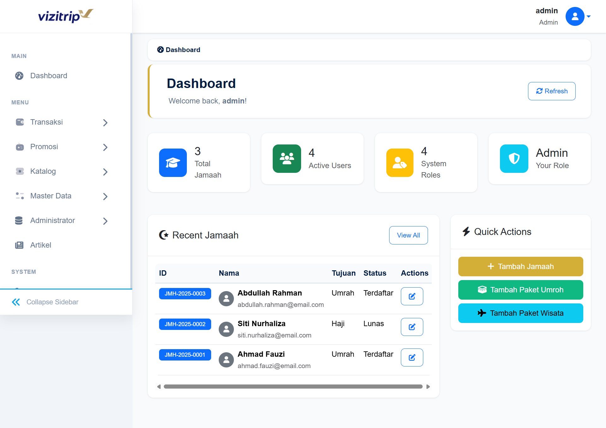
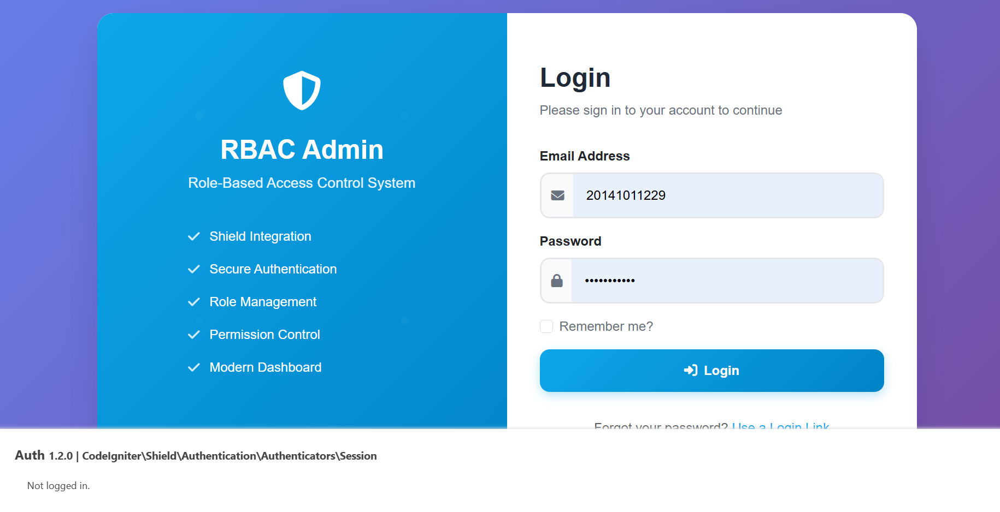
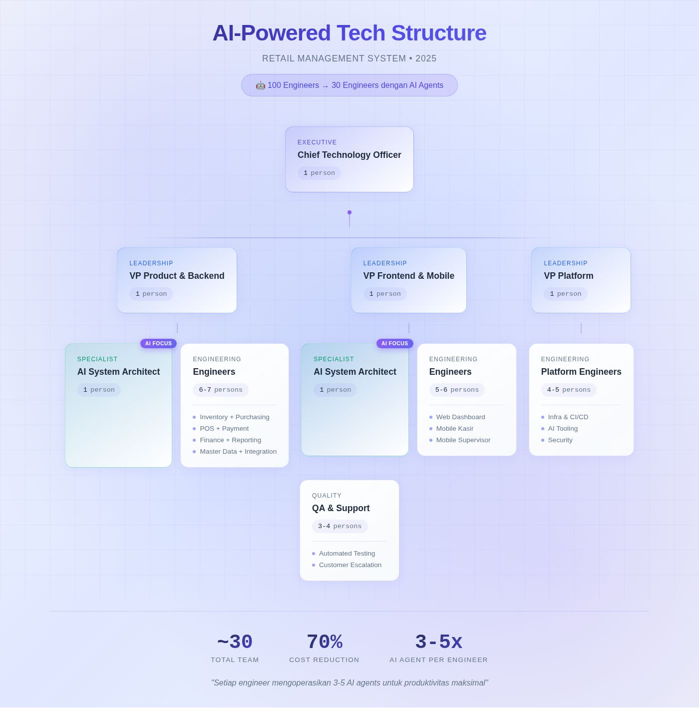

## Bismillah

Kali ini gw mau cerita tentang manfaat AI buat gw, programmer yang udah kepala 3. Bersyukur bisa menikmati kemudahan dan merasakan manfaat dari AI sebagai Programmer. Hampir 10 tahun bergulat dengan Google dan DuckDuckGo untuk setiap permasalahan yang dihadapai saat mengembangkan sebuah sistem.

Ok, Selain mempercepat pekerjaan, AI juga mempermudah gw buat update update aplikasi yang aman, karena kadang ketika update package, ada aja celah keamaanannya, dan AI bisa mendeteksi ituh. Termasuk blog topidesta ini, dibantu AI buat upgrade-upgrade package yang kadaluarsa yang ada celah celah keamaanan, dan penambahan feature tahun di sidebar sebelah kanan. 

Kebetulan saat implementasi AI di pekerjaan itu saat project pembuatan Halaman Administrasi dan Service API untuk travel, di bulan Desember kemaren gw sempet ngerjain project dibantu AI, sebetulnya kalo gak pake AI bisa jadi otak gw bisa meledak lagi. hehe, Selama 1 bulan gw buat Aplikasi Backend dan Admin Travel Vizitrip, kurang lebih tampilan seperti ini.

Semua design disesuaikan dengan TIM Designer lainnya, bayangkan aja gw sendirian, layout design base tidak tersedia, jadilah gw nyomot base design di github, di link berikut:

> https://github.com/mdestafadilah/codeigniter4-rbac-shield

repo itu udah gw integrasiin dengan Shield, lebih powerfull dan secure ketimbang project aplikasi backend di vizitrip, kurang lebih tampilannya seperti ini.

Akhirnya selain buat aplikasi backend beberapa aplikasi internal termasuk blog topidesta ini untuk update beberapa package dikerjakan oleh AI ~ Antigravity. 

Jadi, buat gw yang berumur 36 Tahun ini, selama jadi Programmer, AI itu lumayan juga buat Assisten budak yang pintar ketika otak gw mau meledak ~ Burn Out ~, meskipun gw masih menggunakan Pencarian Normal di Forum forum atau duckduckgo.

### UPDATE

Barusan buka linkedin, dan nemu info ini.

Ternyata kita bisa bikin perusahaan dimana AI sebagai karyawan kita yang bukan sebagai Pengambil keputusan.

Have a nice day!

Source

1. https://www.linkedin.com/posts/activity-7423712953775902720-dGOk?utm_source=share&utm_medium=member_desktop&rcm=ACoAAAheWi0BIInoyxeMs_pYYJU9nfDkVe20DQI