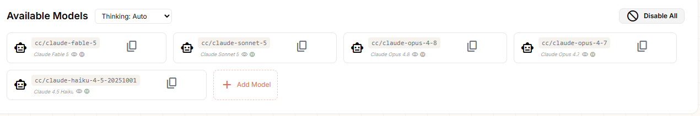
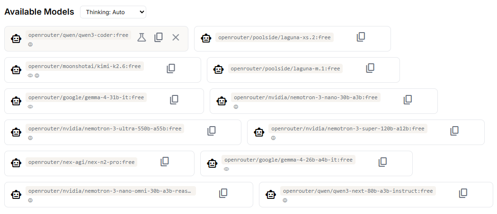

## Bismillah

Kali ini gw mau share ulang dari postingan linkdin orang lain. Tentang model AI yang bisa kita manfaatkan sesuai kebutuhan. Kalo sebelumnya di link ini, [gunakan-ai-sesuai-kebutuhan](/gunakan-ai-sesuai-kebutuhan) itu gw membahas provider AI yang bisa kita manfaatkan sesuai kebutuhan, misalan ChatGPT, Gemini AI, Grok, Claude, Llama, Perplexity, DeepSeek, Kimi, Qwen, Manus, dan lain lain. Dan saat kita gunakan API Mereka banyak model yang disedikan, misalkan, Cloude atau OpenRouter, seperti dibawah ini

> Cloude Model AI

> OpenRouter Model AI

Nah, kalo kemaren kemaren gw gak perhatikan model AI yang cocok, apalagi gw pake IDE TRAE Editor, yang bisa custom Agent dan Skills, nanti gw bahas di postingan lainnya ya. Fokus postingan ini adalah, Model yang tepat untuk mempermudah pekerjaan kita. Baik, berikut ini ringkasannya.

1. Planner 🧠
> Planner bertugas menganalisis requirement, membuat blueprint, dan menyusun task. Di tahap ini, jangan pelit pakai model. Karena kalau planning-nya salah, semua step setelahnya ikut berantakan.
**Rekomendasi**
**Claude Fable → Claude Opus → GLM → Kimi**

2. Plan Executor 📋
> Setelah blueprint selesai, tugas berikutnya adalah membaca plan, menentukan prioritas, lalu mendelegasikan pekerjaan ke agent lain.Ibaratnya seperti Site Engineer yang menjalankan gambar dari Architect.
**Rekomendasi**
**Claude Sonnet → Kimi → MiniMax M3**

3. Executor ⚙️
> Menurut gw executor sebaiknya dibagi dua. Quick Execution Untuk pekerjaan sederhana seperti refactor kecil, rename, styling, atau bug minor. Tidak perlu membuang quota model premium.
**Rekomendasi**
**MiniMax HighSpeed → Mimo v2.5 → DeepSeek V4 Flash**

> Deep Execution Untuk implementasi yang kompleks, reasoning panjang, atau task yang membutuhkan nested delegation.
**Rekomendasi**
**GPT-5.x → GLM 5.x → DeepSeek V4 / R1**

4. Multimodal 👀
> Kalau tugasnya membaca screenshot, Figma, PDF, diagram, atau UI. Menurut pengalaman gw, Gemini masih jadi pilihan terbaik.
**Rekomendasi**
**Gemini → Qwen Max/Plus → Mimo Pro**

5. Orchestrator 🎯
> Kalau butuh model yang bertugas mengumpulkan context, melakukan analisis lintas dokumen, atau mengorkestrasi workflow agent.
Rekomendasi dari Pemilik Postingan
**Claude Fable → Claude Opus → Kimi**

Gimana? Mulai ada gambaran kan, jangan asal pake AI, maksimalkan model AI untuk mempermudah pekerjaan kita.

> Saran gw, pake [9router](https://github.com/decolua/9router)  atau [keirouter](https://github.com/mydisha/keirouter) buat mengatur dan memilih model AI yang kita butuhkan.

source
- https://lnkd.in/p/gfuYHjaV